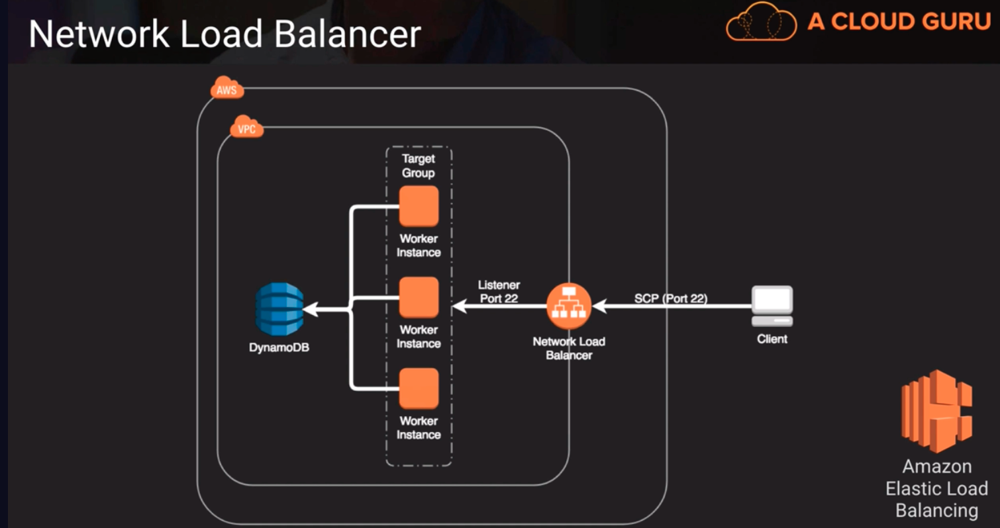
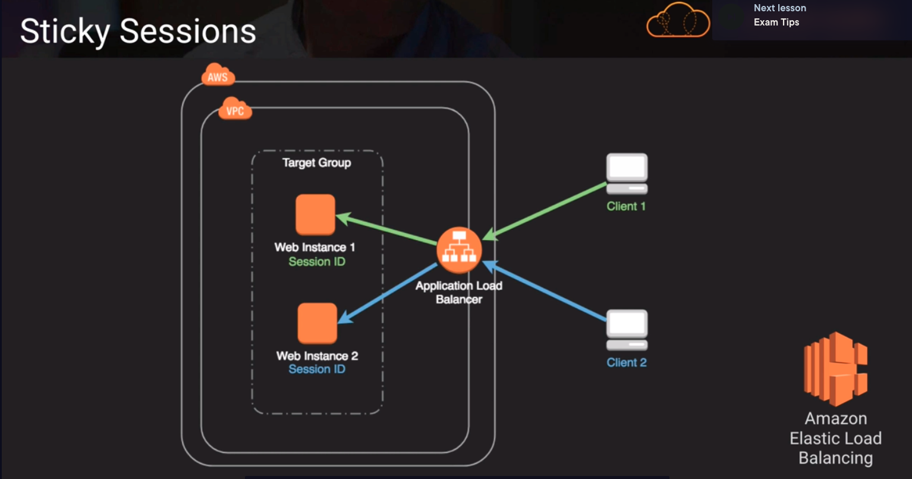

# Elastic Load Balancer
https://aws.amazon.com/elasticloadbalancing/features/

Distributes inbound connections to one or many backend endpoints
- 3 different options:
  1. Application load balancer (Layer 7)
  2. Network load balancer (Layer 4)
  3. Classic load balancer (Layer 4 or Layer 7) ()
- Can be used for facing the internet in public way or private workloads (internally inside our VPCs to distribute internal workloads)
- They are auto-scaling (elastic)
- Consume IP addresses within a VPC subnet, so one should make sure you have plenty spare addresses. If you run out of addresses inside a VPC subnet then you could run into problems with scaling

## Elastic Load Balancer - Similarities
|| Application LB | Network LB | Classic LB |
|:----:|:-----------:|:-------------------:|:---------:|
| Zonal Failover | Yes |
| Platform | VPC Only | VPC Only | EC2-Classic or VPC |
| Health Checks | Yes |
| Cross-Zone Load Balancing | Yes |
| CloudWatch Metrics | Yes |
| SSL Offloading | Yes, they can all terminate SSL connections |
| Resource-based IAM Permissions | Yes |

## ELB - differences

|| Application LB | Network LB | Classic LB |
|:-----------:|:---------------:|:----------------:|:-----------------:|
| Protocols | HTTPS, HTTP | TCP, UDP, TLS | TCP, SSL, HTTP, HTTPS |
| Path or Host-based Routing | Yes | No | No |
| WebSockets | Yes | Yes | No |
| Server Name Indication (SNI) | Yes | Yes, as of 9/2019 | No |
| Sticky Sessions | Yes | Yes, as of 3/2020 | Yes |
| Static IP, Elastic IP | Only through AWS Global Accelerator | Yes | No |
| User Authentication | Yes | No | No |

## ELB - Routing
how you can control the flow of traffic to your backend servers.

### Network load Balancers
With network load balancers we can route based on the destination port. TCP connections to backend are persisted for the duration of the connection.

NLBs excel at speed. If we need raw speed and throughput. We can use an NLB to direct HTTP and HTTPs traffic.

Above, if a client uses SCP to copy files or upload files and we use an NLB to distribute the work across a target group of worker instances. 

### Application load balancers
We have a lot options for routing.
We can route based on:
1. Host-based routing (domain host name)
2. Path-based routing (path given in the URL)
3. HTTP header-based routing (HTTP header elements)
4. HTTP method-based routing (ex. post, put, get)
5. Query string parameter-based routing (query string parameter inside the URL)
6. Source IP address CIDR-based routing

ALBs work at a higher level. With path-based routing we can direct that load to one of many target groups

### Sticky Sessions
An important feature for web applications. Many web applications keep up with clients using sessions IDs to uniquely identify the client for stuff like shopping carts and session parameters. Enabling sticky sessions is how the ELB can keep track of the client and which web server it handed it off to, so it can keep sending it back to that same web server, allowing continuity for the client and web server.

