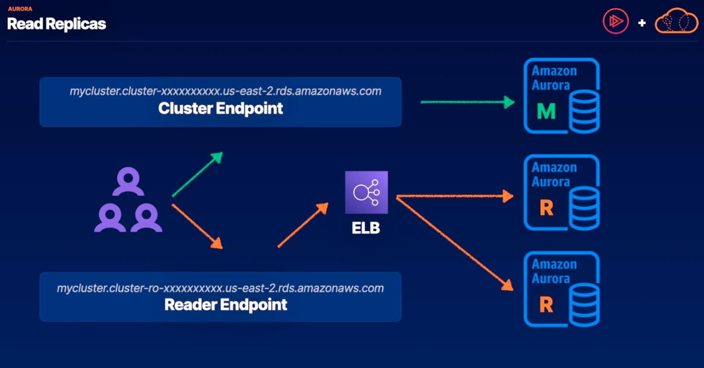
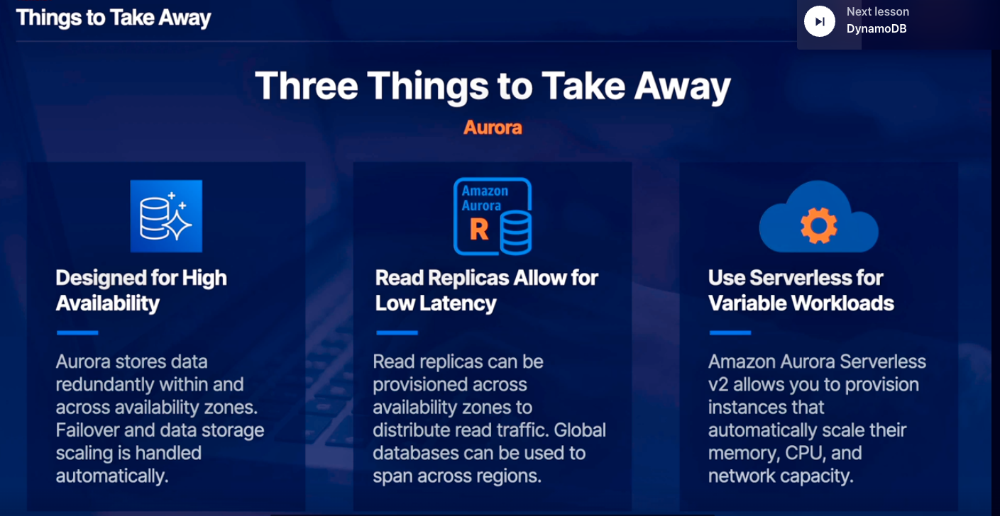

# Aurora -> fully managed RDs service for MySQL and PosgreSQL databases

- implements multi-AZ availability by design which helps with performance and high availability.
- data stores for Aurora will automatically scale, this is managed by AWS
- contains easier multi-region replication

## Read Replicas
you can provision multiple instances and they can span multiple availability zones. These instances handle the compute and networking aspects. We'd have one main instance and up to 15 read replicas. Data is held on data stores distributed across these availability zones and it's independent from the instances that you provision. It can scale in and out independently based on the amount of data that you're storing.
- the main instance handles all write traffic and writes to all data copies, this replication is really fast.
- once data is written, it's usually available to read within 100 milliseconds. The main instance as any of the read replicas can handle read traffic.
1. Aurora is really great for read-heavy applications because read traffic can be distributed across many instances.
2. Aurora also natively handles high availability. So if there's a failure in your main instance, one of your read instances will automatically be promoted. You dont have to worry about switching endpoints over to target a different instance. All of this is handled behind the scenes by Aurora

## Global Databases
You can create read replicas across regions. The rate of replication is a little bit slower here, but data is almost always available in under a second in these secondary regions. Asyn replication is used across regions.
- useful for high availability and disaster recovery (one primary region and up to five secondary regions)
- data replicates from primary to secondary regions with low latency
- leverages storage-level replication for transferring data
- second region can be promoted in case of outage

## Aurora Serverless
- useful when dealing with highly variable workloads in contrast to predictable and consistent workloads which would be better suited for standard.
- scales seamlessly without impacting performance
ACU -> aurora capacity units, which equates to about 2 GiB of memory, CPU, and networking. You can set min or max ACU for a cluster from 0.5 to 128

## Exploring use cases
1. MySQL and PostgreSQL databases
2. Inherently highly available and resilient to failure
3. Aurora serverless is available for highly variable workloads
4. Low operational overheaad

