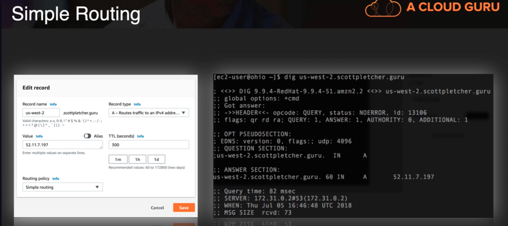
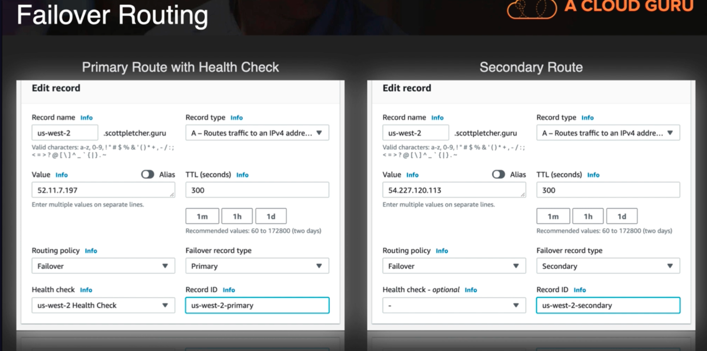
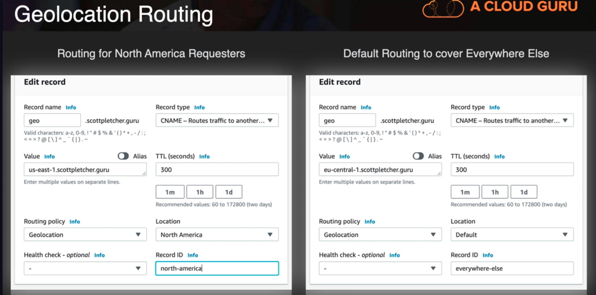
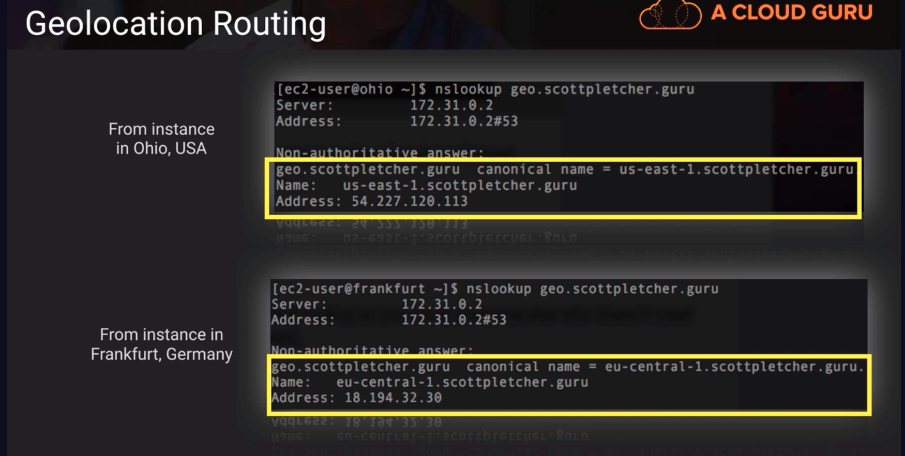
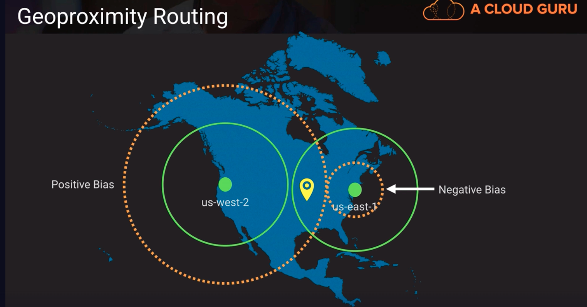

# Route 53

https://docs.aws.amazon.com/Route53/latest/DeveloperGuide/hosted-zones-private.html

https://docs.aws.amazon.com/vpc/latest/userguide/VPC_DHCP_Options.html

## Route 53 Routing Policies

| Policy | Route 53 is thinking... |
|:--------------------:|:----------------------------------------:|
| Simple | Simple. Here's the destination for that name |
| Failover | Normally, I'd route you to <Primary>, but it appears down based on my Health Checks so I'll failover to <Backup>. |
| Geolocation | Looks like you're in Europe, so I'm going to route you to a resource closer to you in that region |
| Geoproximity | You're closer to the US-EAST-1 region than US-WEST-2 so I'll route you to US-EAST-1 |
| Latency | Let me see which resources has lower latency from you, then I'll direct you that way |
| Multivalue Answer | I will return several IP addresses, as a sort of basic load balancer |
| Weighted | You can setup multiple resources and I'll route according to the percentage of weight you assign each |

## Simple Routing

Above, we create a record with a simple routing policy that points to an IP address and it returns the address in the dig command.

## Failover Routing

Above, we create a record with same name but different IP addresses. We set the failover record types accordingly (either primary or secondary). We added a health check associated with the primary (assume we already configured the health check that pings and tries to hit my primary resource, if its unavailable it's going to send me to the secondary route which would be 54.227.120.113)

Above, notice the before and after behavior.

## Geolocation Routing

Above, we configured a route for North American users and then a default route for everyone else. It's important that we have a default route for geolocation because sometimes Route53 wont be able to determine where the person's coming from. The default route is kind of the catch-all

Above, the dns directs to different names based on geolocation of the instance.

## Geoproximity Routing

If we wanted to shift more geography to one region, we can change the bias on the geoproximity record and that has the effect of increasing or decreasing a radius around which we route traffic. The bias can be between negative 99 to positive 99. A positive bias will increase our circle. A negative bias will decrease our circle.
  - Why do this? maybe us-east-1 resources are maxed out due to a larger population on the east side of the country. Adjusting the bias will allow me to equally distribute the load across my regions.

## Latency Routing
based on the latency between the requester and the data center. Essentially, when selecting latency routing policy we can also select which region that the policy for the record will apply to.

## Multivalue Answer Routing
allows records for the same name to point to different IP addresses.
We can setup health checks on each entry so only healthy endpoints would be served up. Basically a load balancing or round robin type direction of traffic. The client can have mutiple addresses from which to choose. If an endpoint becomes unavailable after the resolver caches the response, the client can try another IP.

## Weighted Routing
If we have 2 records with the same DNS name. and if the weight number is equal it will route traffic equally. Weights can be whole numbers between 0 to 255. If weight is set to 0 then that has the effect of disabling traffic going to that endpoint

percentage of traffic = (weight for a specified record) / (sum of all weights for all records)