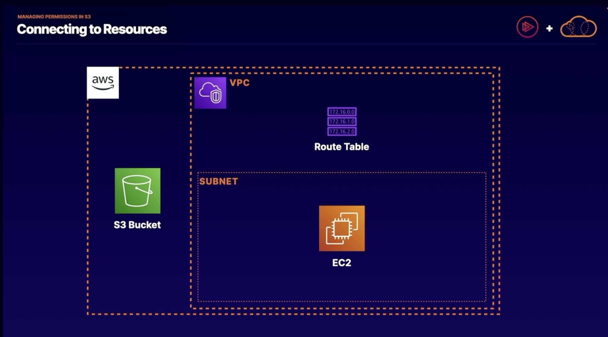

# S3 - an object store
- Maximum object size is 5TB
- largest object in a single PUT is 5GB
- Recommended to use multi-part uploads if larger than 100MB
S3 objects' path looks like a file path but it is really key. Because S3 has more in common with a database than a file system. Key is the name of the record.
## S3 Security
1. Resource-based (object ACL, bucket policy)
2. user-based (IAM policies)
3. Optional multi-factor authentication before Delete

## S3 Data protection
### Versioning:
- New version with each write
- Enables "roll-back" and "un-delete" capabilities
- Old versions count as billable size until they are permanently deleted 
- Integrated with LifeCycle Management
- Optionally require multi-factor authentication:
  - safeguard against accidental deletion of an object 
  - change the versioning state of your bucket
- supports cross-region replication for security, compliance, and latency.

## S3 Storage classes
- Intelligent tiering: moves data around other storage classes based on how frequently or infrequently the objects are accessed.
- Intelligent tiering archive: objects(data) managed by intelliegent tierign are automatically to Glacier or DeepGlacier

### S3 LifeCycle Management - allows you to apply rules to your objects and transition between different storage classes or transition out to an archive. Rules can be based on prefixes, tags, or current vs. previous versions.
- Optimize storage costs
- Adhere to data retention policies
- Keep S3 volumes well-maintained

### S3 Analytics: run reports and it says which data gets accessed frequently or infrequently.
- Data Lake Concept: Athena, RedShift Spectrum, QuickSight
- IoT Streaming Data Repository: Kinesis Firehose
- Machine Learning and AI Storage: Rekognition, Lex, MXNet -> can reference S3 data to use as training sets or ingest for processing.
- Storage Class Analysis: S3 Management Analytics -> useful if you have a lot of data in your S3 bucket and you want to make sure you're storing it in the most cost effective manner.

## S3 Encryption at Rest
### Encryption Option:
- SSE-S3 -> Use S3's existing encryption key for AES-256
- SSE-C -> Upload your own AES-256 encryption key which S3 will use when it writes the objects
- SSE-KMS -> Use a key generated and managed by AWS Key Management Service
- Client-Side -> Encrypt objects using your own local encryption process before uploading to S3(i.e. PGP, GPG, etc.)

## S3 Tricks/Tips that you can use
- transfer acceleration -> which is cloudfront used in reverse to speed up data upload 
- requester pays -> requester rather than the bucket owner pays for requests and data transfer
- tags -> assign tags to objects for use in costing, billing, security, etc.
- events -> trigger notifications to SNS, SQS, or Lambda when certain events happen in your bucket
- static web hosting -> massively scale natively hosting sites in a simple fashion.

# Managing Permissions in S3

## Bucket policy vs. IAM
  - Bucket policy (resource-based policies) is defined at the bucket resource, you give a particular principle access to all objects or a subset of objects in a bucket.
  - IAM (identity-based policies) you are granting temporary permissions in the form of a role to a given user, service, or application.

  ### Scenarios:
  - If a bucket policy neither explicitly allows or denies that IAM user access to the bucket, that's where identity permissions come into play. IAM policies can be attached to users, groups of users, or IAM roles, which can be applied to all sorts of different principles. 
    - If a IAM user was given a role that they can temporarily assume, the role has an attached permission set to allow assuming the role to access objects in a particular S3 bucket. Now the IAM user can access S3 objects from the bucket.
  - If there are two separate AWS accounts, if the IAM user checks against the bucket policy & if they are explicitly allowed with their unique ID, they will be allowed to access objects from the bucket.
  - If they are two separate AWS accounts, and a bucket policy neither explicitly allows or denies that IAM user access to the bucket, then you'll have to establish the permissions and a trust policy.
    - Permissions policy: you will grant access to the S3 bucket 
    - Trust policy: to allow an entity from an outside AWS account to assume that role
    - Create a role for the outside AWS account IAM user which gives permissions to assume the role that's been granted to that account in the trust policy.

## Connecting to Resources

- In this diagram how can the EC2 instance send/receive objects from the S3 bucket?
  1. One way is to use IGW(Internet gateway) which leads to the public internet which leads to the S3 bucket. However ingress and egress via an Internet gateway can get expensive so..
  2. S3 gateway endpoint(Elastic Network Interface) ENI -> allows you to traverse AWS's private internet instead of the public internet. Transferring data costs and latency can be lower. An appropriate route in the route table must be set in the VPC