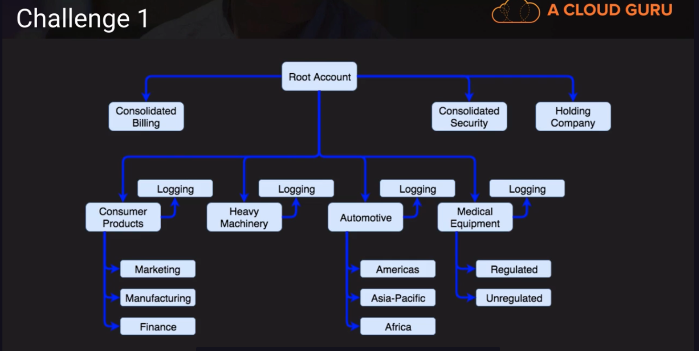
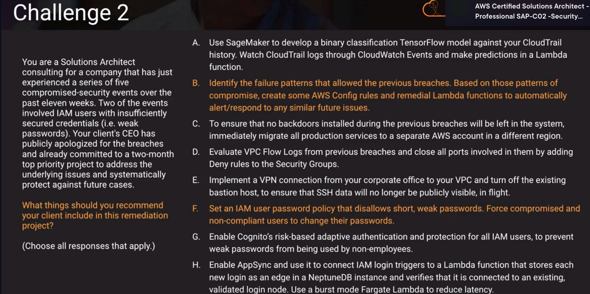
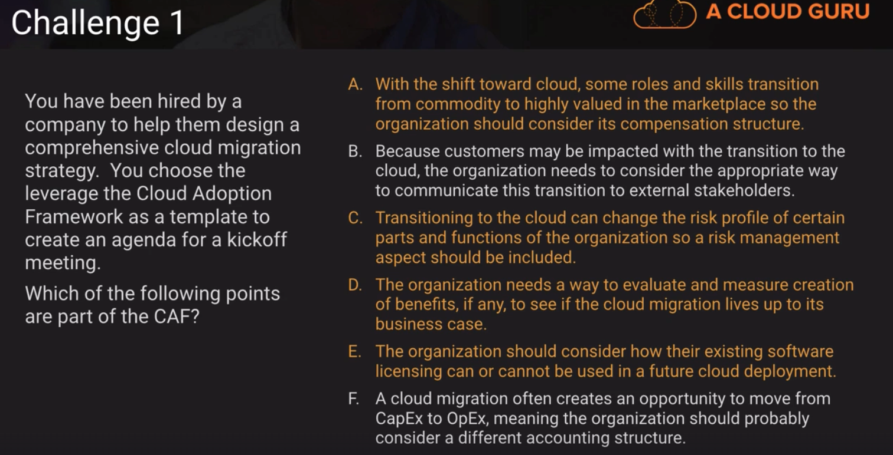
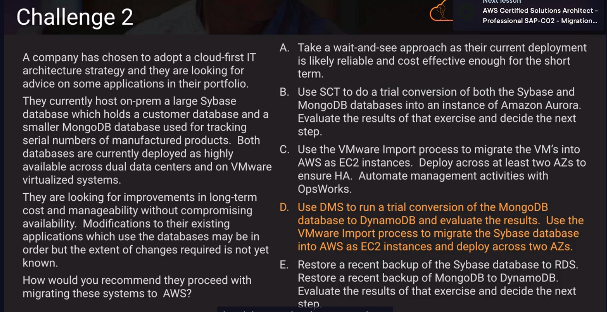
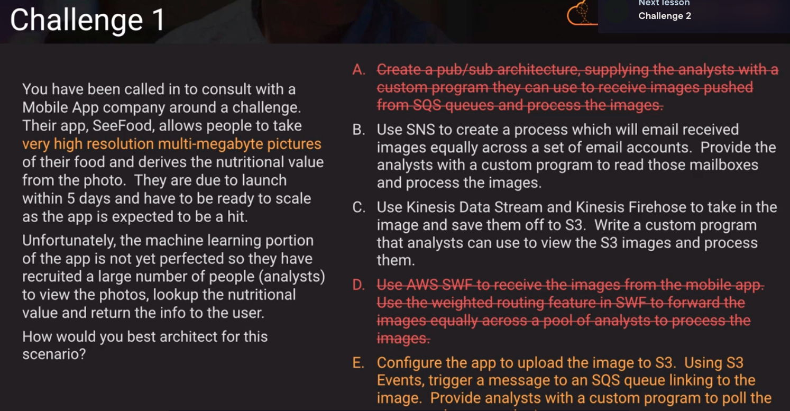
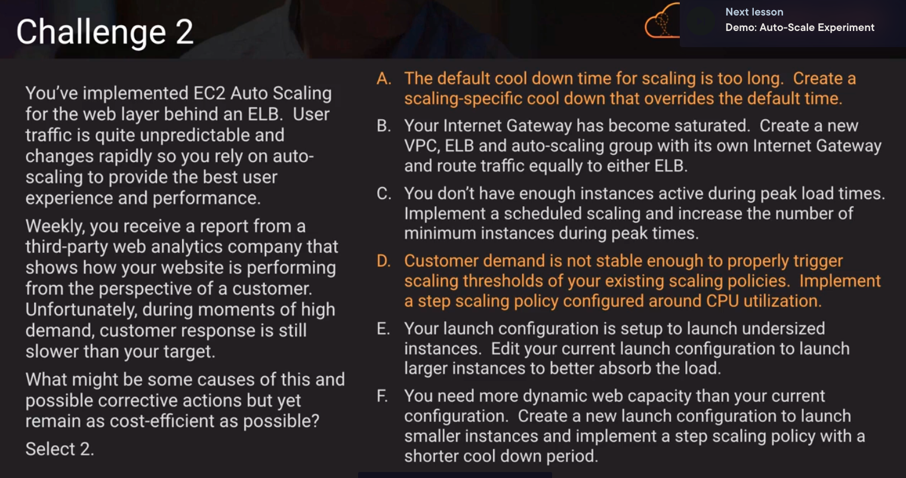
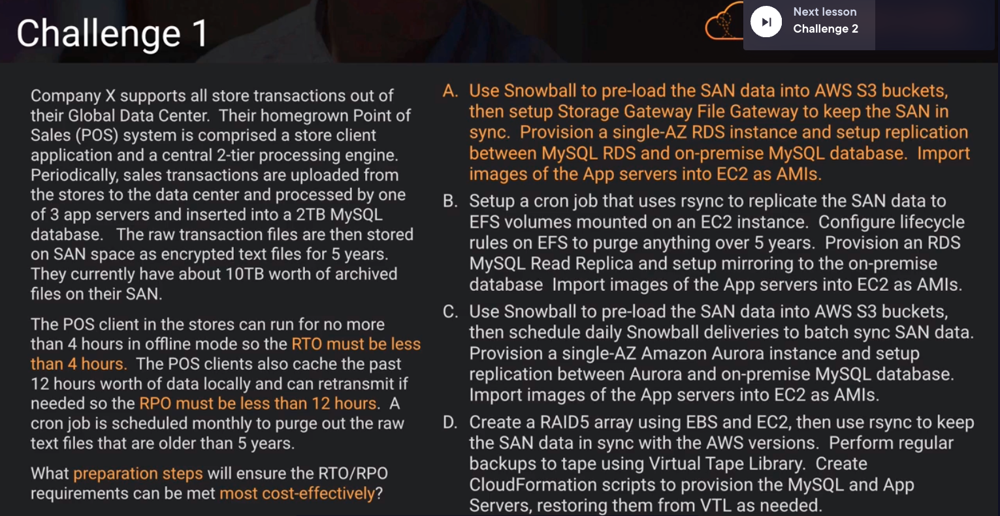
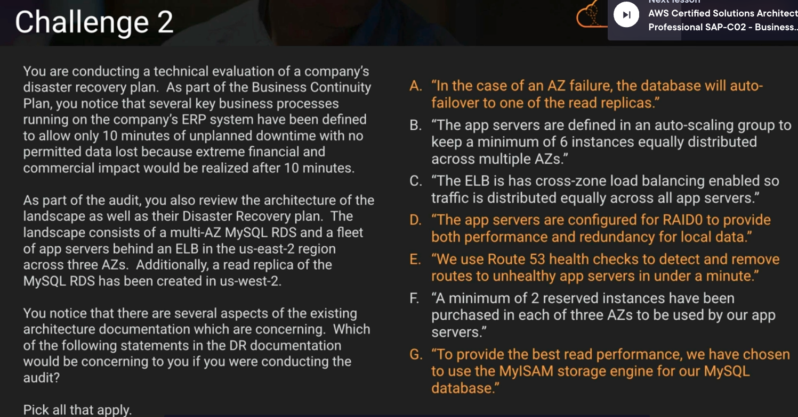

## Data Stores

## Networking

Above, enhanced peering mode doesn't exist

Above, failover policy doesn't help with distributing load. latency policy wont help because if users have the same latency, they're still going to go to the same place. Multi-value answer policy doesn't help because users can cache IP addresses and as a result the load is not spreaded. CloudFront only serves up content and doesn't spread load. ALB can support sticky sessions and SSL

- Quiz questions/answers:

1. VPC CIDR block size is fixed at /56. Subnet CIDR block size is fixed at /64.

2. To allow VPC instances to resolve using on-prem DNS we have to configure a DHCP Option Set to issue our on-prem DNS IP to VPC clients

3. Direct Connect requires 802.1Q VLAN support

4. A network load balancer with an EIP (Elastic IP) will allow our AWS application to leverage static IP addresses that can be allowlisted by the customer firewall. Network load balancers support static IP addresses; you can also assign one elastic IP address per subnet enabled for the load balancer. https://docs.aws.amazon.com/elasticloadbalancing/latest/network/introduction.html

## Security

https://docs.aws.amazon.com/pdfs/whitepapers/latest/organizing-your-aws-environment/organizing-your-aws-environment.pdf#organizing-your-aws-environment

Above, 
- a publishing account allows you to leverage your IT organization as a shared service to provide standardization
- if you want to keep regulatory and compliance requirements localized as much as possible, there is generally a very strong logging component.
- compliance account structure does not exist

Above,
 is how it might look in practice, we have consolidated security, the root account (holding company that serves as the shared service)
 - we created a logging account and attached it to each one of the business units.

Above, 
A. needs a lot of training data to train the model and it takes a lot of time.
B. It's event driven, and possible within the bounds of the situation that they're facing
C.migrating these instances/services isn't going to help us
D. We dont want to close ports we might need, security groups dont have deny rules
G. Cognito has user pools that keeps up with user accounts, IAM has its users that are its own thing and they dont overlap. Cognito's users are separate from IAM users

- Quiz questions/answers:
1. IAM identity Center SSO provides centralized, easy-to-manage solution for granting and revoking access to AWS accounts and services
2. A Service control policy that denies all actions for root users and attaching it to the root OU. you will effectively prevent root users from taking any actions in all accounts within the organization
3. AWS Shield Advanced provides managed DDoS protection for your applications with minimal operational overhead. It integrates with AWS WAF, using application-aware managed rules to detect and mitigate layer 7 DDoS attacks
4. most efficient way of logging all user activity and actions taken on AWS services for your AWS multi-region single account?
    - configure CloudTrail to deliver log files from multiple regions to a single S3 bucket for a single account (see Receiving CloudTrail Log files from Multiple Regions)
6. NACLs are stateless so they do not maintain connection information. Security groups are stateful so they maintain connection information.
8. Control certain areas of IT environment governed by AWS organizations that can only use certain regions? 
    - ACLs and resource-based policies apply to assets and not users or groups. Identity-based policies using the aws:RequestedRegion condition key could work but since we are trying to control at the OU level. an SCP would require less management and localized care. We can use a DENY with StringNotEqualsIfExists conditional against aws:RequestedRegion for allowed Regions
9. IDS is a monitoring system, IPS is a control system. IDS doesnt alter the network packets in any way, whereas the IPS prevents the packet from delivery based on the contents of the packet, much like how a firewall prevents traffic by IP address
11. A security audit failed because username and passwords were hard-coded in a script that runs on an EC2 instance, what's the remediation? 
    - AWS KMS can be used for storing and accessing keys to be used by applications. we access keys in a dynamic way w/o hard-coding them and access by provisioning with an IAM role when used by an EC2 instance.
    - AWS KMS is not as suitable for individual passwords because along with the need for the password to remain secret, the usernames themselves are treated as sensitive information
    - Storing on S3 gives more secure multi-layer control over AWS KMS. Secrets manager or system manager parameter store with an IAM role would be the most optimal choice.
    - Storing credentials in an encryoted file on S3 while creating an IAM role with access assigning it to the EC2 instance. We also need to make sure the KMS key policy allows the IAM role to decrypt the S3 object.
12. mobile app with secure access to AWS resources. How?
       - use cognito SDK to provide temporary credentials. a secure token service and web identity federation using AssumeRoleWithIdentity is possible but it isn't what AWS recommends.
13. OAuth 2.0? focuses on authorization, allowing clients to access resources on behalf of a resource owner, usually through issuing tokens to clients for specific scopes.

## Migrations

B. CAF does not call out the need to communicate the transition to those external stakeholders
C. transitioning to the cloud opens up opportunities but it also surfaces some new risks 
D. we need to know how we are going to measure the success of the migration to the cloud
E. some of our software licenses may prohibit us from running in a multi-tenant environment. we need to be sure if our existing software can be migrated to the cloud
F. a lot of companies move from CapEx to OpEx expense model but it doesn't mean they should reconsider accounting structures

A. Question asks about longterm costs and manageability

B. Schema Conversion Tool (SCT) doesn't support noSQL databases, only DMS supports noSQL databases like MongoDB
C. this is a lift and shift and we wouldn't achieve any sort of longterm benefits
D. answer is D because we can move to a managed database scenario
E. RDS doesn't support Sybase, so we cant just restore a Sybase 
database backup to RDS because its not a supported database

- Quiz questions/answers:
1. Sun Solaris is not a support OS for AWS
3. which combo will allow us to perform a heterogeneous migration from an on-prem Oracle database to an Aurora MySQL database? AWS DMS & AWS SCT.
    - AWS DMS supports both homogeneous and heterogeneous migrations, making it suitable for migrating data from an on-prem Oracle database to an Amazon Aurora MySQL database. AWS SCT helps convert the source database schema to a compatible schema for the target database which is required for a heterogenous migration.
4. AWS Transfer for SFTP securely shares files with a 3rd party
5. AWS Replication Agent must be installed on source servers when migrating an application using AWS Application Migration Service. It enables communication between the source servers and the application migration service.
7. SCT and DMS do not support Informix as a source database. In order to migrate a Informix database to Aurora we have to manually create the schema and use Data Pipeline with JDBC to move the data.
8. Difference between DataSync and Storage Gateway is that DataSync focuses on transferring data between on-prem storage systems and AWS, whereas AWS storage gateway provides a hybrid cloud storage solution that enables on-prem applications to seamlessly use AWS cloud storage
9. Retiring an asset is the least-cost option
10. Homogeneous migration is when we migrate between the same type of databases.

## Architecting to Scale

Above,

A. SQS is a messaging platform and is not considered a pub/sub architecture. SNS is considered a pub/sub architecture. Messages dont get pushed from SQS you have to poll the queues for those messages.
B. Because the customer wants very high resolution multi-megabyte pictures but SNS's limit is 256K so this won't work.
C. The maximum of in-bound message size for Kinesis 1MB, this large but not big enough to accommodate our multi-megabyte pictures.
D. Simple WorkFlow is much more of a statusing framework than a true workflow engine. There is no weighted routing in SWF
E. this is the answer because we can save that image to S3, then we use SQS as a worker queue for that image

B. Internet gateways arent susceptible to saturation. they have no bandwidth limit so we dont think thats potentially a cause here
C. because our demand is unpredictable, schedule scaling with scheduled instances wont really help us.
E. Launch configurations cant be edited after its been created
F. Step scaling policies dont have a cool down period. Rather they have a warm up period, where we can specify how long to allow our new instances to come up before another step scale can be triggered

- Quiz question/answers:
1. a shorter cool down means there will be a shorter interval until the auto scaling service determines that another x number of servers are required to service a spike in demand
3. Kinesis Produce Library (KPL) will allow writing to Kinesis Streams and not reading from them. It performs heavy-lifting tasks associated with distributed stream processing, making it more productive to develop applications.
4. Behaviors in CloudFront allow us to define different origins depending on the URL path. This is useful when we want to serve up static content from S3 and dynamic content from an EC2 fleet for example for the same website.
5. We are not given the WCUs, so we are unable to determine with certainty the number of partitions.
9. two common uses for Kinesis data streams is that it can provide real-time data analytics, and collect and process large streams of data records in real time.
    - combines the power of parallel processing with the value of real-time data. i.e. process website clickstreams in real time and then analyze site usability engagement using multiple different Kinesis Data Streams applications running in parallel
10. SNS doesnt provide the ability to orchestrate a workflow with multiple Lambda functions and incorporate retry logic for specific tasks
    - Step Functions allows us to build resilient workflows by orchestrating multiple Lambda functions. We can define the flow of the order processing and incorporating retry logic for specific tasks in case of failures. Step Functions also provide visualizations of the workflows, making it easier to monitor and debug.
14. SQS can be used as a buffer between S3 new objects events and the Lambda function. 
    - by sending events to an SQS queue, we can ensure that Lambda processes the events at a manageable rate, even during peak periods. SQS provides a reliable and scalable message queuing service that can handle fluctuating workloads.

## Business Continuity

B. EFS is 15 times more expensive than S3 and we'd need to keep  running EC2 instance up to perform the sync
C. Aurora is multi-AZ by default
D. AWS doesnt recommend using RAID5 or RAID6 because they will consume our IOPS. EBS volumes is going to be really expensive. Restoring from virtual tape library can take several hours

A. RDS now offers a new multi-AZ deployment option for MySQL and PostgreSQL databases, enabling automatic failover to one of two readable standby instances
B. we can define a minimum instances for an autoscaling group 
C. without cross-zone load balancing enabled on our ELB, each ELB endpoint will tend to use the resources that it has access to in that specific AZ
D. RAID0 doesn't provide any redundancy
E. because were using an ELB we wouldnt use route53 to try to update routes to specific app servers. We let the ELB do the health checks for us.
F. to ensure 10% that were going to have those resources then buying reserved instances is the only way to guarantee we would have access to those
G. MySQL replication is only supported using NoDB database engine, so we prolly are not using the MyISAM storage engine in our MySQL server here

- Quiz question/answers:
2. Hardware failure is more like when a particular server or network component fails in a data warehouse.
    - failure of utilities or adverse environmental conditiions are considered infrastructure disasters
5. what is false about Redshift in the context of fault tolerance?
    - redshift multi-node cluster are multi-AZ by default
6. RAID0 has the highest write performance as writes are distributed across disks.
7. Backup and Restore possesses a relatively small data size and generous RTO/RPO. it is the most cost-effect approach.
8. Aurora Global Database allows us to failover to a secondary cluster in a different region. Our database will survive even in the unlikely event of a regional degradation or outage.