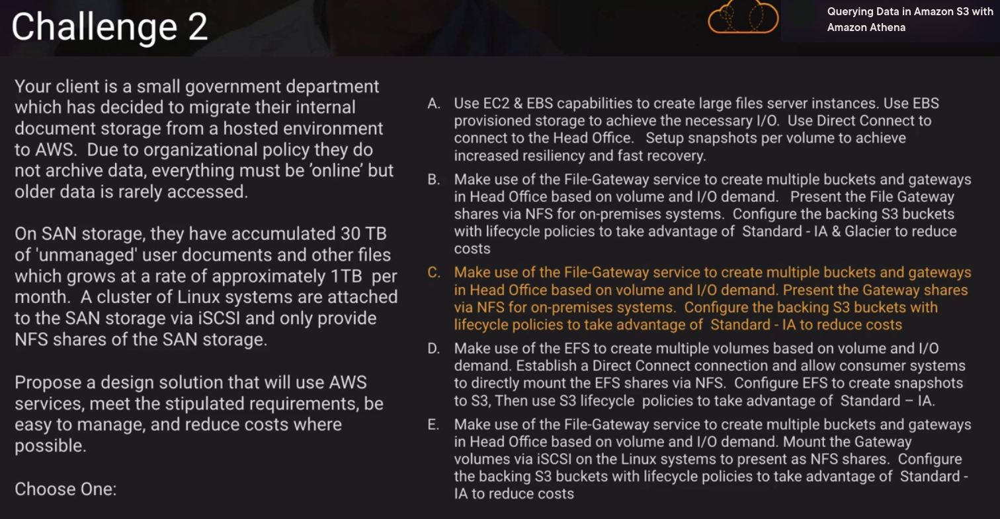
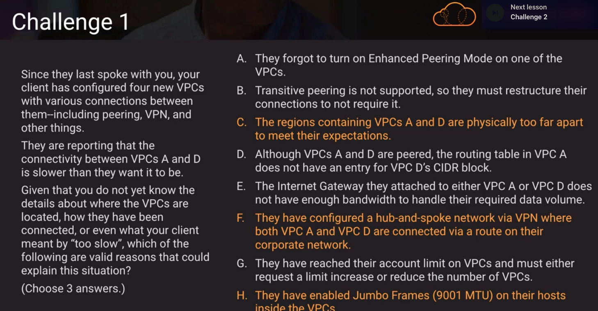
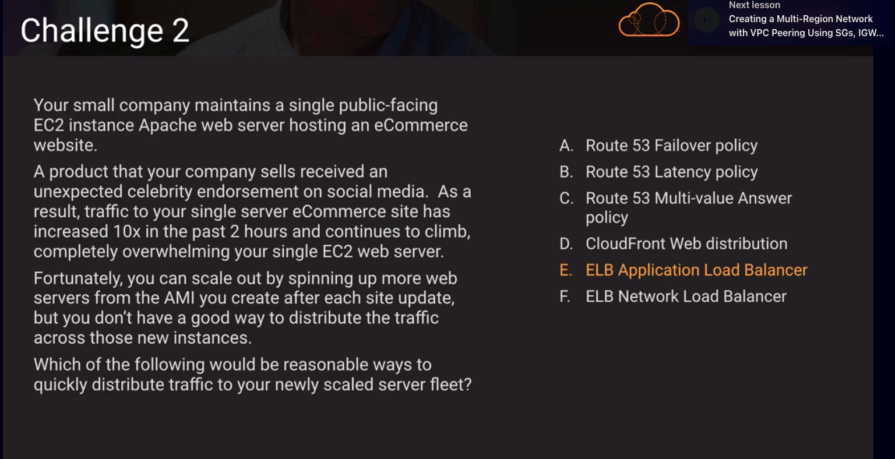

Above, enhanced peering mode doesn't exist

Above, failover policy doesn't help with distributing load. latency policy wont help because if users have the same latency, they're still going to go to the same place. Multi-value answer policy doesn't help because users can cache IP addresses and as a result the load is not spreaded. CloudFront only serves up content and doesn't spread load. ALB can support sticky sessions and SSL

- Quiz questions/answers:

1. VPC CIDR block size is fixed at /56. Subnet CIDR block size is fixed at /64.

2. To allow VPC instances to resolve using on-prem DNS we have to configure a DHCP Option Set to issue our on-prem DNS IP to VPC clients

3. Direct Connect requires 802.1Q VLAN support

4. A network load balancer with an EIP (Elastic IP) will allow our AWS application to leverage static IP addresses that can be allowlisted by the customer firewall. Network load balancers support static IP addresses; you can also assign one elastic IP address per subnet enabled for the load balancer. https://docs.aws.amazon.com/elasticloadbalancing/latest/network/introduction.html

5. 