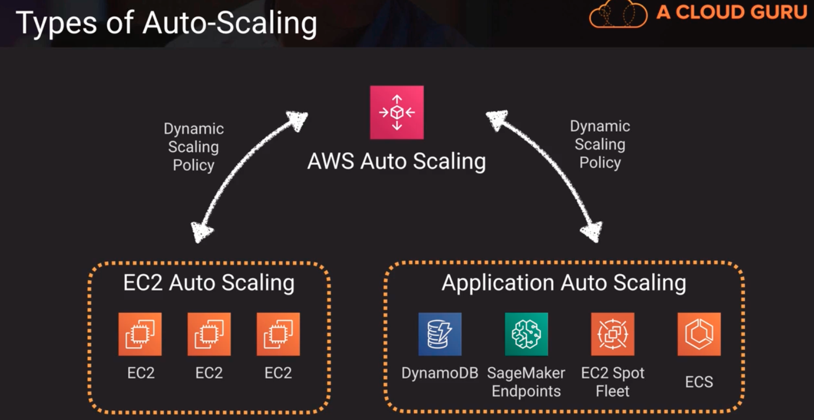
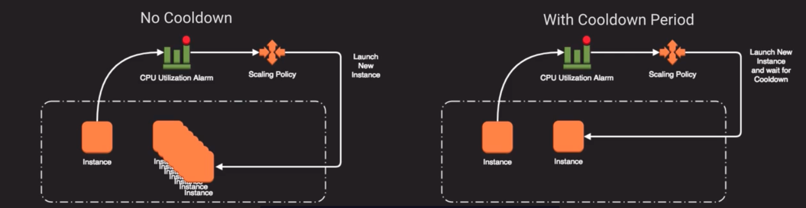

# Auto-Scaling

## Types of Auto-Scaling

| Name | What | Why |
|:------------------:|:-------------------:|:------------------:|
| Amazon EC2 Auto Scaling | Like the name says..focused on EC2 and nothing else | Setup scaling groups for EC2 instances; health checks to remove unhealthy instances |
| Application Auto Scaling | API used to control scaling for resources other than EC2 like Dynamo, ECS, EMR | Provides a common way to interact with the scalability of other services |
| AWS Auto Scaling | Provides centralized way to manage scalability for whole stacks; Predictive scaling feature | Console that can manage both of the  above from a unified standpoint |

## EC2 Auto-Scaling Groups
- Automatically provides horizontal scaling (scale-out) for your landscape
- Triggered by an event or scaling action to either launch or terminate instances
- Availability, Cost and System Metrics can all factor into scaling
- 4 Scaling options:
    1. Maintain - keep a specific or minimum number of instances running
    2. Manual - use maximum, minimum, or specific number of instances
    3. Schedule - increase of decrease instances based on schedule
    4. Dynamic - scale based on real-time metrics of the systems

## Launch Configurations
- to use EC2 auto-scaling you need to set an auto scaling group with a launch configuration (contains all that the auto scaling process is going to need when it tries to launch a new instance including the AMI and which VPC you want it launched in, if you want it attached to an elastic load balancer etc)
1. Specify VPC and subnets for scaled instances
2. Attach to a ELB
3. Define a Health check grace period (a time period that the scaling policy will allow that system to spin up and become healthy before it starts alerting on potential health problems of that instance because maybe its not responding)
4. Define size of group to stay at initial size
5. Or use scaling policy which can be based from metrics

## Scaling Types
| Scaling Type | What | When |
|:---------------:|:------------------------:|:----------------:|
| Maintain | Hands-off way to maintain X number of instances | "I need 3 instances always" |
| Manual | Manually change desired capacity via console or CLI | "My needs change so rarely that I can just manually add or remove" |
| Scheduled | Adjust min/max instances based on specific times | "Every Monday morning, we get a rush on our website." |
| Dynamic | Scale in response to behavior of elements in the environment | "When CPU utilization gets to 70% on current instances, scale up." |

## EC2 Auto Scaling Policies
| Scaling | What | When |
| Target Tracking Policy | Scale based on a predefined or custom metrics in relation to a target value | "When CPU utilization gets to 70% on current instances, scale up"|
| Simple Scaling Policy | Waits until health check and cool down period expires before evaluating new need | "Let's add new instances slow and steady" |
| Step Scaling Policy | Responds to scaling needs with more sophistication and logic | "Add all the instances" |

## Scaling Cooldown Concept for EC2
- configurable duration that gives your scaling a chance to "come up to speed" and absorb load
- default cooldown period is 300 seconds
- automatically applies to dynamic scaling and optionally to manual scaling but not supported for scheduled scaling (scheduled scaling has a time based schedule that you're using versus any sort of metrics or events that you're going to need to let settle before the cooldown period comes into play)
- can override default cooldown via scaling-specific cool down (ex. a scale-down policy may terminate instances so you wouldnt need to wait as long to evaludate whether you can terminate more instances as you'd have to wait until new instances were fully spun up)

1. Cool Down period -> gives resources time to stabilize before automatically triggering another scaling event. There's a health check grace period and cooldown period. Cool down is designed to allow the resources to come up to speed and start absorbing the load, this may be a different amount of time were willing to wait before we start checking for health
2. health check -> gives resources enough time to come up before we start checking their health status

## Scaling Based on Amazon SQS
- we can trigger scaling events based on external conditiions like queue size in an SQS queue

Above,
how we can process through things in a scalable asynchronous manner

## AWS Application Auto Scaling

| Scaling | What | When |
| Target tracking policy | initiates scaling events to try to track as closely as possible a given target metric | "I want my ECS hosts to stay at or below 70% CPU utilization" |
| Step scaling policy | Based on a metric, adjusts capacity given certain defined thresholds | "I want to increase my EC2 Spot Fleet by 20% every time I add another 10,000 connection on my ELB" |
| Scheduled scaling policy | initiates scaling events based on a predefined time, day or date | "Every monday at 0800, I want to increase the Read Capacity Units of my DynamoDB Table to 20,000" |

## AWS Auto Scaling [Console]
- provides a nice way to gather all the resources and manage scaling in a more holistic way vs. doing it at each and every stack layer in each and every sub-service that were using. Provides high level scaling strategies that are phrased more in business terms than technical terms

## AWS Predictive Scaling -> can used to automatically scale or used as a data point and control scaling manually
- predictive scaling can dynamically scale based on learning your laod and calculating expected capacity
- without dynamics scalnig, you can just use the data to adjust your own scaling policies
- you can also opt-out of this if you dont want AWS collecting this data