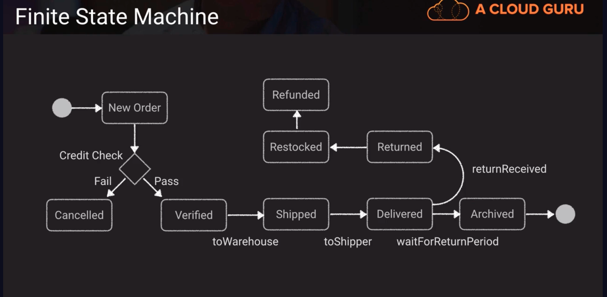

# AWS Step Functions -> a managed workflow and orchestration platform
- scalable and highly available
- we can define our app as a state machine
- create tasks, sequential steps, parallel steps, branching paths or timers
- we use Amazon State Language declarative JSON that allows us to configure and document the steps of our Step Functions
- apps can interact and update the stream via Step Function API or there is some direct integration with Lambda and some of the other AWS services
- visual interface describes flow and realtime status
- detailed logs of each step execution

## Finite State Machine -> an object an assume different state or statueses through a process
- the state machine concept is used to describe what Step Functions do.

Above,
we use an order and what an order processing flow might look like. The order can take different states as it travels through its life cycle. 
So it comes in as a new order, then we do a credit check and that order can assume a canceled state or a verified state. 
   - Once it gets shipped to the warehouse, it has a different state and then ultimately it gets delivered then maybe after a period of time maybe after our return period elapses we move it into an archive state or it could potentially be returned and then we would do some other stuff to that order. 
   - So its still the same object, the same order but its just assumed different states

## AWS Batch -> management tool for creating, managing and executing batch-oriented tasks using EC2 instances
- as much as we'd like to say that event-driven, real-time applications are always preferred there is still a need for good old batch processing. 
- we can choose for a batch to either manage those compute instances dynamically, by scaling out, based on load or we can control it ourselves.
Steps include:
   1. Create a compute environment: managed or unmanaged, spot or on-demand, vCPUs
   2. Create a job queue with priority and assigned to a Compute Environment
   3. Create job definition: script or JSON, environment variables, mount points, IAM role, container image, etc
   4. Schedule the job (if we choose managed compute environment, its going to scale out the needed infrastructure and then scale it back once the job is done)

## Comparisons
|   | When | Use Case |
| Step Functions | Out-of-the-box coordination of AWS service components | Order Processing Flow |
| Simple Workflow Service | Need to supprot external processes or specialized execution logic, or when manual intervention is required | Loan Application Process with Manual Review Steps |
| Simple Queue Service | Messaging Queue; Store and forward patterns | Image Resize Process |
| AWS Batch | Scheduled or reoccuring tasks that do not require heavy logic | Rotate logs daily on firewall applicance|

