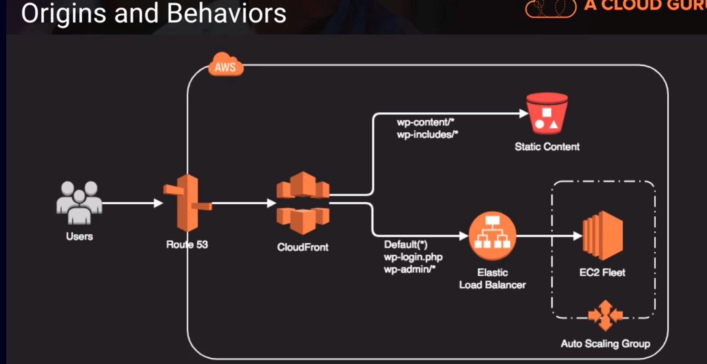

# CloudFront Part 2
- can deliver content to your users faster by caching static and dynamic content at edge locations
- dynamic content delivery is achieved using HTTP cookies forwarded from your origin
- supports adobe flash media server's RTMP protocol but you have to choose RTMP delivery method
- web distributions also support media streaming and live streaming but use HTTP or HTTPS
- origins can be S3, EC2, ELB or another web server
- multiple origins can be configured
- use behaviors to configure serving up origin content based on URL paths

## Origins and Behaviors

Above,
An example would be a wordpress site where we have Route53 coming into a cloudfront distribution. We specify the static content as going to be coming from an S3 bucket whereas our dynamic content can come off a load balancer that backended with an EC2 fleet

## Invalidation Requests
- There are several ways to invalidate a cloudfront cache:
    1. simply delete the file from the origin and wait for the TTL(this is configurable) to expire
    2. use the AWS console to request invalidation for all content or a specific path such as /images/*
    3. use the cloudfront API to submit an invalidation request
    4. use third-party tools to perform cloudfront invalidation (CloudBerry, Ylastic, CDN Planet CloudFront Purge Tool)

## Zone Apex Support
- cloudfront support zone apex DNS entries. this is your domain name without any www or any sub-domain in front of it. example would be odogwuguru.com that we point to a cloudfront distribution. Our nslookup would return the IP addresses of the cloudfront distribution.

## Geo-Restrictions
- if we have certain regulatory restrictions or guidelines where you're not allowed to show content or expose content to certina geographies or countries. We can use the whitelisting and blacklisting capability to restrict or explicitly grant access to our cloudfront distribution