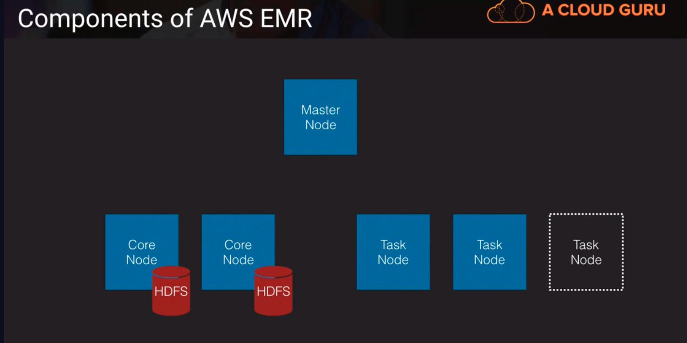
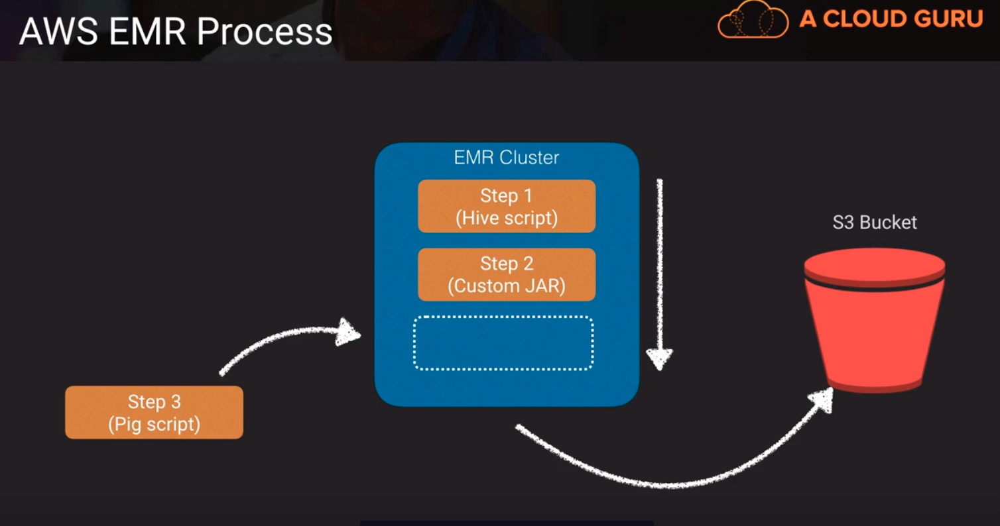

# Elastic MapReduce -> collection of opensource projects wrapped together in a very manageable easy to deploy manner

https://aws.amazon.com/emr/faqs/

- a managed Hadoop framework for processing huge amounts of data
- there are two main pieces of Hadoop: HDFS and MapReduce and the rest are like add-ons. 

1. Hadoop HDFS: a persistent data store. a file system that the data gets stored in. A certain way of storing files that is conducive to data analytics and data manipulation
2. Hadoop MapReduce: for distributed processing. The actual framework used to do the processing of the data
3. ZooKeeper: for resource coordination. coordinates all these services to make sure they work together properly
4. Oozie: a workflow framework. 
5. Pig: a scripting framework
6. Hive: a SQL interface into our Hadoop landscape
7. Mahout: a machine learning component
8. Hbase: a columnar database for storing Hadoop data
9. Flume: useful for adjusting application and system logs
10. Sqoop: can facilitate the import of data into Hadoop from other databases or other data sources
11. Ambari: a management monitoring console

- companies provide enterprise support and professional services and they also contribute to these open source projects as well. i.e. HortonWorks and Cloudera
- also supports Apache Spark, Hbase, Presto and Flink -> these are other open source projects that have various features and benefits
- most commonly used for log analysis, financial analysis or extract, translate and loading (ETL) activities
- a step is a programatic task for performing some process on the data (i.e. count words)
- a cluster is a collection of EC2 instances provisioned by EMR to run our steps

## Components of AWS EMR

Above, 
the core nodes have the HDFS storage to persistently store our data. We also have task nodes which act as worker nodes to work on the steps with ephemeral storage. This is how we can scale out EMR to process many TBs of data quickly.

## AWS EMR Process

Above, 
1. The steps, step 1 can be a Hive script. Hive is just an SQL interface into Hadoop
2. step 2 may be a custom JAW that we've created in Java
3. step 3 may be a pig script and pig is just a scripting language that we can use to do stuff in a Hadoop environment. And at the end we spit it into an S3 bucket.
- We are going to use this for massive amounts of data, lets say we need to collect all our logs and then scan through the logs to identify anomalies or problems that we want to flag, EMR is good at that