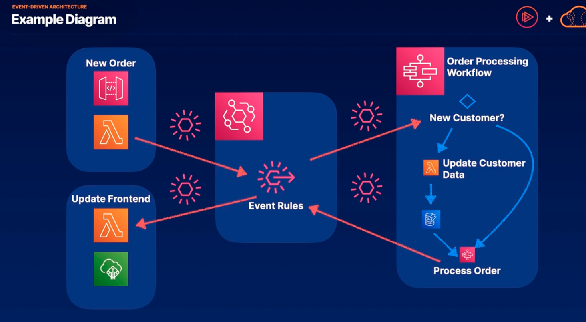

# Event-Driven Architecture 

https://pages.awscloud.com/global-ln-gc-300-build-eda-ent-guide-learn

- how to stitch together the appropriate serverless services to create application architectures 
    1. that can scale down to zero and scale up to meet need. 
    2. This keeps costs low and performance high 
    3. follows the best practices of the well-architected framework.

- trigger asynchronous events across your AWS environments with events
- an event is any change in state or update signaled by an event producer
- event routers filter and push events and their payloads to event consumers
- event consumers use the payloads to update state and make backend changes

- using event bridge as a backbone we can deliver events to and from many different AWS services

## Defining Serverless
- A service is considered serverless:
    1. no server management: patches and OS updates are handled by the provider i.e. Lambda
    2. flexible scaling: our application scales automatically within bounds we define
    3. high availability: availability and fault tolerance are built in by default
    4. scales to zero: there is no idle capacity when services are not in use

- Not all AWS services with serverless in the name do not meet the criteria above services such as: Aurora serverless, neptune serverless, EMR serverles and opensearch serverless. 
    - These are the best-fit versions for serverless applications at this time. 
    - So if we need a relational database serving a serverless application Aurora serverless is likely the best option and it also allows for scaling up to meet demand. But it does have a minimum size and minimum cost in that it doesnt quite scale to zero.

## The Main Players in Event-Driven Architecture
- serverless and event-driven could be synonymous 

1. Lambda gives us serverless compute for custom logic 
2. EventBridge is an event bus for choreographing asynchronous events. we can create event rules to filter events and send them to the appropriate destination
3. Step Functions orchestrates workflows involving many services. when we have a stateful synchronous workflow we can use step functions
4. SQS, simple queue serivce is an event buffer for decoupling serverless workflows. 
5. Simple Notification Service is used to send events to subscribers, including email. These subscribers can be services or can be emails to human subscribers
6. API Gateway is a way to receive events triggered by external producers, a front-end application would be an example of a external producer.
7. DynamoDB is a scalable, serverless, NoSQL database service. this is optimized for event-driven architecture.
8. S3, simple storage service is object storage that can emit events on bucket actions

## Orchestration vs Choreography
1. Orchestration involved orchestrating a workflow which can involve things like decision trees or retrys. These are more highly coupled workflows that are often orchestrated in AWS step functions
2. Choreography involves the asynchronous coordination of many event producers and consumers. Event orchestrators such as step functions can be a part of choreographed serverless ecosystems

### Example

Above, we have a frontend application and it can produce a new order. When producing a new order we may make a call to an API gateway which triggers a Lambda then you have our central event hub, EventBridge where we define rules. 
   - These event rules will determine where that order data is sent when the lambda function is triggered. 
   - On the backend, we may have a workflow in step functions that determins whether the event comes from a new customer or from an existing customer. In either way, this will call a new step function which will process the order.
   - so our lambda function is triggered which sends the event to our event bus which then sends it to the appropriate service which in this case, the step function service
   - once the order is processed we'll need to update the front-end. in this case, we're using a lambda function and IoT core as a web socket.
   - once the order is processed, a new event will be produced and directed to the event bus. EventBridge will filter and push the event to the update front-end Lambda which in turn will send it to the frontend application to be seen by the end user

## Summary
1. Choreograph asynchronous events: EventBridge allows you to set up event rules and asynchronously choreograph the flow of events across many services on AWS
2. Orchestrate serverless workflows: when maintaining state, idempotency, or dependent events are necessary, use Step Functions to orchestrate events across services
3. Choose Serverless for new solutions: serverless is often a great option for migrating small workloads to AWS. It is necessary to understand the use cases for all of the main players of serverless architecture.