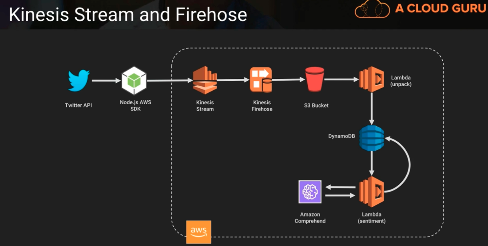

# Kinesis -> a collection of services for processing streams of various data

https://github.com/ACloudGuru/Does-Twitter-Hate-Cats

- data is processed in shards with each shard able to ingest 1000 records per second
- a default limit of 500 shards, but you can request an increase to unlimited shards
- records consist of Partition key, sequence number and data blob (up to 1MB)
    - when a piece of data comes into kinesis, its called a record 
- transient data store - default retention of 24 hours but can be configured for up to 365 days (8760 hours). We still shouldn't treat this as a persistent data store; its just a way to gather in data at a very high rate of speed and then we have to do something with the data such as write it to a database or S3 or process it through Lambda

## Kinesis Video Streams
- one of the newer flavors is the ability to process video streams (not on exam)

## Kinesis Data Streams
- one of the flavours that allows us to ingest a high volume of data and then process it through a variety of ways

## Kinesis Fire hose
- one of the flavours that allows us to automatically send that data to a variety of landing spaces. 
- So we don't have to process it right then and there we can land that data in some other system or service. We can actually do analytics on the data as its coming in. We dont have to wait until it gets landed in a data warehouse before we start looking at analytics on the data

## Kinesis Data Stream Key Concepts
- Kinesis processes things in shards. we can think of shards as lanes in a highway. the more lanes in a highway the more traffic can go through at one time. The more shards we have, the more traffic can go through. 
    - With our data coming in, our data gets divided up into those shards. Then ultimately it gets passed onto either fire hose where it gets landed, maybe in S3 or Redshift or we can have applications called consumer applications (they read these shards and pick up the data and then they can process it)

    - Kinesis processes data where each shard is given a partition key(128 bit MD5 hash) and unique to each shard.
        - each piece of data as it comes into the shard gets assigned a sequence number (these numbers are always increasing). We can use the sequence number inside a given partition key to decide the newness relative to some other piece of data in that same shard. Sequence numbers can be duplicated across shards.
        - to uniquely identify your data you really have to use that partition key and that sequence number

## Kinesis Strea and Firehose

Above,
twitter api brings in tweets via kinesis and then using firehose, we landed them on an S3 bucket. Once they hit the S3 bucket, we then triggered a Lambda routine which unpacked that tweet and stored it in a dynamoDB database. We then did text analysis to try to figure out whether that tweet was friendly or not so friendly
