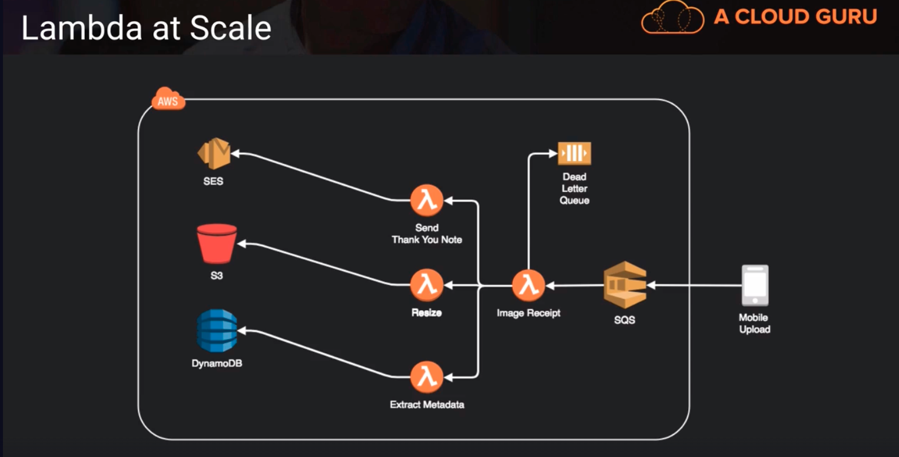

# Lambda, Serverless Application Model and EventBridge

## AWS Lambda
- allows us to run code on-demand without the need for infrastructure. So we run functions rather than whole applications on an EC2 instance or RDS database for example
- supports Node.js, Python, Java, Go and C# (there is way to create our own language interpreter and use that instead)
- extremely useful option for creating serverless architectures
- code is stateless and executed on an event basis (SNS, SQS, S3, DynamoDB Streams, etc). Once it executes is goes away, it doesnt really keep up with any sort of data
- no fundamental limits to scaling a function since AWS dynamically allocates capacity in relation to events. No limites to how many Lambda functions can be executed at one time. This allows it to scale aggressively at a very low cost

### Lambda at Scale

Above, 
one common architecture is a fan-out architecture. We get a piece of data in or some sort of instruction in and then we use a lambda function to then launch maybe three other parallel lambda functions. and those go about their business doing the activity. The idea here behind this architecture is that we are going to be able to fan out on many different threads to do a work or task.

## AWS Serverless Application Model (SAM)
- open source framework for building serverless apps on AWS
- uses YAML as the configuration language
- includes AWS CLI-like functionality to create, deploy, and update serverless apps using AWS services such as Lambda, DynamoDB and API Gateway
- enables local testing and debugging of apps using a Lambda-like emulator via Docker
- extension of CloudFormation so we can use everything CloudFormation can provide by way of resources and functions (creates CloudFormation templates in the background and that's what creates the AWS resources)

### AWS Serverless Application Repository
- a repo of pre-made serverless apps that we can just use and model after and learn from 

## AWS SAM vs Serverless Framework
- AWS SAM
    1. uses YAML for templates
    2. purpose-build to help make developing and deploying serverless apps as efficient as possible
    3. generates cloudformation scripts

- Serverless Framework
    1. uses YAML for templates
    2. purpose-built to help make developing and deploying serverless apps as efficient as possible
    3. generates CloudFormation scripts
    4. supports many other cloud providers such as Azure, GCP, IBM, CloudFlare, etc

## Amazon EventBridge
- designed to link variety of AWS and 3rd party apps to rules logic for launching other event-based actions i.e. Lambda function or SNS event
- designed to link AWS and 3rd party apps. so it brings a lot of pre-integrated 3rd party services that you can very easily hook into the events that some of the serverless services on AWS support
    - for example, if someone creates a ticket we can trigger a lambda function to do something like a reset a password
