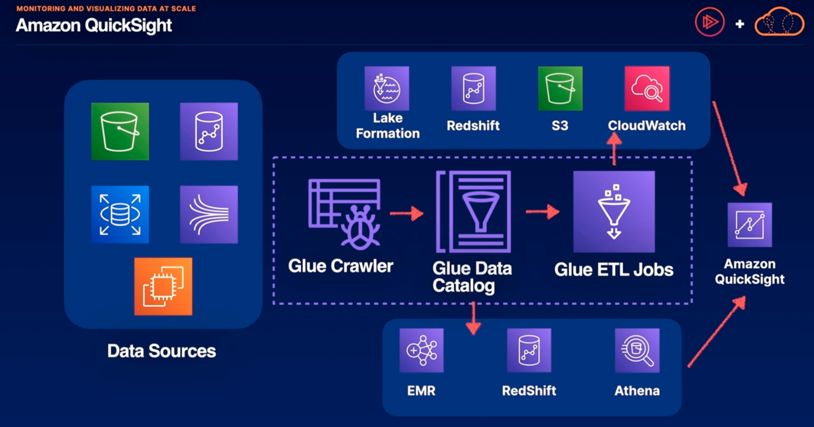

# Monitoring and Visualizing Data at Scale

## The challenges of collecting data
- we have logs, metrics, and statistics stores in databases and we want to make business decisions based on insights derived from our collected data but there can be a disconnect between the data collected and analyzing it to make business decisions.

## Amazon Quicksight -> serverless pay-per-user service for business intelligence (BI) and business analytics
- low cost compared to other BI solutions
- uses SPICE and AutoGraph technologies 
    - SPICE is an in-memory cache for super fast data analytics
    - AutoGraph is a technology that supplies a best fit graph given a set of data
- accessible from web browsers or mobile applications
- creates hybrid datasets from multiple sources (so not all of the data in a given data visualization has to be from a single data source)
- can leverage AWS AI/ML for natural language queries and automated insights

### Supported Data Sources
- there are a ton of data sources that QuickSight can directly ingest.

| Supported Data Source for QuickSight | its important to check documentation to understand the current supported data sources          |     |
|:-------------------:|:--------------:|:----------------:|
| AWS Native Services | Popular Relational databases | 3rd party data sources, but this list is ever growing |
| Amazon Athena       | Apache Spark 2.0+ | Snowflake    |
| Amazon Aurora       | Exasol 7.1.2+     | Jira    |
| Amazon OpenSearch   | MariaDB 10.0+     | Salesforce    |
| Amazon RedShift     | Microsoft SQL Server 2012+   | ServiceNow     |
| Amazon S3           | MySQL 5.1+   | Adobe Analytics    |
| Amazon RDS          | Oracle 12c+   | Github    |
| AWS IoT Analytics   | PostgreSQL 9.3.1+   | Twitter    |
| Amazon Timestream   | Presto 0.167+   |     |
|                     | Teradata 14.0+  |     |

Above,
- QuickSight can ingest other data sources if supported by AWS Glue
    - AWS Glue can extract, transform and load data from many different sources and deliver that data to Amazon QuickSight
        - First we would provision a Glue Crawler to assemble the data we would like to analyze.
        - From this data we would create a Glue Data Catalog and this can be analyzed directly in EMR, stored in RedShift, or queried with Athena
        - We also create ETL jobs to deliver these two other AWS services such as Lake Formation, Redshift, S3, or CloudWatch
        - once we've extracted, transformed and loaded the data into the appropriate service we can then deliver this highly customized dataset to QuickSight for analysis.

## Amazon OpenSearch -> an open-source search and analytics suite forked from ElasticSearch
- provides AWS-managed OpenSearch clusters
- create opensearch dashboard or use built-in Kibana
- visualize, search, and analyze data in real time
- more advanced querying and lower cost at scale compared to cloudwatch

1. when we have many accounts delivering messages, log files, configurations, and documents to any kind of centralized account, its often a great solution to use OpenSearch to make sense of those logs
2. OpenSearch can also be used to create search functionality in our custom application through the AWS CDK

## OpenSearch as a Data Source
- if we want to share our opensearch findings as business data, opensearch can also be used as a data source for QuickSight.
    - not only can opensearch be used to boost visibility on log file metrics, it can also be used as a data source to visualize data in Quicksight

## Summary
1. QuickSight is AWS-native BI service: visualize our business data and share data insights with users in our QuickSight application. Consume data from many sources.
2. OpenSearch provides Open Source Analytics: if we already have experience with ElasticSearch or Kibana, OpenSearch may be a great choice for any AWS-managed service. it can also power search apps.