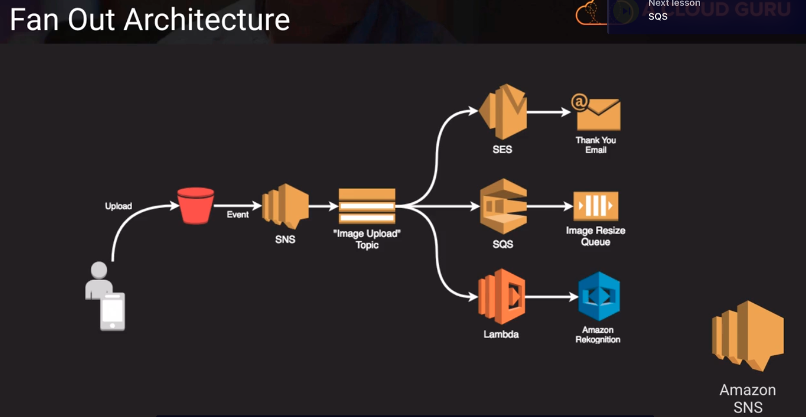

# SNS, Simple Notification Service

- enables a publish/subscribe design pattern
- topics = a channel for publishing a notification (sort of like an inbox but really an outbox)
- subscriptions = configuring an endpoint to receive messages published on the topic
- endpoint protocols include HTTP(S), email, SMS, SQS, and Amazon Device Messaging (push notifications) and Lambda

## Fan Out Architecture

- Above, is a design pattern that is useful for doing things in parallel. 
    1. So we can have some event, maybe a user uploads an item and it goes into SNS.
    2. Then we have this image upload topic and whenever something gets inserted into that topic then we have configured three different endpoints that get notified of that message coming in
    3. we have simple email service, which sends a thank you note back to the user 
    4. we have SQS which takes that image and puts it into a resize queue so it can be worked on by worker EC2 instances
    5. then also subscribing to this topic is a Lambda function where maybe we run that through some image analytics

- SNS is very useful when you need to do these types of architectures where we have several processes that can run in parallel