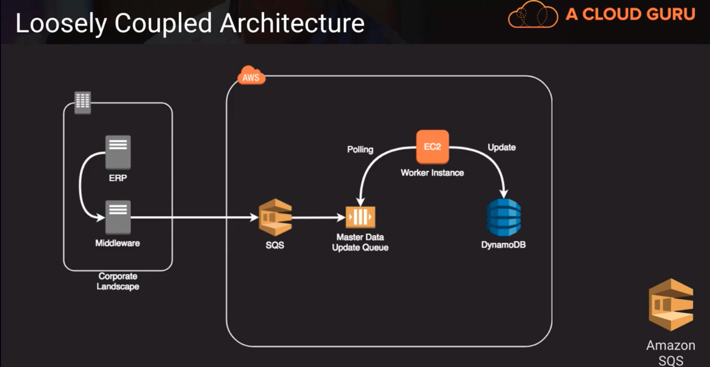
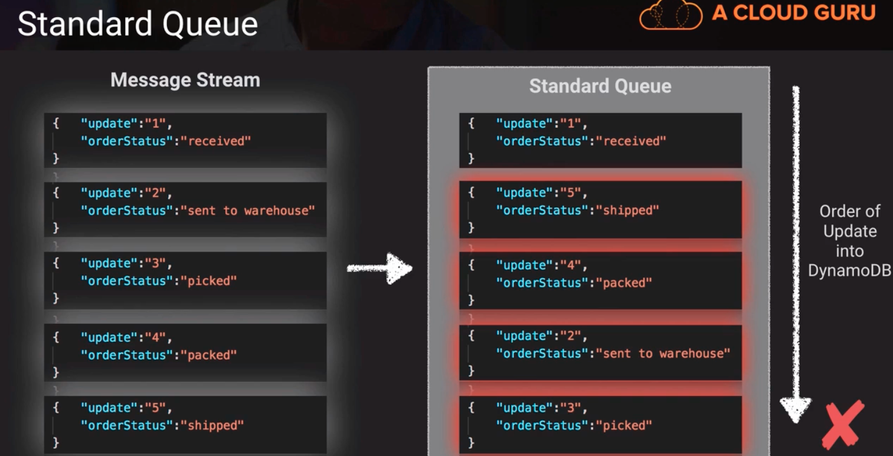
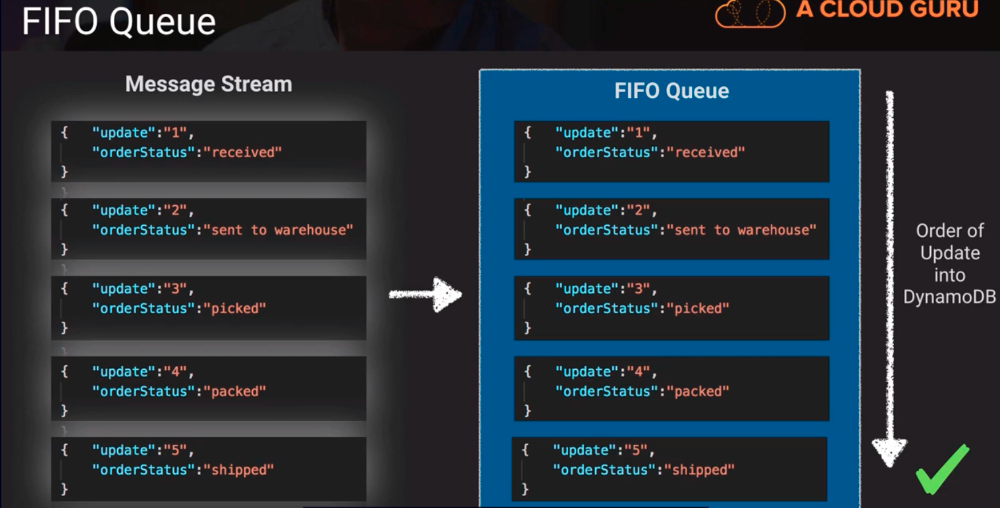

# SQS, simple queue service -> highly scalable and reliable hosted messaging queue.
- available integration with KMS for encrypted messaging
- transient storage-default 4 days, max 14 days (not a longterm storage)
- optionally supports First-In First-Out queue ordering
- maximum message size of 256KB but using a special Java SQS SDK, you can have messages as large as 2GB
    - this stores the message on S3 and then creates the SQS message as a pointer to that S3 message

## Loosely Coupled
A significant benefit of a queueing pattern is the ability to create more loosely coupled architectures 
   - this permits portions of the interface chain to tolerate downtime, or temporary outages without disrupting the whole chain. 
   - allows us to govern the data flow better

### Example - Loosely Coupled Architecture

Above,
we have an ERP system that's generating messages, Master Data Updates. The middleware lands these messages into an SQS queue, where they're then picked up by an EC2 worker instance, maybe for some transformation, or some augmentation. They're then updated into DynamoDB. 
   - Suppose the message traffic comes intermittently, maybe a thousand updates within a few minutes due to a mass change. We could scale horizontally by adding more worker instances and process through that queue faster if we need to.

## Standard Queue

Above,
 In a standard queue, we have no assurances that the messages will enter or leave the queue based on when they arrived. And for a ongoing process, this could present some risk. 
   - The message stream we're receiving is update one, update two, update three, and so forth. We can see there's various steps to process. Update one is received, update two is sent to warehouse, update three is picked, and so forth. 
   - Now if we just have a standard queue, we have non guarantee that we're going to be able to process those messages in order. So if we're continually updating the same record. in this case the final update would be update three picked, which would be incorrect because we've already shipped this product.

## FIFO Queue   

Above,
 We can swith over to FIFO Queue, that will maintain the order in which the messages were received. The big tradeoff in this is that enforcing this order processing means that if a message fails or gets stucks, it's going to hold up all the other messages behind it, this can introduce some latency or delay in clearing queues.

## Amazon MQ -> managed implementation of Apache ActiveMQ, a message broker. Message brokers takes care of taking in messages, managing them, and letting other applications, via API access them. Functions similar to SQS but a different implementation of a messaging queue.
- fully managed and highly available within a region
- Supports the ActiveMQ API and supports JMS, NMS, MQTT for IoT implementations, WebSocket
- designed as a drop-in replacement for on-premise message brokers
- use SQS if you create a new application from scratch because it offers more feature set and is tightly integrated into other Amazon services.
- Use MQ if you want an easy low-hassle path to migrate from existing message brokers to AWS