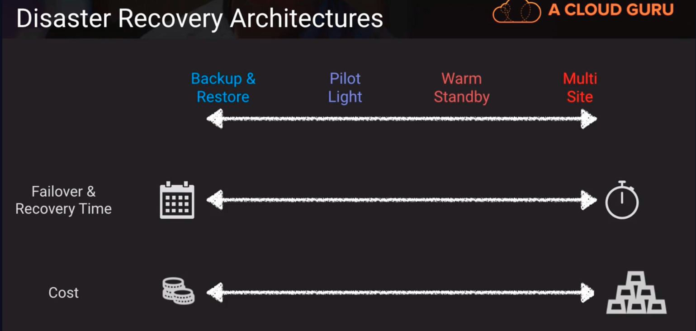
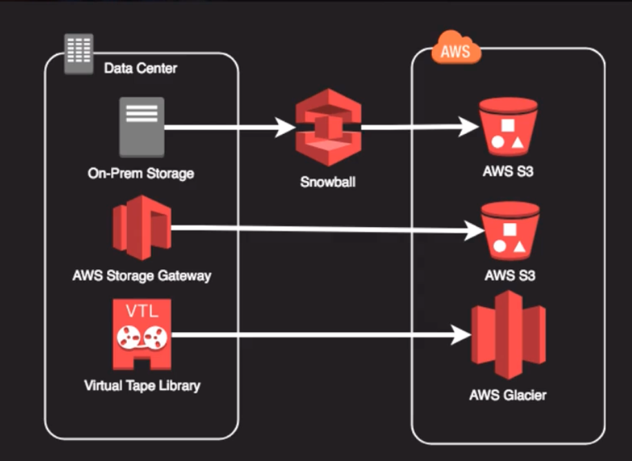
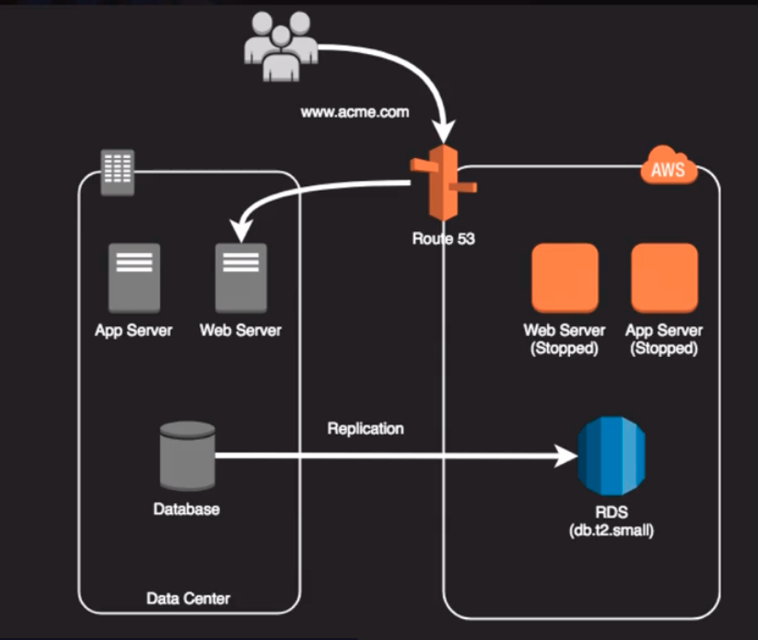
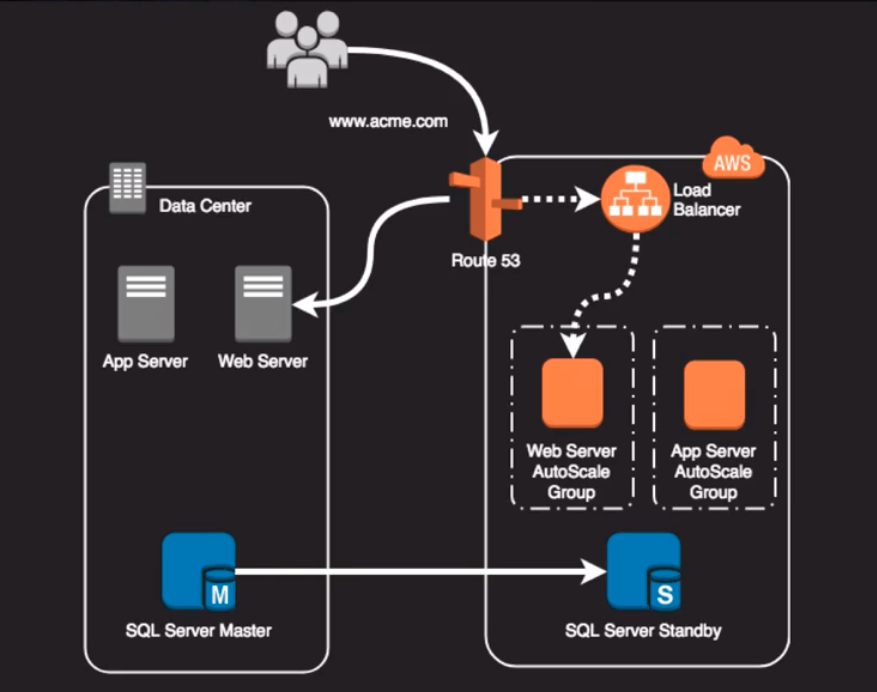
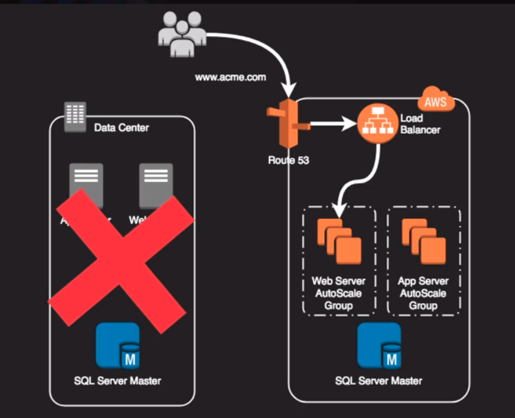
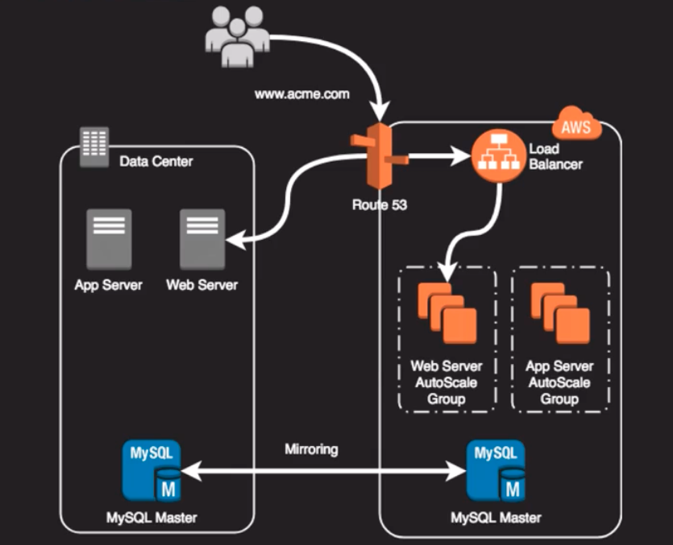
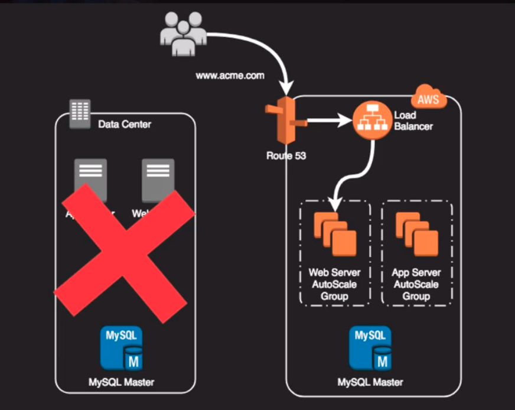

# AWS Continuum of HA 

Above, the ones that take longer cost less. less time, cost much more.

## Backup and Restore
- Pros:
    1. very common entry point into AWS
    2. minimal effort to configure

- Cons:
    1. least flexibility
    2. analogous to off-site backup storage

### Example: 

Above,
- we use snowball to transition some data to S3, or maybe we use the virtual tape library or AWS storage gateway to backup our data to AWS

## Pilot Light
- Pros: 
    1. Cost effective way to maintain a "hot site" concept(like a stand by just waiting for things to happen). we have a very minimal footprint on AWS
    2. Suitable for a variety of landscapes and applications

- Cons:
    1. usually requires manual intervention for failover
    2. spinning up cloud environments will take minutes or hours
    3. must keep AMIs up-to-date with on-prem counterparts, but theres nothing worse than failing over in a disaster only to find out that we're running an old version of our software

### Example:

Above,
 RDS is sychronizing or replicating our on-prem database. We have our replicas of our web server and our app server. 

Above,
 if theres a failure at our main data center, we will start those web servers and application servers in AWS

## Warm Standby
- Pros: 
    1. All services are up and ready to accept a failover faster within minutes or seconds
    2. Can be used as a "shadow environment" for testing or production staging

- Cons:
    1. Resources would need to be scaled to accept production load
    2. Still requires some environment adjustments but could be scripted

### Example

Above,
we have our app server and web server. we have our SQL server master. we also have a SQL server standby and these two are kept in sync. we've already got our load balancer set up but using route53 were not directing any traffic to the load balancer

Above,
if we have a failure for our on-prem data center, we cna change over route53 to send that load to our load balancers and then our web servers and app servers would scale up to meet the incoming demand

## Multi-Site
- one of the best ways we can ensure very little downtime, because we have a landscape that's built out on AWS thats ready to accept load at any time

- Pros:
    1. Ready all the time to take full production load--effectively a mirrored data center
    2. Fails over in seconds or less
    3. No or little intervention required to fail over

- Cons:
    1. Most expensive DR option
    2. Can be perceived as wasteful as we have reources just standing around waiting for the primary to fail

### Example:

Above, 
this method can fail over in seconds or less. requires little or no intervention. i.e. if we use route53, we can use the health check to auto failover to a different load balancer or different servers. based on route53 saw the target system as being online or not. DNS requires usually have TTL so there might be some customer impact until the DNS entry pointing to the failed site totally expires. but theres nothing that we have to do in this failover scenario

Above,
if we have a failure, route53 could just redirect the traffic to the load balancer and then our web servers and app servers that are ready and waiting would just pick up that load.