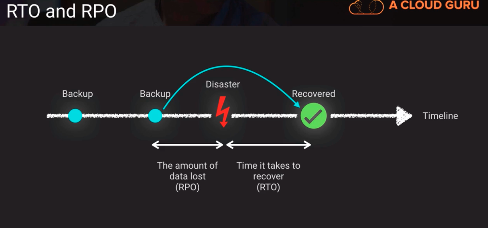

# Business Continuity Concepts

- AWS S3 Availability Goal is 99.99% which is 52 minutes disruption per year
1. Business Continuity (BC) -> seeks to minimize business activity disruption when something unexpected happens
2. Disaster Recovery (DR) -> act of responding to an event that threatens business continuity
3. High availability (HA) -> designing in redundancies to reduce the chance of impacting service levels
4. Fault tolerance -> designing in the ability to absorb problems without impacting service levels
5. Service Level Agreement (SLA) -> an agreed goal or target for a given service on its performance or availability
6. Recovery Time Objective (RTO) -> time that it takes after a disruption to restore business processes to their service levels (T is for Time)
7. Recovery Point Objective (RPO) -> acceptable amount of data loss measured in time (P is for data that goes "poofs")

Above,
the amount of time between the disaster happening to fully recovered is RTO.

- Most business continuity plans define acceptable recovery point objectives and recovery time objectives. RTO and RPO have to support the business continuity plan because the authors of the BC plan have to have certain assumptions for how long services are going to be unavailable or how much data gets lost.
    - RTO and RPO then justify the level of high availability investment we want to make. They also define what our process is for disaster recovery because ultimately, high availability is going to try to mitigate the act of having to do a disaster recovery
    - but if we do have to do a disaster recovery its going to deliver or fulfill those RTO and RPO objectives

## Disaster Categories

| Category | Example |
|:--------:|:-------:|
| Hardware Failure | Network switch power supply fails and brings down LAN |
| Deployment Failure | Deploying a patch that breaks a key ERP business process |
| Load Induced | Distributed Denial of Service attack on our website |
| Data Induced | Ariane 5 rocket explosion on June 4, 1996 where the rocket control software suffered a failure when it was trying to do a data conversion from a 64-bit floating-point value into a 16-bit signed integer, and that caused the onboard processor to go out of control and initiate self destruct |
| Credential expiration | an SSL/TLS certificate expires on our eCommerce site |
| Dependency | S3 subsystem failure cause numerous other AWS service failures |
| Infrastructure | a construction crew accidently cuts a fiber optic data line |
| Identifier exhaustion | "We currently do not have sufficient capacity in the AZ you requested" |