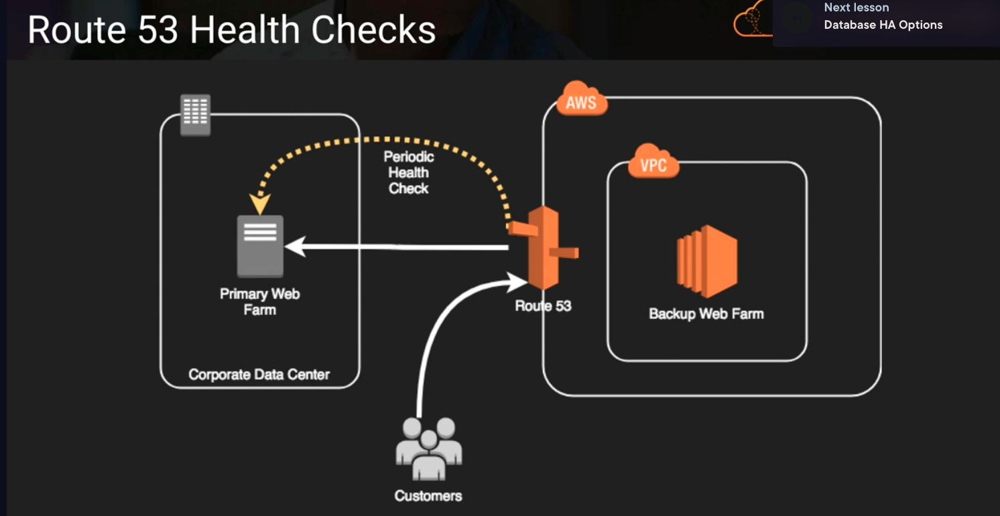
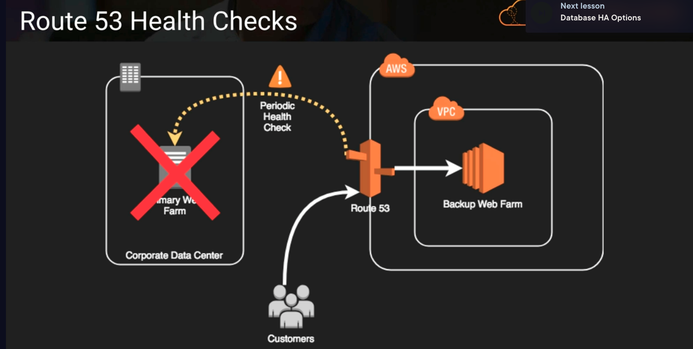

# Compute Options

## HA Approaches for Compute
- up-to-date AMIs are critical for rapid fail-over
- AMIs can be copied to other regions for safety or DR staging
- horizontally scalable architectures are preferred because risk can be spread across multiple smaller machines vs one large machine
- reserved instances is give us a higher priority for launching instances in a specific availabilty zone, but they do not guarantee that we will always be able to launch an instance. 
- On-demand capacity reservations guarantee that we will be able to launch an instance of the specified type in a specific availability zone, subject to availability at the time of reservation creation.
- auto scaling and elastic load balancing work together to provide automated recovery by maintaining minimum instances
- route53 health checks also provide self-healing redireciton of traffic

### Route53 Health Checks

Above,
we use route53 to route traffic to an on-prem web farm. we can do route53 health checks on anything that has a HTTP endpoint

Above,
if the web farm failed, we would just redirect traffic to our backup web farm on AWS and this requires no input from us