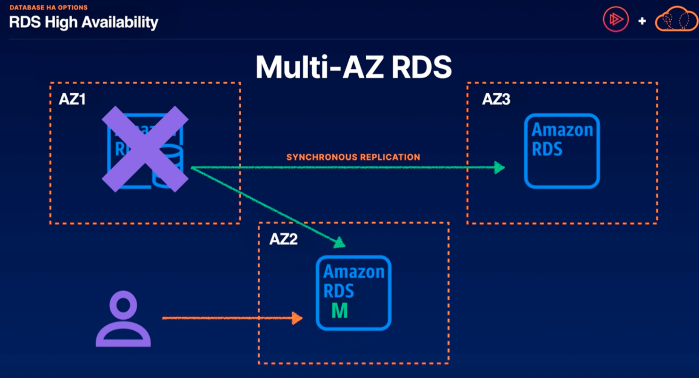
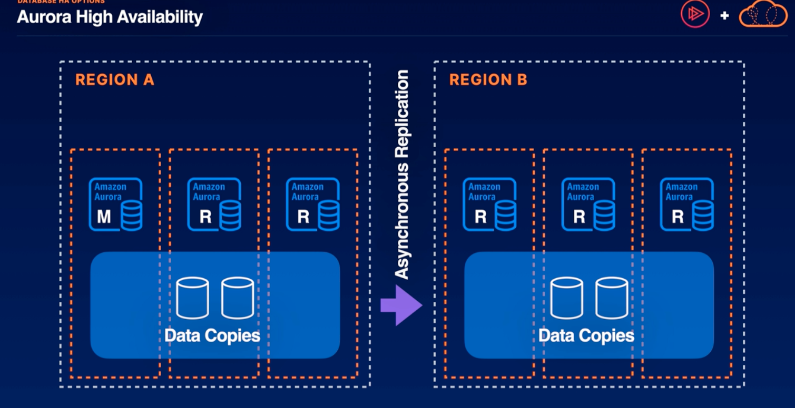
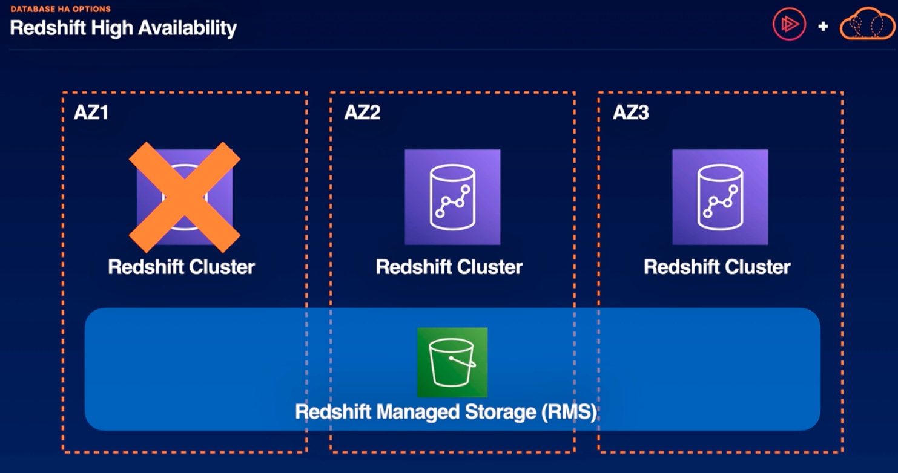

# Database HA Options

## Choosing the right database

| High operational efficiency and less control |    |   | low operational efficiency and more control |
|:-------------:|:-------------:|:-----------:|:-----------:|
| DynamoDB - possesses high operational efficiency and less control | Aurora - lesser high operational efficiency and a bit more control | RDS - more low operational efficienct and less control | EC2 databases - possesses low operational efficiency and more control |

- DynamoDB is the best highly available database for noSQL data solutions. We can still control read and write capacity whether or not its a global table or regional table.
- Aurora requires little operational overhead to make it multi-AZ or even multi-region. For relational data, it is the best database for high availability.
- RDS is highly available with multi-AZ deployments. gets a little trickier if we want a multi-regional solution. the multi-AZ instances cant serve traffic on RDS
- EC2 where we can run any database engine on EC2, but we would be in charge of autoscaling and how to ensure that our application is highly available

## DynamoDB High Availability
- distributes data and incoming traffic across partitions by default
- partitions are replicated synchronously across three AZs in a region
- global tables allow for multi-region availability and fault tolerance

## RDS High Availability
### Multi-AZ RDS

Above,
These Multi-AZ RDS instances are instances that receive synchronous replication of anything that's written to the main Amazon RDS instance. 
   - All of our read traffic is still going to be going to our Amazon RDS. We can create read replicas but these are separate from our multi-AZ RDS instances. 
   - Multi-AZ is explicitly for failover. So if our main instance fails, one of those multi-AZ RDS instances will pick up where that instance left off.

### Regional Read Replicas
- if one region we have a multi-availability zone RDS cluster and in another region we may continuously replicate to an Amazon RDS instance which is a read replica.
    - in the event of a regional failure, we can promote our regional read replica to receive traffic for our application. we can think of this as the warm standby solution for high availability in the event of a regional failure

### Snapshot Recovery
- when it comes to regional failures if our RTO is a bit more forgiving. If we have an RTO of hours instead of minutes we can use a backup and recovery style high availability model with our RDS instance.
    - in region A, we have a multi-AZ RDS cluster. In region B, we use Amazon S3 to store periodic snapshots of our multi-AZ RDS cluster.
        - in the event of a regional failure, we can simply restore one of those snapshots to region B. Its important to understand our RTO and RPO because depending on the frequency of those snapshots we may incurring some loss of data with that recovery

## Aurora High Availability
- allows us to have a main instance and multiple read replicas distributed across availability zones within a region. the data from the main Aurora instance will be synchronously written to data copies distributed across these availability zones
    - unlike RDS, Aurora is able to receive read traffic to all of those instances acting as backups to our main instance. 
    - In the event of a failure of our main instance, Aurora will automatically promote one of our read replicas to become the main instance

### Global Databases
- a feature of Aurora
- one primary region and up to five secondary regions
- data replicates from primary to secondary regions with low latency
- leverages storage-level replication for transferring data
- secondary region can be promoted in case of outage or regional failure

### Example

- Region A where data copies are distributed across multiple availability zones and our main instance exists there in region A
- Region B and up to four other secondary regions, we can have read replicas distributed across availability zones within their own data copies that are synchronously replicated with low latency
- in the event that region A totally fails we can promote one of the instances in region B to become the main instance with very low RTO.

## Redshift High Availability
- only RA3 instances support multi-AZ deployment
- best option for HA otherwise is a multi-node cluster (means our redshift database is split into multiple nodes in the same availability zone)
- single-node clusters will have to be restored from S3 snapshot on failure

Above,
- for the RA3 instances when they're spread across multiple availability zones, Redshift high availability will act a little bit differently than the other databases we've explored so far.
    - if we have a multi-AZ deployment with RA3 instances, we are going to be leveraging something called Redshift Managed Storage (RMS). RMS is basically hosted in S3 and therefore spans all of our availability zones. its really only the compute later and a memory cache thats stored in that redshift instance. 
    - because its leveraging this clever storage mechanism, if a redshift cluster fails and we need to continue to serve the same amount of traffic it will actually provision a new redshift cluster in a 3rd availability zone which will continue to serve traffic to that same endpoint once its up and running

1. Redshift uses multi-node clusters for HA: while Redshift RA3 instances allow for multi-AZ deployments, most redshift clusters use multi-node clusters for HA within a single AZ