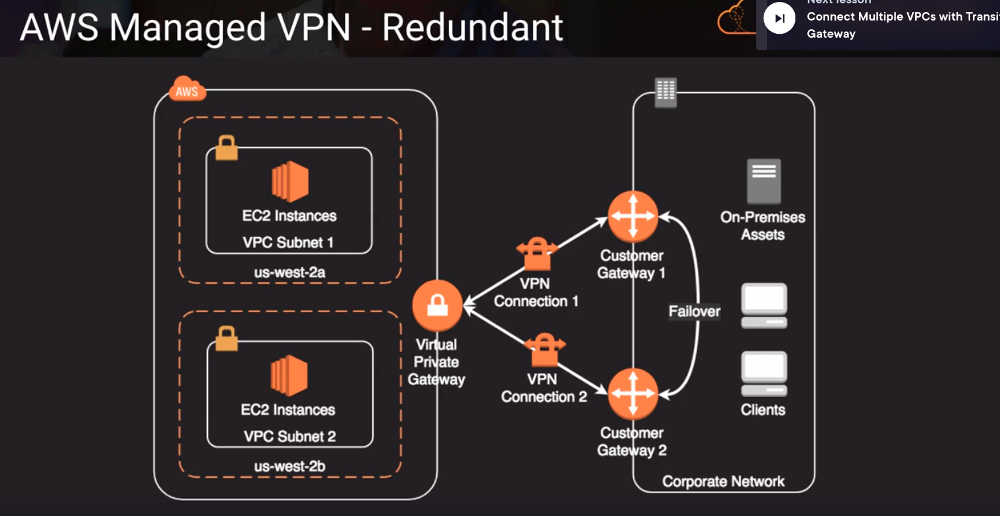
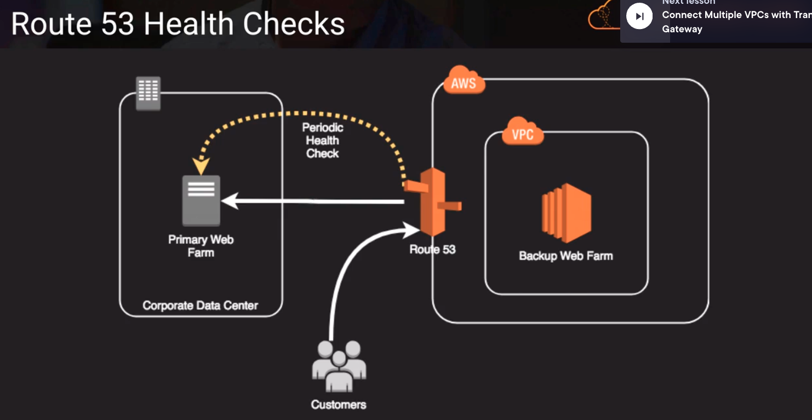
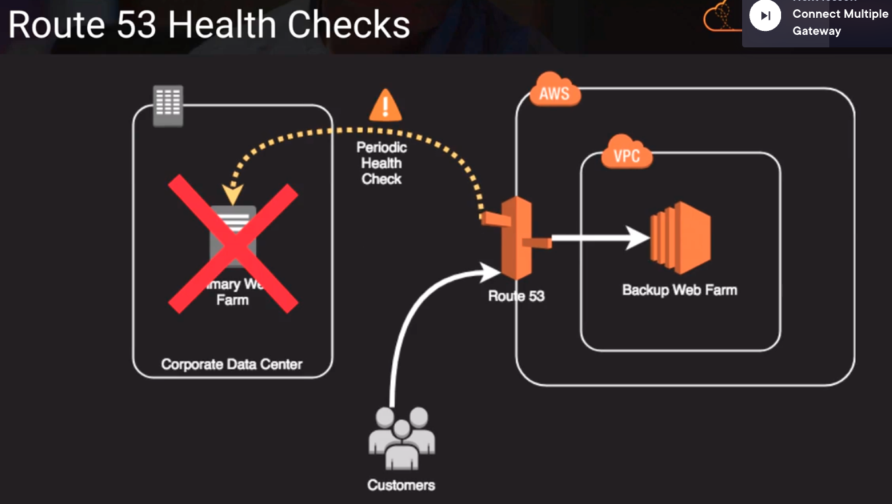

# Network HA Options

## HA Approaches for Networking
- by creating subnets in the available AZs, we create multi-AZ presence for our VPC
- best practice is to create at least two VPN tunnels into our Virtual Private Gateway
- Direct Connect is not HA by default, so we need to establish a secondary connection via another Direct Connect (ideally with another provider) or use a VPN
- Route53's health checks provide basic level of redirecting DNS resolutions
- Elastic IPs allow us flexibility to change out backing assets without impacting name resolution
- for multi-AZ redundancy of NAT Gateways, create gateways in each AZ with routes for private subnets to use the local gateway

### Example AWS Managed VPN - Redundant

Above,
we're handling the failover on the customer side

### Example Route53 health checks

Above,
we can use Route53 to do a health check 

Above, 
we then redirect traffic if our primary web server fails