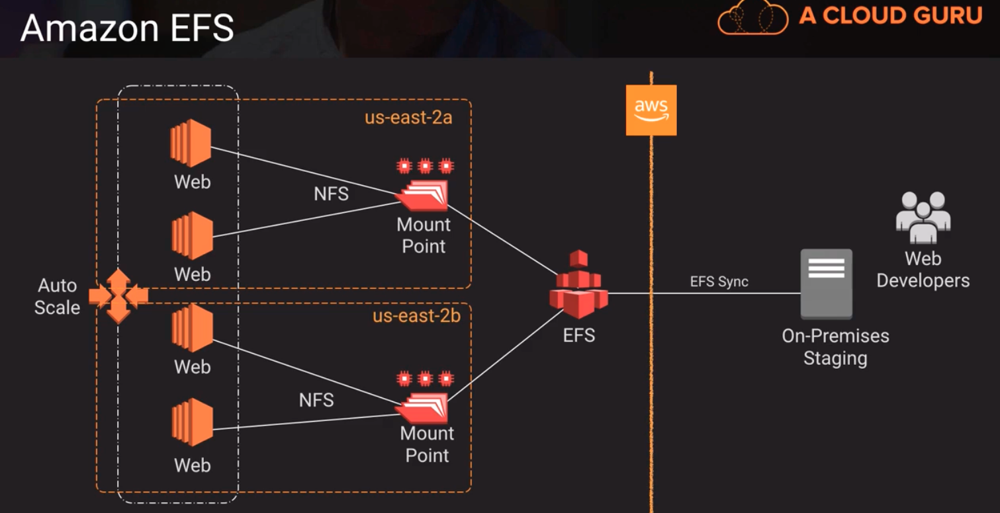
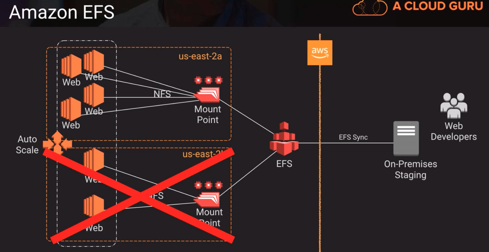

# Storage HA Options

## EBS Volumes

- annual failure rate less than 0.2% compared to commodity hard drive at 4%. (given 1000 EBS volumes, expect around 2 to fail per year)
- availability target of 99.999%
    - this availability is achieved by automatically replicating within a single AZ 
        - this leaves us vulnerable to AZ failure, so we should plan accordingly
- easy to snapshot, which is stored on S3 and multi-AZ durable
- we can copy snapshots to other regions as well
- supports RAID configurations

### RAID Configurations
- RAID 2,3,4 aren't really used nowadays
- parity bit allows us to recover information if one of those drives is removed or fails. So we can add an empty drive and RAID5 can calculate whats missing and recreate that data
- AWS doesnt recommend using RAID5 or RAID6, because EBS volumes are accessed over a network. Writing those parity bits, sucks up a lot of IO. It can consume as much as 20 and 30% of our available IOPS

|    | RAID0 | RAID1 | RAID5 | RAID6 |
| Redundancy | None (sometimes called striping, we distribute load across multiple I/O devices) | 1 drive can fail (sometimes called mirroring, duplicate copies reduces our capacity by 50%). A little bit slower on reads and writes than RAID0 | 1 drive can fail(minimum of 3 drives where 2 drives store data and 1 drive stores a parity bit) | 2 drives can fail (minimum of 4 drives; has two methods of parity; primary parity method and secondary parity method and we can permit two drives to fail out a RAID6 array) |
| Reads | **** | *** | **** | **** |
| Writes | **** | *** | ** | * |
| Capacity | 100% | 50% | (n-1)/n | (n-2)/n |
| Disk Layout | A1, A2, A3, A4, A5, A6, A7, A8 | A1, A1, A2, A2, A3, A3, A4, A4 | A1, A2, Ap, B1, Bp, B2, Cp, C1, C2, D1, D2, Dp | A1, A2, Ap1, Ap2, B1, Bp1, Bp2, B2, Cp1, Cp2, C1, C2, Dp2, D1, D2, Dp1 |

### RAID IOPS and Throughput
- volume type: ESB Provisioned IOPS SSD (Io1)

|   | Volume Size | Provisioned IOPS | Total Volume IOPS | Usable Space | Throughput |
| No RAID | (1) 1000 GB | 4000 | 4000 | 1000 GB | 500 MB/s |
| RAID0 | (2) 500 GB | 4000 | 8000 | 1000 GB | 1000 MB/s |
| RAID1 | (2) 500 GB | 4000 | 4000 | 500 GB | 500 MB/s |

- Above,
for RAID0 our throughput is doubled because we are spreading our load across multiple drives
for RAID1 because we are duplicating the data across both those drives, our usable space is cut in half but our throughput remains the same.

## S3 Storage
- standard storage class (99.99% availability = 52.6 minutes/year)
- standard infrequent access (99.9% availability = 8.76 hours / year)
- one-zone infrequent access (99.5% availability = 1.83 days / year)
- eleven 9s of durability (99.999999999)
- standard & standard-IA have multi-AZ durability; one-zone only as single AZ durability
- backing service for EBS snapshots and many other AWS services

## Amazon EFS
- implementation of the NFS file system
- true file system as opposed to block storage (EBS) or object storage (S3)
- file locking, strong consistency, concurrently accessible
- each file object and metadata is stored across multiple AZs
- can be accessed from all AZs concurrently
- mount targets are highly available

Above,
we have an EFS volume and mount points. 

Above,

if one of the AZ's fail, we can continue to scale out our web servers and they would point to that mount point thats available in whatever local AZ they happen to come up in.

## Other Options
1. Amazon Storage gateway
    - good way to migrate on-prem data to AWS for offsite backup
    - best for continuous sync needs
2. Snowball
    - various options for migrating data to AWS based on volume
    - only for batch transfers of data
3. Glacier
    - safe offsite archive storage
    - long-term storage with rare retrieval needs