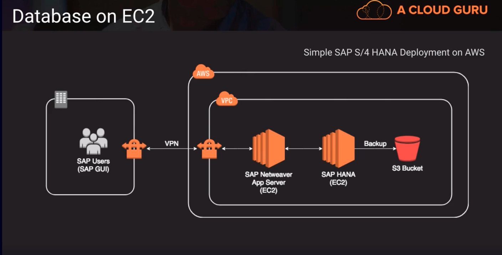

# Database on EC2

- Run any database with full control and ultimate flexbility on EC2
- Would have to manage everything like backups, redundancy, patching, and scale
- Running a database on EC2 is a good option: 
  1. if you require a database that is not yet supported by RDS, such as IBM DB2 or SAP HANA.
  2. if it is not feasible to migrate to AWS-managewd database

Above is an example of running a database on ec2 rather than RDS. This is a minimal SAP installation. Since SAP HANA database isn't supported under RDS so you need to run it on an EC2 instance.
