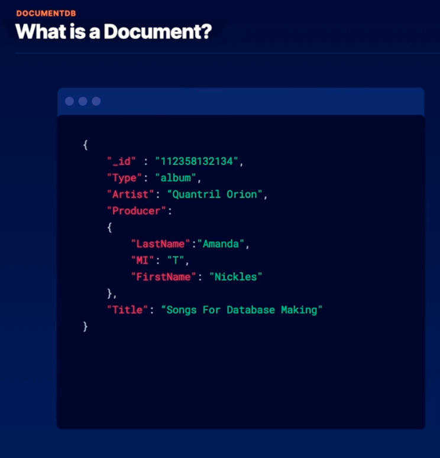

# DocumentDB -> AWS native document data storage
- NoSQL JSON document database service
- compatible with MongoDB APIs( it emulates MongoDB API)
- contains AWS-managed auto scaling (handles multi-AZ and multi-region read replicas)
- supports write-then-read consistency

## What is a document?

A document is a JSON blob.
JSON format -> document databases store Data in JSON. This allows a natural schema which can make development more intuitive.
- Document data is NoSQL data which has a flexible schema, allowing devs to iterate quickly. Devs can add fields or remove them without worrying about breaking some rigid schema.
DocumentDB architecture is similar to Aurora, where you have one main instance and up to 15 read replicas.
Applications accessing documentDB can do so by accessing a reader endpoint that points to all of the read instances. A writer endpoint which points to the main instance. You can create instance endpoints or endpoints that target a certain subset of the instances.
DocumentDB is highly available and reliable

## Use Cases
1. NoSQL document databases
2. User profiles
3. Real-time big data
4. Content management