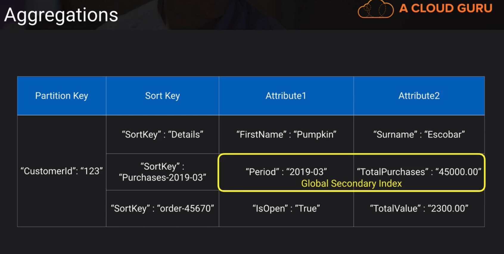
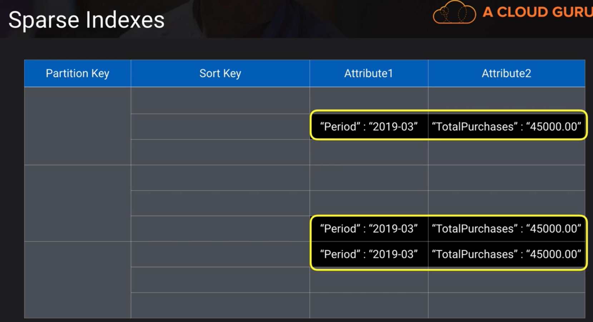
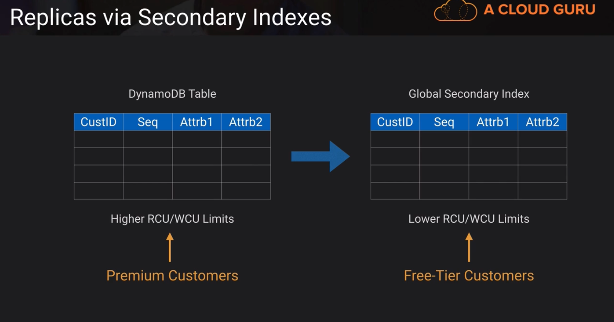

# DynamoDB

https://docs.aws.amazon.com/amazondynamodb/latest/developerguide/GSI.html

- A managed, multi-AZ NoSQL data store with Cross-Region replication option
- Defaults to eventual consistency reads(because it takes time to propagate across regions) but can request strongly consistent read via SDK parameter if its really important that you get the latest data.
Has the compatibility to conduct ACID transactions
- Priced on throughput rather than compute
- Provision read/write capacity in anticipation of need
- Autoscale capacity adjusts per configured min/max levels
- on-demand capacity for flexible capacity at a small premium cost
- Achieve ACID compliance with DynamoDB transactions
The ACID compliance model is Atomic, Consistent, Isolated, and Durable. Atomic transactions are "all or nothing", Consistent transactions must be valid, Isolated transactions can't mess with one another, and Durable means that a completed transaction must stick around.

## Relational vs NoSQL
Relational -> when data is structured very well and deal with entity relationships.
NoSQL -> excels managing name/value pairs.
- A NoSQL record is self-contained and doesn't have to relate to other tables to make sense.
- Attribute -> the name/value pair
- Item -> the whole collection of name and values
- Table -> when many items/records come together
- Partition key -> a unique primary key that identifies a record i.e. "TriumvirateStore" : "1234". The parition key is TriumvirateStore. DynamoDB will use this key to create an internal hash (a way to map a data value of arbitrary size to one of fixed size. It uses this hash to decide which partition or underlying physical storage to store the value. this can be called a hash attribute)
- Sort Key -> when we want composite primary key, it will include the parition key and sort key. We can have occurrences of the same partition key just as long as the sort key is different. (the same hash is done to the parition key but in addition, the records are stored in the sort order of the sort key).. useful if we want to pull back a subset of data based on some sort key. For example, if we have an application that never edits a sales order but just created new versions of it. If we queried only the primary key, we might get back a bunch of records. If we queried the sort key, we'd only back one record.

## Secondary Indexes
| Index Type | Description | How to remember |
|:--------------------:|:---------------------------:|:-------------------------------------------------------------------------------------------------------------------:|
|Global Secondary Index| Partition key and sort key can be different from those on the table| I'm not restricted to just the partitioning set forth by the partition key. I'm global |
| Local Secondary Index | Same partition key as the table but different sort key | I have to stay local and respect the table's partition key, but I can choose whatever sort key I want. |

In order to improve the performance of queries to your DynamoDB table; and when the most common queries do not use the partition key: create a global secondary index with the most common queried attribute as the parition key. 
  - The global secondary index can be used to speed up queries against non-primary key items. They have their own throughput capacity separate to the table. Using the most common queried attribute as the global secondary index's parition key lets us query on it directly.

- Limitation:
  1. There is a limit to the number of indexes and attributes per index
  2. Indexes take up storage space

| Index Type | When to Use | Example |
|:-----------------:|:--------------------------------------------:|:-------------------------------------------------------------------------------------------------------:|
| Global Secondary Index | When you want a fast query of attributes outside the primary key - without having to do a table scan (read everything sequentially) | "I'd like to query Sales Orders by Customer number rather than Sales Order Number" |
| Local Secondary Index | When you already know the partition key and want to quickly query on some other attribute | "I have the Sales Order Number, but I'd like to retrieve only those records with a certain Material Number" |

- When we create an index, we need to select which attributes that will be projected on to that index

- We can increate the speed of read operations with Secondary Indexes and DynamoDB Accelerator (DAX)
  - DAX works as an in-memory cache in front of DynamoDB that can help speed up read operations.

| If you need to.. | Consider..  | Cost | Benefit |
|:----------------:|:-----------:|:------------:|:--------------:|
| access just a few attributes the fastest way possible | Projecting just those few attributes in a global secondary index | Minimal | Lowest possible latency access for non-key items |
| frequently access some non-key attributes| projecting those attributes in a global secondary index | moderate; aim to offset cost of table scans | Lowest possible latency access for non-key items |
| frequently access most non-key attributes | projecting those attributes or even the entire table in a global secondary index | Up to Double | Maximum flexibility |
|rarely query but write or update frequently | projecting keys only for the global secondary index | Minimal | Very fast write or updates for non-parition-key items |

## Aggregations

- In the diagram above, if we wanted to quickly update or pull total purchases across all customers, we could define a global secondary index with period as the primary key and total purchases as an attribute. We can quickly perform aggregations based on date. We can query the table and find out the total purchases across all customers for March 2019

## Sparse Indexes

- if we continue our example of a global secondary index on period, we will notice that not every record has an attribute called period.in DynamoDB, the index will only exist for those items that have the period attribute. The index is smaller and will incur fewer reads and writes.

## Replicas via Secondary Indexes

We can use a global secondary index to create table replicas; we have to use the same partition key and sort key.
When do we do this?
1. When we have two tiers of customers(premium and free-tier). Premium customers, we want to be sure they dont run into perfomance issues. So they can do read/writes against a dynamoDB table with higher RCU/WCU limits. Free-tier customers receive lower RCU/WCU limits
2. With performance reasons, we want to have high write capacities. The original table would have high write capacity limits (writes only from data stream). the global secondary index would have high read capacity limits (read only for analytics) 

