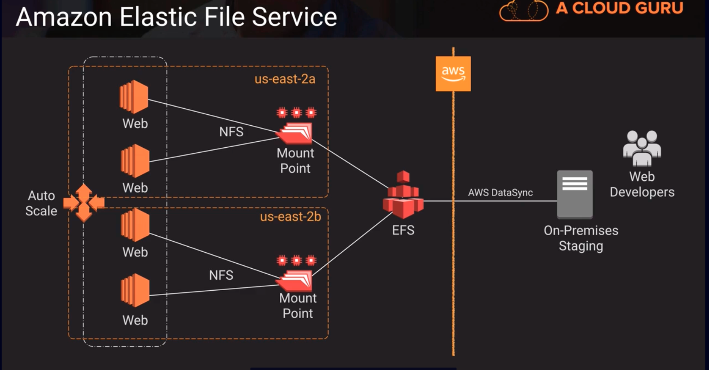

# EFS -> Elastic File System
- An implementation of NFS file share
- Elastic storage capacity, where you only pay for what you use (in contrast to EBS where you have to provision a certain amount of space when you set up a volume)
- Distributed across Multi-AZ in a given region, it has redundancy and resiliency
- Configure mount-points in one or many AZs
- Can be mounted from on-premises systems (recommended to use Direct Connect)
NFS isn't a secure protocol, so its not suggested to run over raw internet. Use a secure tunnel or VPN connection. 
  - Amazon DataSync allows you to make use of a purpose-built protocol to keep storage on-prem in sync with EFS or S3 over a Direct Connect or the internet and it does so securely. It also supports EFS to EFS sync in the case where you might want to keep multiple EFS shares in sync.
1. EFS is about 3 times more expensive than EBS
2. EFS is 20 times more expensive than S3

There are some NFSv4 features that aren't supported, check docs if you happen to need some of those features to make sure that EFS supports those NFS4 features that you may use.

