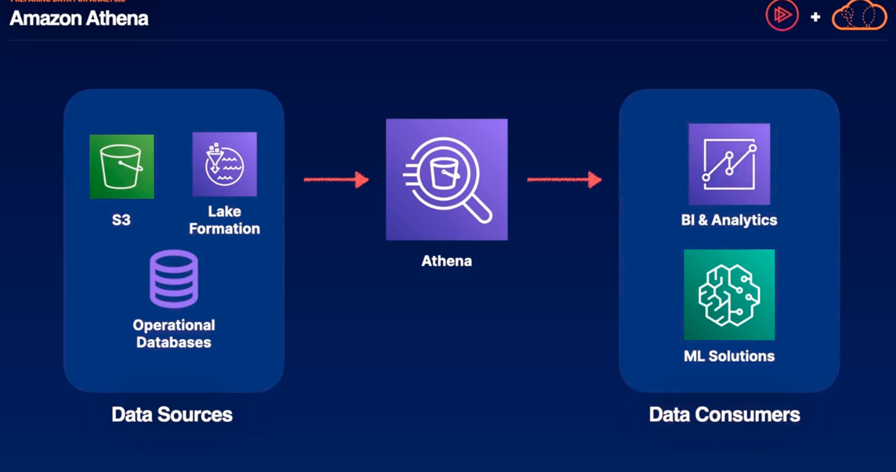

# Preparing Data for Analysis

## Data Ecosystems

We often have data stores that contain alot of data: S3, Data Lake, Redshift, etc. However users can't get much insight into this data unless they use analytics tools like QuickSight or ML SageMaker. However the data in data stores isn't prepared to be delivered to these insight gaining applications and so we need data preparation. AWS Glue and Amazon Athena 

## ETL

ETL -> extract, transform, load
Extract only the subset from our data; the data relevant to our insights
Transform -> sometimes the data isn't in the form that we need or not very clean. It could have duplicates or data in the wrong formats or has unwanted fields. Transforming could be any form of cleaning, de-duplication, combining data from different sources, sorting data or any number of other transformations.
Load -> after data is transformed we can load it into whatever application/data source for analysis

## AWS Glue
AWS main service for ETL at scale
1. Allows us to discover data with Glue crawlers
2. Prepare data with Glue Data catalogs and Glue ETL jobs
3. Integrate data from disparate sources
4. Serverless, AWS handles scaling for you

### Glue Crawler
- Glue Crawler will be given a task to go around our data sources (RedShift, S3, ebs on EC2, RDS, etc) and collect data that meets certain formats. 
### Glue Data Catalogs 
- It stores the metadata for where to find your relevant data in a Glue Data Catalog. Glue Data Catalogs can be leveraged directly by services like EMR, Redshift, or Athena (they can now do searches on the subset of data that you've defined in your data catalog)
### Glue ETL Jobs
    - If that data still isn't in the form that you need, we can also define glue ETL jobs that can also run in a schedule or run in response to events that you've defined.
    - Glue ETL jobs can transform the data defined in a data catalog and then load it into a new data source such as Lake Formation, Redshift, S3, or CloudWatch
### Amazon Quicksite
If the above, it's the final destination the data may be deliver to data consumer such as Amazon Quicksite.

### Glue Data Quality
Allows you to define rules to help ensure the quality of your data.We can set up alerts and data quality metrics to provide confidence in the data you are leveraging

## Amazon Athena
Optimized to analyze petabyte-scale data where it lives. Extracts data at petabyte scale. Its a serverless service. It acts as an abstraction layer on top where you can use SQL queries to gain insights from the data stored in your data source.

- Serverless big data querying service
- Involves creating databases from S3 objects 
- Uses standard SQL to create queries
- Can run Spark code with Apache Spark on Amazon Athena

We can use the results of these queries which is usually a subset of the data from the data sources to plug directly into BI and analytics tools such as QuickSight or feed a ML algorithm like SageMaker. Athena was designed to use with S3 but we can also defin federated queries to analyze data from over 25 different data sources.
