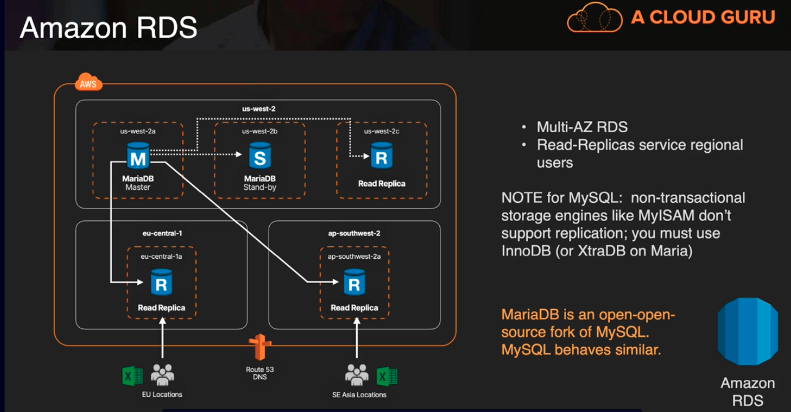

# RDS -> Relational Database Service
A managed database option for MySQL, Maria, PostgreSQL, Microsoft SQL server, Oracle and MySQL-compatible Aurora
- Best suited for structued, relational data store needs
- Useful for a drop-in replacment for existing on-prem instances of same databases
- Features:
  1. Automated backups and patching in customer-defined maintenance windows
  2. Push-button scaling, replication and redundancy

## Amazon RDS Anti-Patterns
| If you need..        | Don't use RDS, instead use.. |
|:----------------------------------:|:-----------------------------------------------------:|
| Lots of large binary objects (BLOBS)     | S3 | 
| automated scalability        | DynamoDB  | 
| name/value data structure    | DynamoDB(which is noSQL, a noSQL platform would be much better) |  
| Data is not well structured or unpredictable | DynamoDB |
| Other database platforms like IBM DB2 or SAP HANA | EC2 |
| Complete control over the database | EC2 |

- RDS tries to commoditize the database, it doesn't provide you with alot of access to the deep, dark features of a database engine

In the diagram above, MariaDB is an open-source fork of MySQL and behaves similar.
it contains a Multi-AZ RDS where the read replicas service regional users. With MySQL, there are non-transactional storage engines like MyISAM that don't support replication. It is suggested to use InnoDB(or XtraDB on Maria).
  - The replication between the master and standy is synchronous (sync replication). So as soon as the transaction is commited it is instantly replicated to those other standbys. So if the master fails, the standbys stand up and become the master.
  - The replication between the master and read replicas is asynchronous (async replication) which means they are lagging a few seconds or a min or less with regard to the writes that are occurring on the master.
  - If a whole region fails, we can promote a read replica to a standalone (single AZ) instance. Then we reconfigure that single-AZ to be multi-AZ.
   - we can script the promotion of read replica based on CloudWatch alarms, but it may be better to do manually.

