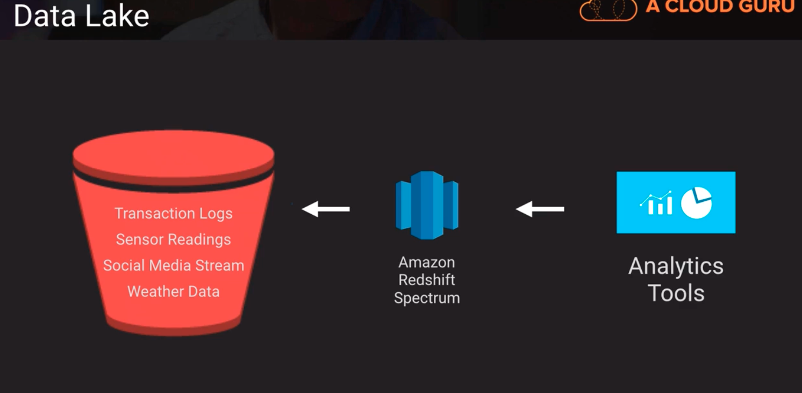

# Redshift
A fully managed, clustered peta-byte scale data warehouse
- extremely cost-effective as compared to some other on-premises data warehouse platforms
- PostgreSQL compatible with JDBC and ODBC drivers available; compatible with most BI tools out of the box
- Features parallel processing and columnar data stores which are optimized for complex queries
- Option to query directly from data files on S3 via Redshift Spectrum

## Data Lake
- query raw data w/o extensive pre-processing
- lessen time from data collection to data value
- identify correlations between disparate data sets

in the diagram, after data is stored in S3 we can query data using RedShift Spectrum and then point analytics tools to RedShift Spectrum.
