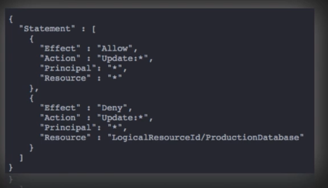

# CloudFormation -> infrastructure as code
- use JSON or YAML, we can model and provision entire landscapes
- repeatable, automatic deployments and rollbacks
- nest common components for reusability
- supports over 300 resource types (components of AWS services)
- if we want more, we can create our own custom resources via SNS or Lambda

## CloudFormation Concepts
- Templates: the JSON or YAML text file that contains the instructions for building out the AWS environment
- Stacks: the entire environment described by the template and created, updated, and deleted as a single unit
- Change Sets: a summary of proposed changes to our stack that will allow us to see how those changes might impact our existing resources before implementing them

### Stack Policies -> protects specific resources within our stack from being unintentionally deleted or updated
1. an example for us is when we would like apply a stack policy that doesnt allow a database to be shutdown or brought up. Because if its a production database it has live data and we shut it down and bring it back up and reinitialize it, then were gonna lose all that data.
  - the stack policy acts as a failsafe against a particular resource to make sure that if somebody accidently executes a template, it doesn't damage or hurt that database.
- We can add stack policies via the console or the CLI when we create a stack 
- once applied, a stack policy cannot be removed but it can be modified via CLI
- by default, stack policies protect everything and prohibit us from making any changes to anything. So if we want to allow anything, we have to explicitly allow it.
    1. one example would be explicitly allowing(effect) updates(action) for all(*) resources(resource) and in the next bracket explicitly deny(effect) updates (action) for specific resources.
    

## CloudFormation Best Practices
- AWS provides Python "helper scripts" which can help you install software and start services on your EC2 instances
    1. useful for building in the installation of software or the download of patches for whenever an AMI is stood up from a cloud formation template
- use CloudFormation to make changes to our landscape rather than going directly into the resources
- make use of Change Sets to identify potential trouble spots in our updates
- use stack policies to explicitly protect sensitive portions of our stack
- use a version control system such as CodeCommit or GitHub to track changes to templates