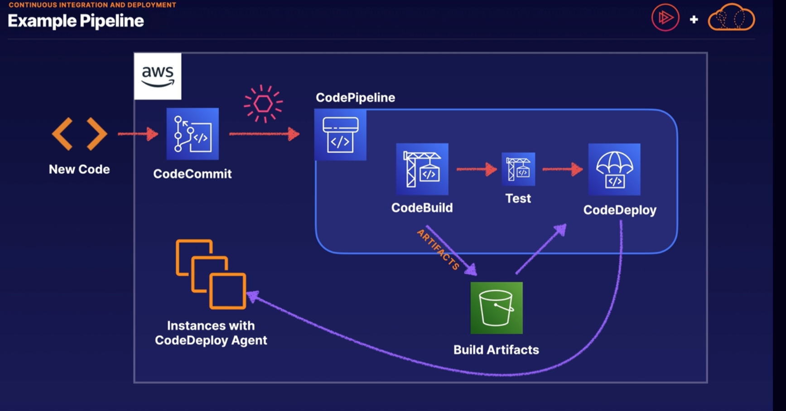

# Continuous Integration and Deployment (CICD)

1. Continuous Integration -> merge code changes back to main branch as frequently as possible, enabled by automated testing as we go.
2. Continuous Delivery -> automating our release process to the point where we can deploy at the click of a button
3. Continuous Deployment -> each code change triggers a series of automated release stages, ultimately deploying to production without human intervention

## Key CI/CD Services

1. CodeCommit -> AWS-managed Git repository: if we want all the security and access to our code to exist in AWS instead of in a third party service.
2. CodePipeline -> orchestrates CI/CD events triggered by new code commit
3. CodeBuild -> compiles code, runs tests, and produces deployable packages
4. CodeDeploy -> deploys packages to EC2, Elastic Beanstalk, ECS, Lambda, etc.

### Example Pipeline (for a single account structure)

- Above, we have our AWS account and CodeCommit repository. We also have instances with a codedeploy agent. We want to make it so when we commit code to CodeCommit, we automatically deploy these changes to the instances with the CodeDeploy agent
    - so we commit new code, let's say we have an event that is triggered when that code is merged to the main branch
    - that event will then trigger our CodePipeline
    - our code pipeline will run CodeBuild which will compile the code and deploy an artifact to an S3 bucket
    - then perhaps there is another step to test our code
    - finally, if all these tests pass, we will use CodeDeploy to retrieve those artifacts and deploy them to the instances with the CodeDeploy agent

### Multi-Account Pipelines
- Sometimes in a multi-account environment, we wont be deploying to same account where the code pipeline exists

- Above, we deploy a serverless application to a staging account and then a production account but all from a single pipeline
    - we commit new code and CodeCommit triggers an event when that code is merged to the main branch
    - we then use CodeBuild to create those build artifacts and do any tests,
    - then we use CodeBuild to deploy a staging environment (in this case, our build artifact is going to be a CloudFormation template) 
    - the CloudFormation template can be deployed into the staging account (in order to do this, our CodePipeline assumes a role in the staging account and provisions the architecture needed) 
    - assuming the previous step resolves without error, we can then deploy to our production environment using the same mechanism 
    - our CloudFormation stack will not only define the resources needed for this simple serverless application, it will also have a reference to the build artifacts which contain the Lambda code

#### Another Example of Multi-Account Pipelines

- Above, in this scenario we want our development, staging and production accounts to have full control over the pipelines that are triggered by our CodeCommit
    - in this case, we have a DevOps account, a Dev account, a Staging account. and a Prod account
        -  DevOps account contains CodeCommit, and just like the other scenarios, when we commit new code this triggers an event. If we have a different branch in CodeCommit for each of the development stages
            - when new code is merged to the dev branch, for example, it will trigger an event which will then be delivered to an event bridge in the dev account 
        - this will then trigger a pipeline that exists indepedently in the dev account.
        - we can do the same thing for staging and production 

### Other CI/CD Services
1. Cloud9 -> pre-configured, cloud-native development IDE (which means we can write our code in the console)
    - the terminal in Cloud9 will assume all the permissions that we as a user have in our AWS account
2. CodeGuru -> automate code reviews, and provide intelligent code recommendations
3. CodeStar -> easily deploy pre-configured CI/CD ecosystems and granularly control permissions as to who can commit code to those code bases.
4. X-Ray -> trace distributed systems, and visualize your distributed patterns 
    - great for tracing distributed serverless applications and also great for visualizing your code pipelines, especially if they're distributed across multiple accounts
5. CodeArtifact -> securely fetch, store, and publish packages across organizations 
    - this uses popular package managers like NPM or PIP
    - we can store approved open source packages here or we can create our own in-house packages and make them available across our organization with CodeArtifact

## Summary
1. CodePipeline is the key to CI/CD.
    - it allows us to orchestrate CI/CD services and events for testing and deploying new code, including automated and manual steps
2. CodeBuild compiles and tests our code.
    - compile our application code, run unit tests, and automate artifact management with CodeBuild
3. Isolate our production resources
    - introducing multiple accounts into our CI/CD solution makes it easiter to limit or eliminate direct human access to production resources