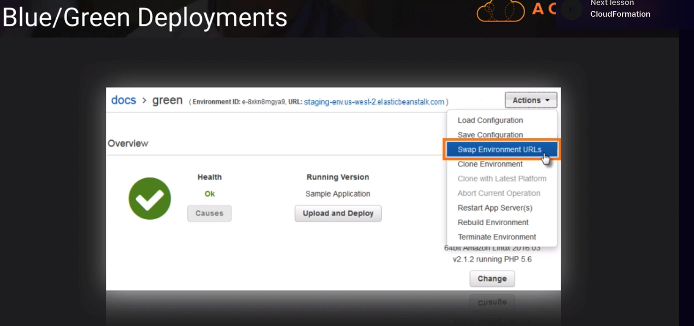

# Elastic Beanstalk -> orchestration service to make it push-button easy to deploy scalable web landscapes
- supports a wide range of platforms -> Docker, PHP, Java, NodeJS
- support multiple environments within Application (DEV, QA, PRD, etc)
- great for ease of deployment, but not great if we need lots of control and flexibility. So if we need more control of our resources like ELB or ASG, we might need to do this more manually.

## Layers of Elastic Beanstalk
- application layer -> the management layer where we can have multiple environments. these are our instances, load balancers, auto-scaling groups, and monitoring etc.
- application versions -> on top of our application's environment. We can have as many versions we want. we can decide how to deploy those versions when we need to do an upgrade

## Elastic Beanstalk Deployment Options
🕚 = fastest
🕚🕚🕚🕚 = slowest
| Deployment Option | What | Deployment Time | Downtime? | Rollback Process |
|:------:|:------:|:------:|:----:|:------:|
| All at once | new application version is deployed to existing instances all at once, potentially resulting in downtime | 🕚 | Yes | Manual |
| Rolling | One by one, new application version is deployed to existing instances in batches | 🕚🕚 | No | Manual |
| Rolling with Additional Batch | Launch new version instances prior to taking any old version instances out of service | 🕚🕚🕚 | No | Manual |
| Immutable | Launch a ful set of new version instances in separate auto-scaling group and only cuts over when health check is passed | 🕚🕚🕚🕚 | No | Terminate New Instances |
| Traffic Splitting | Percent of client traffic is routed to new instances for purposes of "canary testing" | 🕚🕚🕚🕚 | No | Reroute DNS and Term New Instances |
| Blue/Green | CNAME DNS entry changes when new version is fully up, leaving old version in place until new is fully verified | 🕚🕚🕚🕚 | No | Swap URL |

- With Blue/Green, there's a special option on Elastic Beanstalk that allows us to swap the URLs and point to the new version. So if we have problems, we can just swap the URLs back, pointing to the old version. See below,

