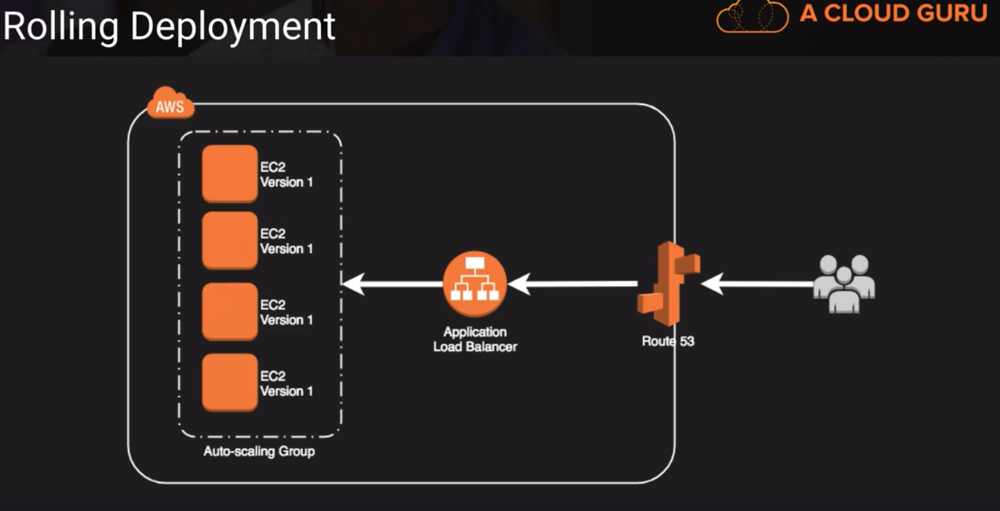
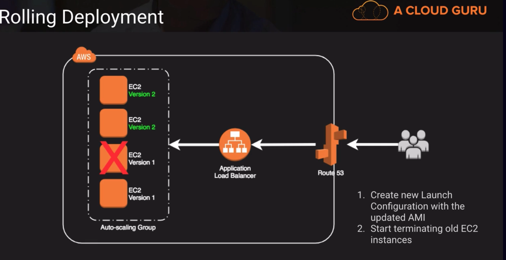
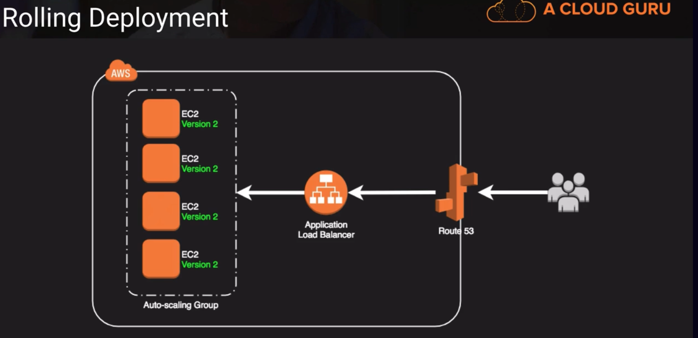
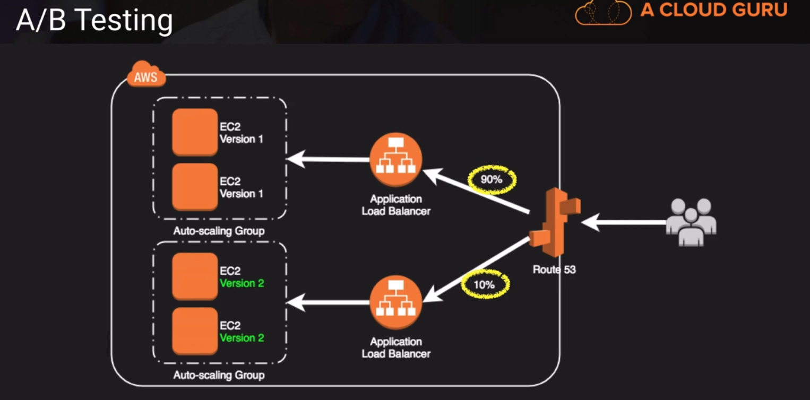
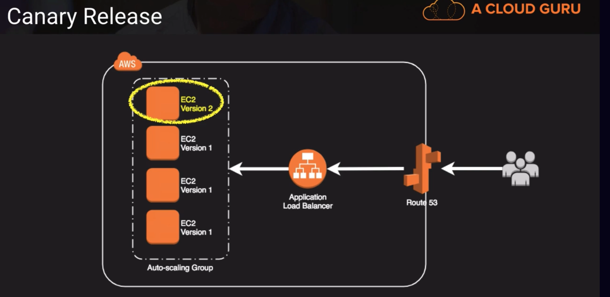
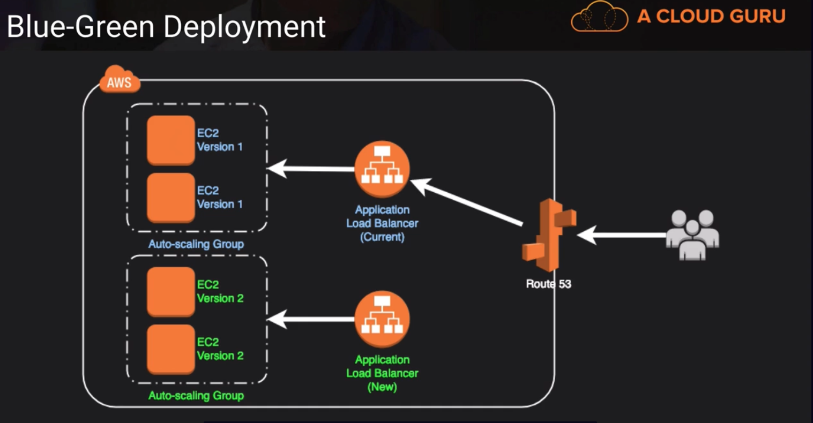
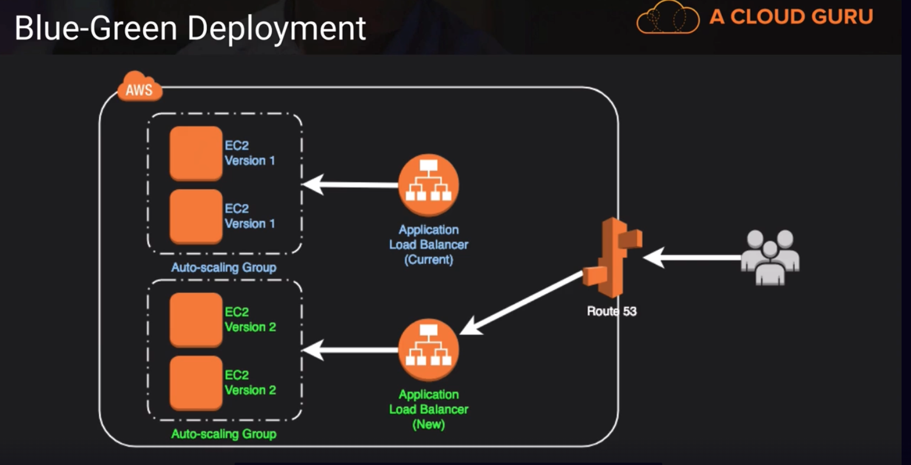

# Types of Deployments

## 3 Types of software deployments:
1. big bang -> where everything goes live all at once
    - most riskiest, but gives shortest amount of time for an implementation
2. phased rollout -> more gradual over time
    - has lower risk, but going to take some time
3. parallel adoption -> implements the new, while still using the old. In some cases, it may require duplicate data entry to keep both systems up and running
    - takes the most amount of time, but we wouldnt say it has the least amount of risk because we're actually trying to maintain two systems. One of the most difficult things in a software rollout or deployment is trying to keep your underlying data in sync if you're doing a parallel adoption. 
        - there is still a significant degree of risk there, it's just placed in a different place in the project

### Phased Rollout Types
#### Rolling Deployment
- we have a application load balancer, an autoscaling group along with a fleet of EC2 servers running on Version 1, see below
- 

    - we can create a new launch configuration with the updated AMI (because we cant edit an existing launch configuration)
    
    - we start terminating the old EC2 instances, and when they come up they would come up under the new AMI
    

    - eventually we would have all of our fleet updated to our Version 2, see below
    

#### A/B Testing
- using Route53, we can do A/B Testing or A/B deployment which is very common in websites where they want to test the new format or the new layout of a website with a small percentage of people and see if that increases conversion rate
- in this example, we can use Route53 and can send 90% of the traffic to one version and a smaller 10% to the new version. Then over time we can shift that percentage until ultimately, we're serving 100% of the traffic to version 2 and 0% to version 1.

#### Canary Release
- where we deploy a version 2 in production, and just sit back and wait and see if we had any errors and if a given time passed, and we didnt have any errors then we would go ahead and deploy the new version to the other parts of our environment. See below,

#### Blue-Green Deployment
- in this case we have two load balancers, we an auto-scaling group that's already running with version 1. We can create a new load balancer, and behind that we'll put an auto-scaling group that's running version two of our application.
    - then at some point in time, we decide to switch over, usually at the Route53 level, but there are multiple ways we can switch over. And if we had problems, its just a matter of simply switching back to the current version through Route53 configuration. See below,
    
    

- the goal of blue/green deployments is to achieve immutable infrastructure, where we dont make changes to our application after its deployed, but redeploy altogether.

##### Blue Green Methods
1. update DNS with Route53 to point to a new ELB or instance
2. swap Auto-Scaling Group already primed with new version instances behind the ELB
3. change Auto-Scaling Group Launch Configuration to use new AMI version and terminate old instances
4. swap environment URL of Elastic Beanstalk
5. clone stack in AWS OpsWorks and update DNS

##### Blue Green Contraindictions (Anti-patterns) -> situations that may not be candidates for blue-green deployment
1. if our code tightly coupled with our data store schema
  - for blue/green deployments to very handy, we want to deploy those independently of our data layer, but if our code is tightly coupled or we're making a schema change during that upgrade process then it could cause problems.
  - best practice here is to make sure our schema changes are both forward and backward compatible in the case that we have to rollback, so we're not struggling to undo those schema changes on our data store.
2. the upgrade requires special upgrade routines to be run during deployment. This is pretty common in ERP systems or very complex software. When they do an upgrade sometimes they have to run a post-processing program to change some internals of how the data is stored or how the program works
- these types of things arent very conducive to blue/green deployments because the rollback is not just as simple as re-pointing a DNS entry for example
3. Some off-the-shelf products might not be blue-green friendly
