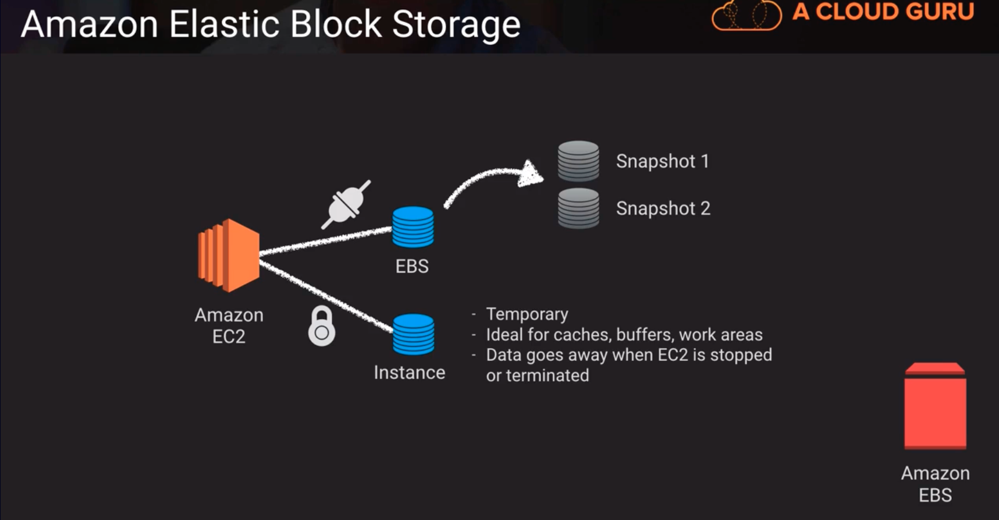

# EBS -> Elastic Block Storage

- kind of like virtual hard drives
- can only be used with EC2 instances
- Tied to a single AZ
- Variety of optimized choices for IOPS, Throughput and Cost

Diagram contrast instance storage vs EBS.
- Instance is epheremal and they are locked to that specific EC2 instance while EBS is perserved via snapshots
## EBS Snapshots
- cost-effective and easy backup strategy
    1. a backup strategy could include setting up a cloudwatch job to take a periodic snapshot of my volumes
- share data sets with users/accounts
- migrate a system(EC2 instances) to a new AZ or region
- convert unencrypted volume to an encrypted volume -> after taking snapshot of unencrypted snapshot when creating a volume from snapshot check for encryption
- snapshots have a versioning mechanism, where the latest snapshot of an ebs volume only stores what changed from the previous snapshot. 
  - But if the pre-existing snapshot is deleted, the data is forwarded to the latest snapshot.
  - we can restore from a later snapshot, and it also uses data from pre-existing snapshots.
  - if the chain is broken in between snapshot versions and the snapshot is deleted, we can't recreate a volume from that point in time with that snapshot. 

## Amazon Data LifeCycle Manager
- schedule snapshots for volumes or instances every X hours
- provides retention rules to remove old/stale snapshots to reduce costs