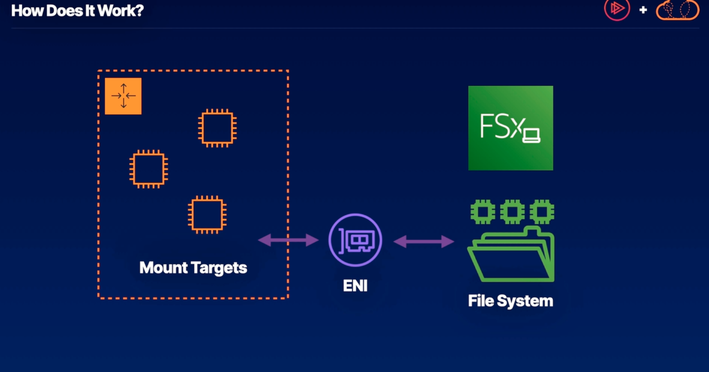
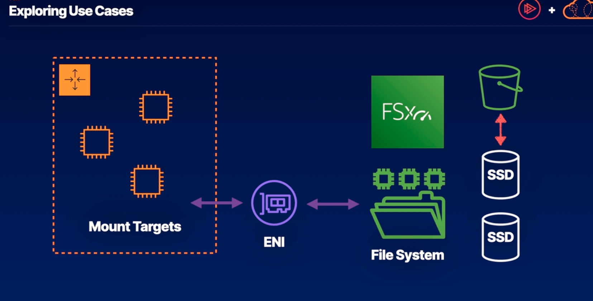

# FSx -> AWS File Sharing service that's compatible with Windows file server

- Useful where EFS isn't compatible
  - it is a distributed file system 
  - provides non NFS options for file sharing.
  - commonly used for Windows file services integration with AWS
  - takes advantage of the scalability and availability enabled by AWS

## Four Flavors of FSx -> each support one or more file-sharing protocols
1. FSx for Windows File Server
2. FSx for Lustre
3. Amazon FSx for NetApp ONTAP
4. FSx for OpenZFS

## How does FSx work? -> by nature stores redundant copies of files wherever they're stored.

If we have an auto scaling group of EC2 instances(3), they would be considered the mount targets for my file system. The file system(FSx) managed by AWS has an endpoint which my mount targets can be configured to have access to. 
  - For networking, we use an Elastic Network Interface to allow network communication between those mount targets and the distributed file system. 
  - For access, we can grant IAM roles or commonly people will use the managed Microsoft AD that they're already using to register their Windows servers

## Exploring Use Cases 
### FSx for Windows File Server -> scalable, highly available cloud native solution
- Windows line-of-business applications
- Windows content management systems
- Media processing workflows
- Windows data analytics

### FSx for Lustre -> one of the most popular high performance file storage systems

- High-performance distributed applications
- High-performance compute clusters
- Can reliably interact with thousands of EC2 instances
- Big Data and Machine Learning applications

- All the drives backing the data in this file system are solid state drives, because of this they can arrange it so that the most frequently accessed data is the data that can be accessed the fastest.
- Also leverages S3 to store snapshots and as sort of a cold storage for the least frequently accessed files in the system

### Summary
1. FSx covers several file share use cases -> most commonly used for windows file server file shares, FSx can also be used for ONTAP, OpenZFS, and Lustre with deep AWS integration.
2. FSx for Windows File Server -> for SMB-based file shares that EFS is not compatible with, FSx is a great alternative. AWS handles management of the servers, so there's no need to worry about access.
3. FSx for Lustre Uses Modern HPC Storage -> FSx for Lustre strategically organized data on SSDs to optimize the most used data for fast access, designed for high performance.

