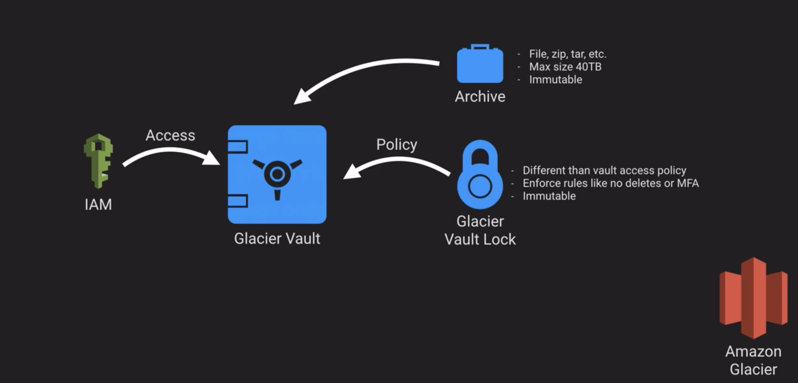
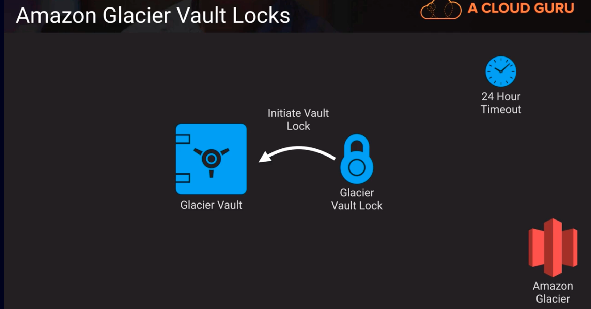

# Glacier: a storage archive solution
- Essentially storage that is cold (cheap, slow to respond, seldom accessed)
- Used by AWS Storage Gateway Virtual Tape Library as a backend to store backups, if you're backing up two virtual tape libraries.
- Integrated with S3 via LifeCycle Management
Glacier is its own API, it doesn't need S3

In the diagram above, it illustrates Glacier's core components.
- Glacier vault -> liken to S3 bucket. you cant change it or delete it, you can only overwrite with a new version.
- Archive -> liken to S3 object, immutable. Max size is 40TB, Can be a file, zip, tar, etc
- Policy(Glacier Vault Lock) -> defined what rules that vault must obey by. ex. maybe it enforces a rule that says nobody can delete any objects on the Glacier Vault or must use MFA to reduce the likelihood of accidental deletion. The Glacier vault lock is immutable.
- IAM Access -> giving roles to individual people to administer the vault or do things to the Glacier vault lock.

## Glacier Vault Lock

- you can create a glacier vault lock and then you initiate a vault lock and by default you have 24 hours to confirm that that vault lock is performing. 
  - If the 24 hours elapses and you don't confirm it then it aborts. So in 24 hour window you can abort it or complete the vault lock. 
  - completing lock applies the vault lock permanently to the glacier vault
