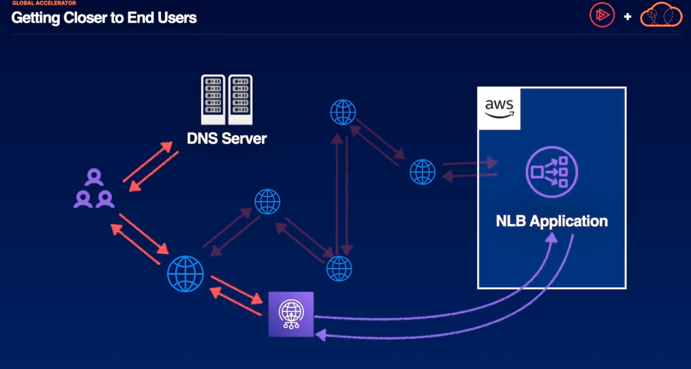
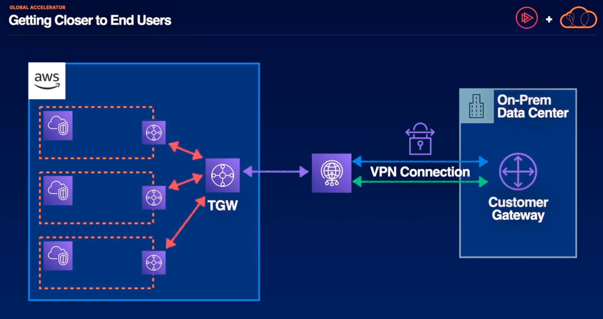

# Global Accelerator

Establish AWS endpoints to get your applications closer to your users, whether they're internal or external applications.
- Allows public app users to short-cut past public infrastructure
- Establishes endpoints that direct toward AWS network edge locations, edge locations are spread all around the globe in order to optimize how quickly you can get traffic onto the AWS network.
- Provides global static public IPs to access your application endpoints
- Improves networking performance, security, and reliability
- Can be used for failover in multi-region architectures

## Getting closer to End Users

Above, users enter a URL that goes to a public DNS server to show them how to resolve their request. That request would traverse the public internet in order to reach the NLB application. This can involve many hops over the public internet, so it can take quite some time before that request reaches its way back to the user.
  - When we provision global accelerator, we create the opportunity to hop on the AWS network earlier at an edge location that is physically closer to end user

Above, if we have a data center and like to improve its connection speed with your AWS environment. We could connect our VPN connection to a Global accelerator endpoint to create a shorter overall route to your AWS environment. We can associate global accelerator with a transit gateway which can then direct traffic to your VPCs

## Common Use Cases
1. Public applications: the AWS private network tends to be faster than the public internet, particularly over long distances.
   - Global accelerator creates global public static IPs that will direct application traffic to the edge location that exists closest to the end users
2. Hybrid networking: lower latency for your site-to-site VPN, a great middle ground if Direct Connect is too pricey but still need a little boost in performance 
3. Origin Masking: adding extra protection from DDoS attacks, your static entry points are protected by AWS shiled by default.
4. Multi-region failover: static IP addresses route to endpoints in up to 10 different region, picking the closest available for the user.
   - so even if we have an entire regional failure, global accelerator will be able to direct users' traffic to your application 

## Summary
1. Global accelerator can improve latency
  - receive responses from AWS-hosted applications up to 60% compared to the public internet
2. Multi-regional routing and failover
  - resolves any cast IPs to the nearest edge location, from which it uses BGP to route traffic to the nearest healthy endpoint
3. A common Exam red herring, so its important to know what it doesn't do.
  