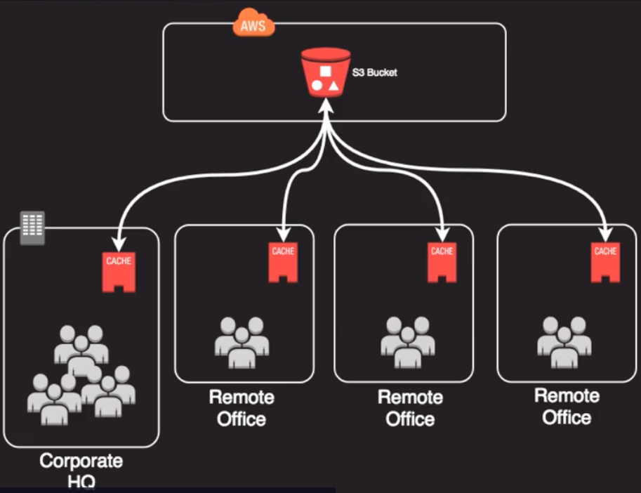
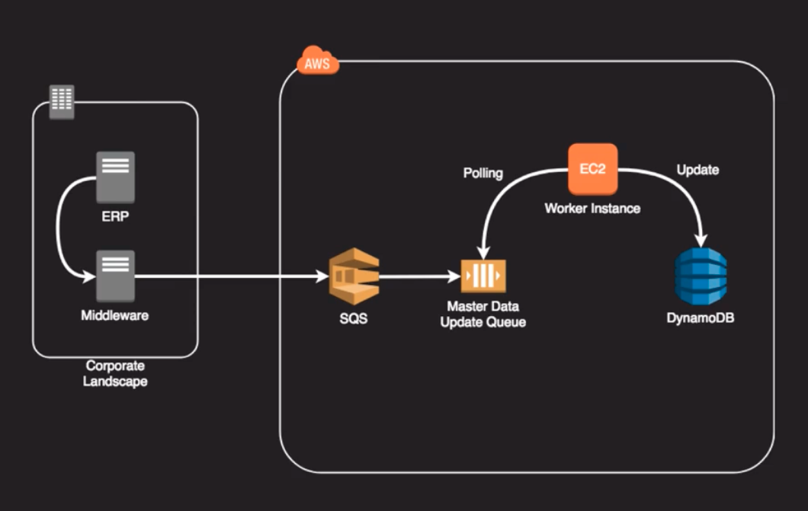
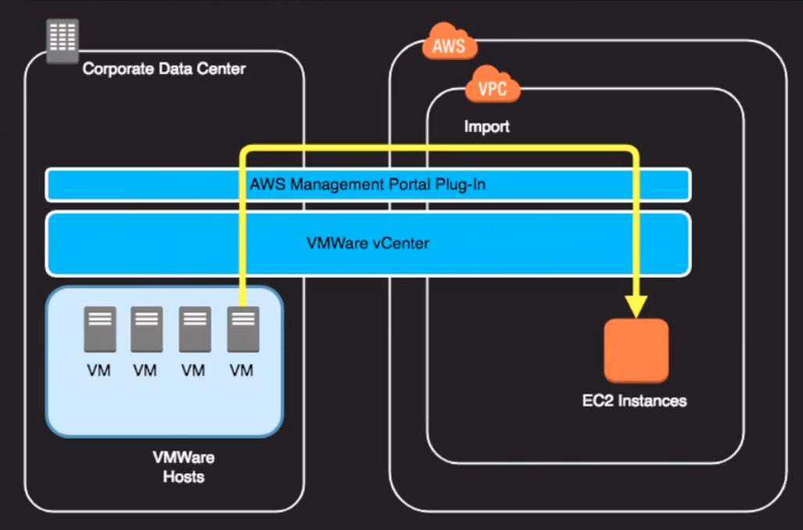

# Hybrid Architectures -> make use of cloud resources along with on-prem resources

- very common first step as a pilot for cloud migrations
- infrastructure can augment or simply be extensions of on-prem platforms - VMWare, for example
- ideally, integrations are loosely coupled - meaning each end can exist without extensive knowledge of the other side

### Example 1

Above,
we use AWS storage gateway to have a locally cached volume in a corporate HQ and a bunch of remote offices and we're storing the objects back in AWS on S3. the end users don't know that their objects are being stored on S3 as it is seamless.
   - storage gateway creates a bridge between on-prem and AWS
   - seamless to end-users
   - common first step into the cloud due to low risk and appealing economics

### Example 2

Above,
we have an on-prem ERP system and use middleware to interface with SQS. In this case maybe we're updating some master data that lives in a dynamoDB database. When the ERP system generates and updates it pushes it out to middleware. Middleware sends it to SQS. It ends up in an SQS queue and in this case we have an EC2 worker instance that's monitoring that queue and performs the update on the DynamoDB database. This illustrates an example of a loosely coupled architecture because the ERP system doesn't have to know about DynamoDB, nor does it have to know about SQS or the worker instance

### Example 2

Above,
we are using VMWare Vcenter. VMWare allows us to spread workloads across cloud providers as well as on prem resources. There's a plugin for VCenter.
- VMWare VCenter plugin allows transparent migration of VMs to and from AWS.
- VMWare cloud furthers this concept with more public cloud-native features
