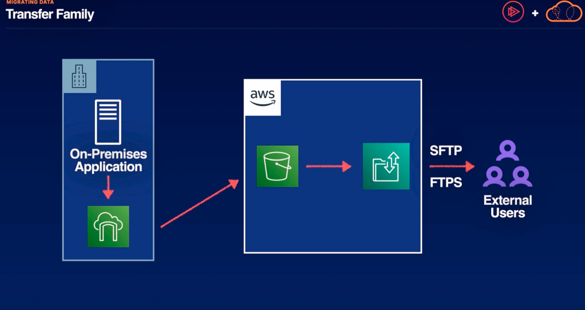

# Migrating Data

## Database Migration Service
- DMS is used to migrate source relational databases to RDS, Aurora, or EC2-based databases.
- the built-in Schema Conversion Tool(SCT) allows for heterogeneous migrations
- DMS can be used for smaller homogenous migrations as well as MongoDB and DynamoDB migrations 
- SCT will be necessary for complex data sets like data warehouses
- DMS can replicate directly to AWS, S3, or Snowball

### Examples

Above,
- we have an on-prem data store and a VPN connection to the AWS cloud. 
1. We can create a replication instance which receives data from our on-prem data store and deliver it to a target database, in this case, Aurora database. As updates are made to our on-prem data store, DMS maintains this connection and continuously updates the target database until we decide to make the cutover to the AWS hosted target database.

Above,
if we dont want our data to traverse the public internet and we dont have a direct connection, we can also replicate that data on a snowball device. We can have this delivered to an S3 bucket where it will then be delivered to the replication instance and to that target database

## DataSync -> new most up-to-date way to migrate file systems or object storage to AWS over the internet
1. secure online service that automates moving data from on-prem to AWS
2. compatible with SMB, HDFS, and NFS fileshares
3. move self-managed object storage to S3
4. sync data to elastic file system or Amazon FSx

- If we have an on-prem file share, we can then install the datasync agent on-prem to deliver that file share to a snowball device or straight to S3 an Outposts.
    - from there we can use our VPN connection to connect to the DataSync service in the AWS cloud. DataSync will then deliver our file share or object store to the appropriate service depending on the file system we're replicating

## Transfer Family
DMS and DataSync are both great ways to transfer large swaths of data from our on-prem warehouse to AWS. Sometimes we want to transfer a specific set of files to AWS or give access to a specific set of files or objects from our AWS storage services, this is where transfer family comes into play.
- multi-AZ architecture for high availability
- uses SFTP, FTP, FTPS, and AS2 protocols for file transfers
- use transfer family managed file transfer workflows (MFTW) to automate encryption, filtering, tagging, and compression
- authenticate external users to securely transfer files and objects to and from AWS

### Example

Above, 
If we have our on-prem data center and an on-prem application. This application is caching its data locally, but also using a storage gateway to sync that data with the AWS cloud. The objects it's producing are held in an S3 bucket. We want to give access to some subset of those objects to external users using our application. Once authenticated those external users can access the files from the Transfer Family using SFTP or FTPS protocols

## Summary
DMS instances will automate the migration of our on-prem or cloud databases, and can handle homogenous or heterogeneous database migrations.