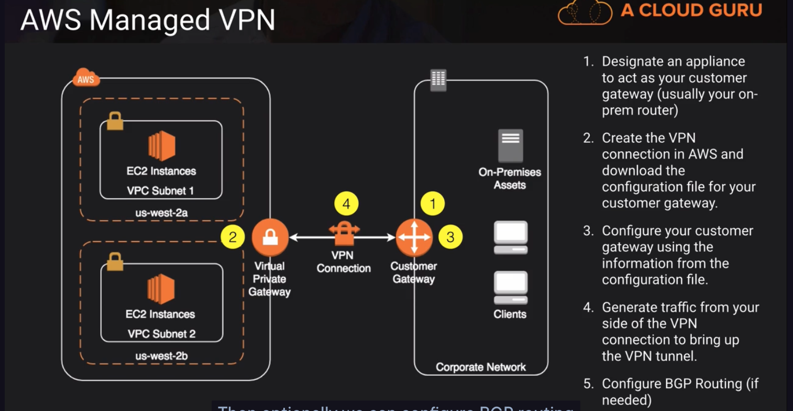
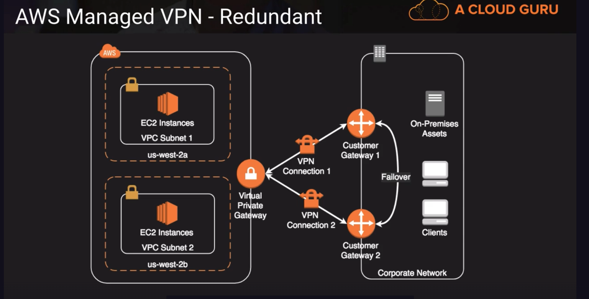
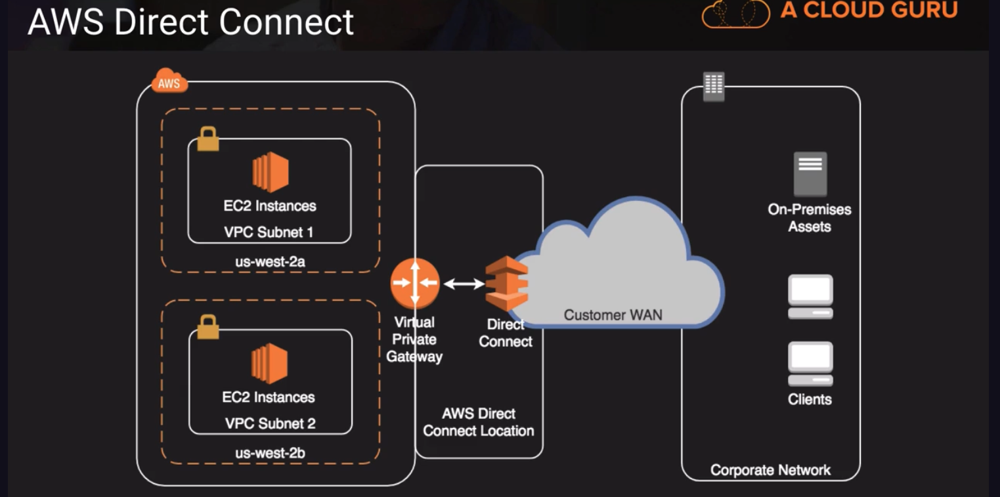
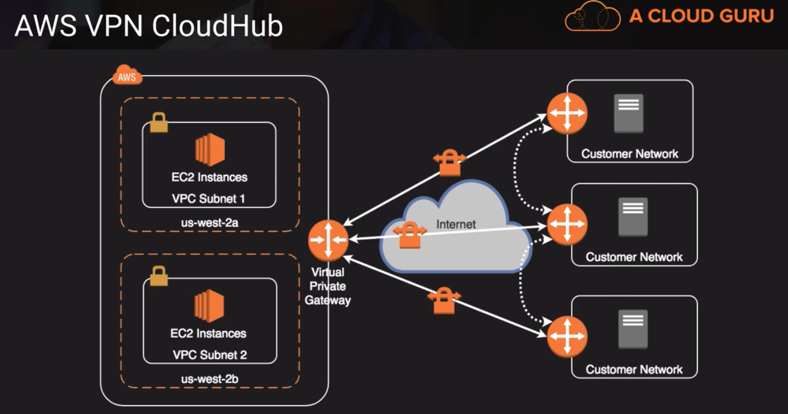
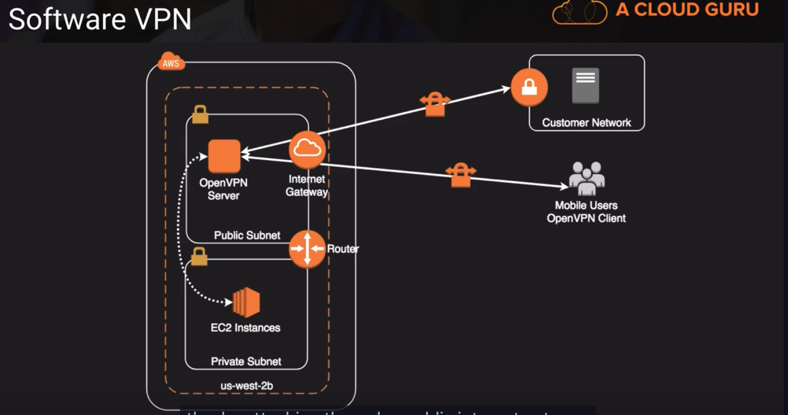
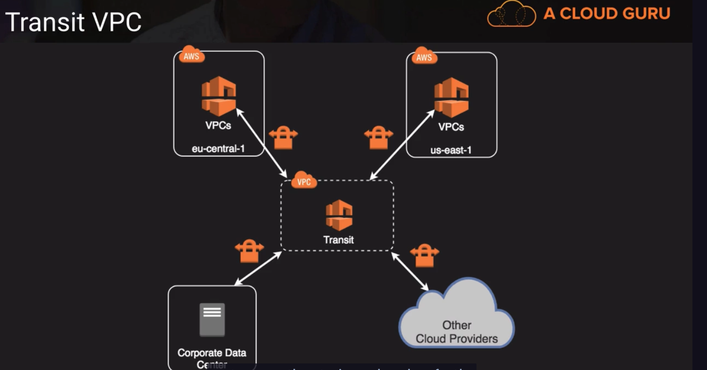

# AWS Managed VPN
https://www.youtube.com/watch?v=uj7Ting6Ckk
https://docs.aws.amazon.com/whitepapers/latest/aws-vpc-connectivity-options/network-to-amazon-vpc-connectivity-options.html

| AWS Managed VPN |
|:--------------:|:------------------:|
| What | AWS managed IPsec VPN connection over your existing internet |
| When | Quick and usually simple way to establish a secure tunneled connection to a VPC; Redundant link for Direct Connect or to other VPC VPN |
| Pros | Support static routes or BGP peering and routing |
| Cons | Dependent on your internet connection |

- AWS can auto generate config files for popular routers like Cisco, Juniper, and Palo Alto
- Generally we use IPsec as the encryption protocol

- useful if we want to have a redundant connection into AWS, but customer has to take care of the failover on their side of the network.

## AWS Direct Connect
| Direct Connect |
|:-------------------------:|:---------------------:|
| What | Dedicated network conneciton over private lines straight into AWS backbone |
| When | Require a "big pipe" into AWS; lots of resources and services being provided on AWS to your corporate users |
| Pros | More predictable network performance; potential bandwidth cost reduction; up to 10 Gbps provisioned connections; Supports BGP peering and routing |
| Cons | May require additional telecom and hosting provider relationships and/or new network circuits |
| How | Work with your existing Data Networking Provider; Create Virtual Interfaces (VIF) to connect to VPCs (private VIF) or other AWS service like S3 or Glacier (public VIF) |

Direct connection is a single connection from AWS router to Customer router, so it's not redundant. AWS recommends setting up a second connection, either a VPN connection or a second Direct Connect connection.

## Direct Connect Plus VPN 
| Direct Connect Plus VPN |
|:------------------------:|:--------------------------------:|
| What | IPsec VPN connection over private lines |
| When | Want added security of encrypted tunnel over Direct Connect |
| Pros | More secure (in theory) than Direct Connect alone |
| Cons | More complexity introduced by VPN layer |
| How | Work with your existing Data Networking Provider |

## VPN CloudHub
kinda like a do it yourself MPLS network using public internet and IPSec VPN. Here we'd use AWS's virtual private gateway as the hub.

| VPN CloudHub |
|:------------:|:----------------------------------------------:|
| What | Connect locations in a Hub and Spoke manner using AWS's Virtual Private Gateway |
| When | Link remote offices for backup or primary WAN access to AWS resources and each other |
| Pros | Reuses existing Internet connection; Supports BGP routes to direct traffic (for example, use MPLS first then CloudHub VPN as backup) |
| Cons | Dependent on Internet conneciton; No inherent redundancy |
| How | Assign multiple Customer Gateways to a Virtual Private Gateway, each with their own BGP ASN and unique IP ranges |

## Software VPN
kinda the ultimate do it yourself option for VPN
| Software VPN |
|:--------------:|:---------------------------------------------:|
| What | You provide your own VPN endpoint and software |
| When | You must manage both ends of the VPN connection for compliance reasons or your want to use a VPN option not supported by AWS |
| Pros | Ultimate flexibility and manageability |
| Cons | You must design for any needed redundancy across the whole chain |
| How | Install VPN software via Marketplace appliance or on an EC2 instance |

## Transit VPC
for geographic dispersed VPCs in locations all over the world and you want to create kind of common transit center, a common meeting place where all paths cross. At the heart of this option is where you have one VPC that's really just a pass through and its a good way to support a hybrid deployment across several different cloud providers

| Transit VPC |
|:---------------:|:--------------------------------------------:|
| What | Common strategy for connecting geographically disperse VPCs and locations in order to create a global network transit center |
| When | Locations and VPC-deployed assets across multiple regions that need to communicate with one another |
| Pros | Ultimate flexibility and manageability but also AWS-managed VPN hub-and-spoke between VPCs |
| Cons | You must design for any needed redundancy across the whole chain |
| How | Providers like Cisco, Juniper Networks and Riverbed have offering which work with their equipments and AWS VPC |

There's the other cloud providers in the diagram, so if the company is also a customer of Microsoft Azure this is a way you can connect those two resources and have secure access.s
