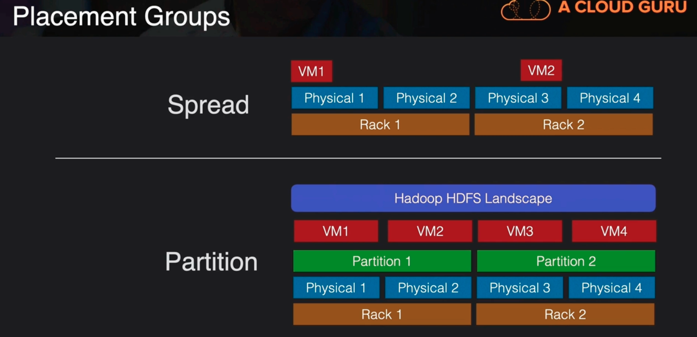

# Enhanced Networking

1. Generally used for High Performance Computing use-cases
2. Uses single root I/O virtualization (SR-IOV) to deliver higher performance than traditional virtualized network interfaces
3. Might have to install driver if other than Amazon Linux HVM AMI
4. Intel 82599 VF Interface
   - 10 Gbps
5. Elastic Network Adapter
   - 25 Gbps

Which interface you can use depends on which instance type you have

## Placement Groups
we have some control over how we can arrange our instances over the physical hardware that they live on

Clustered placement group -> grouping your instances close together generally on the same rack or same hardware so that they can have the lowest latency between their communication.

Spread placement group -> we can put our instances on physically separate hardware. If we're concerned that if a rack fails or a piece of hardware fails on that rack then it doesn't necessarily take down our whole system because we have some diversity on where that instance lives

Partition placement group -> use case: if I have a really large application that consists of a lot of instances then I can group those different layers and different partitions and manage how those partitions are spread across different hardware.

|    Three Placement Groups       |            |            |             |
|                | Clustered | Spread | Partition |
|:-------:|:-------------------:||:-----------------------:|:--------------------------:|
| What | Instances are placed into a low-latency group within a single AZ | Instances spread across underlying hardware | Instances are grouped into paritions and spread across racks |
| When | Need low network latency and/or high network throughput | Reduce risk of simultaneous failure if underlying hardware fails | Reduce risk of correlated hardware failure for multi-instance workloads |
| Pros | Get the most out of Enhanced Networking Instances | Can span multiple AZ's | Better for large distributed or replicated workloads than Spread |
| Cons | Finite capacity: recommend launching all you might need up front | Max of 7 instances running per group per AZ | Not supposed for Dedicated Hosts |

