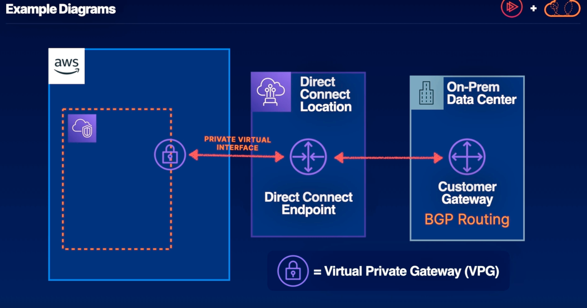
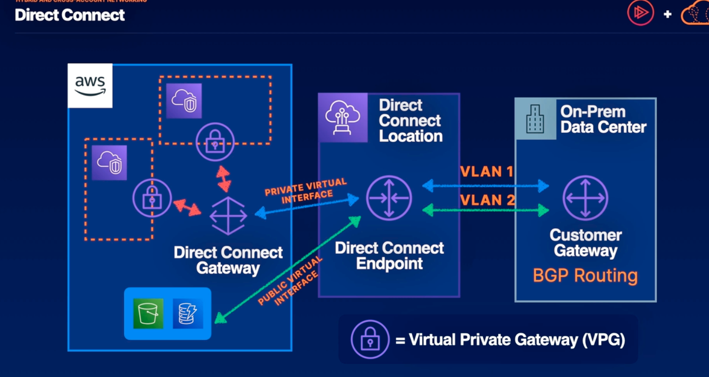
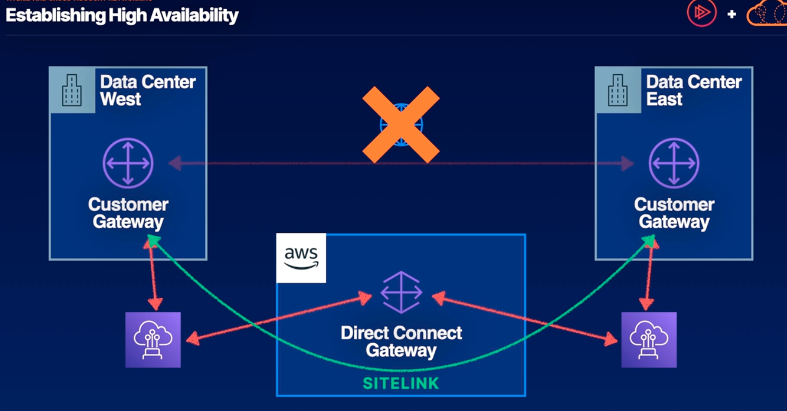
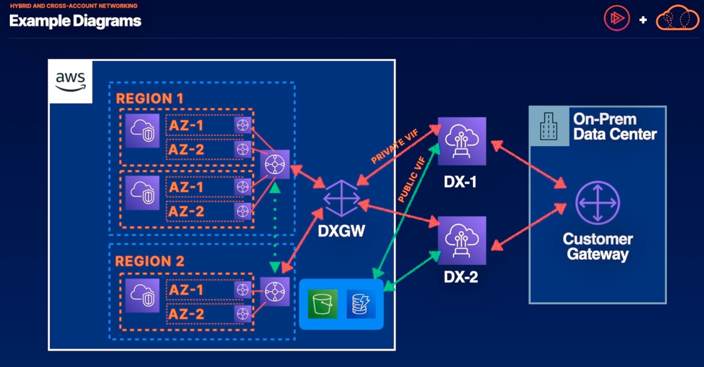

# Hybrid and Cross-Account Networking

https://docs.aws.amazon.com/whitepapers/latest/hybrid-connectivity/connectivity-models.html

## Direct Connect -> a private route from On-prem to the cloud without traversing the public internet
- AWS connects its global network to your data center by establishing a physical line from their data centers to yours.
- Reduces dependency on fluctuations in public ISP demand and so it mitigates flunctuations in your connection speed as opposed to connecting over the public internet.
- Must work with partners (ISPs) to establish your DX(Direct Connect)
- Great if you cannot risk having any of your traffic traversing the public internet or if you have frequent transfers of large data sets
- Very pricey and takes a lot of time to provision, 2 weeks or more to get physical line established.

Above, the ISP partner establishes a physical line with your on-prem data, we can then use a private virtual interface to connect that endpoint directly with a VPC using a VPG(virtual private gateway)

Above, if we need to connect to more VPCs, we can have multiple virtual LANS connecting to our Direct Connect endpoint. We can provision a direct connect gateway in our AWS account which can connect to up to 3 virtual private gateways or transit gateways
- We can also use a public virtual interface to connect our direct connection to services with public endpoints such as S3 or DynamoDB. 

## Site-to-Site VPN
- Fastest way to connect on-prem to the cloud
In some cases, Direct Connect might be too expensive or too slow to establish in these situations the solution for a hybrid network would be a Site-to-Site VPN 
1. We use IPSec tunnels for secure and fully managed connections, establishing network traffic between your on-prem data center and AWS cloud.
2. We can connect directly to VPCs or to transit gateways that can connect to many VPCs
3. Two tunnels per connection for high availability
4. Monitor VPN health with AWS-native tools

Site-to-site VPN or direct connection have a certain flaw that when your working with a service provider is single point of failure. And so having two direct connect locations with different ISP providers is an optimal solution to accomplish high availability.

Above, we can also use Direct Connect to establish high availability between your data centers. And if there connection to each over the public internet goes down they can still be connected to each other through sitelink via direct connect

Exam tip: scenarios will involve multiple data centers, accounts, and regions. Identify and eliminate single points of failure.

Above, we have two DX connections that connect to the highly available direct connect gateway. Connected through private virtual interfaces. You will be connected to public services in AWS via a public virtual interface. 
- To associate your on-prem data center with all the VPCs across multiple regions your direct connect gateway can be associated with transit gateways in each region. These transit gateways will be associated with transit gateway attachments in each AZ in each VPC
- For the VPCs to communicate with each other we'll have to peer our two transit gateways which will make it so these VPCs can communicate with each other.

- We can only attach a single direct connect gateway to up to 3 transit gateways.