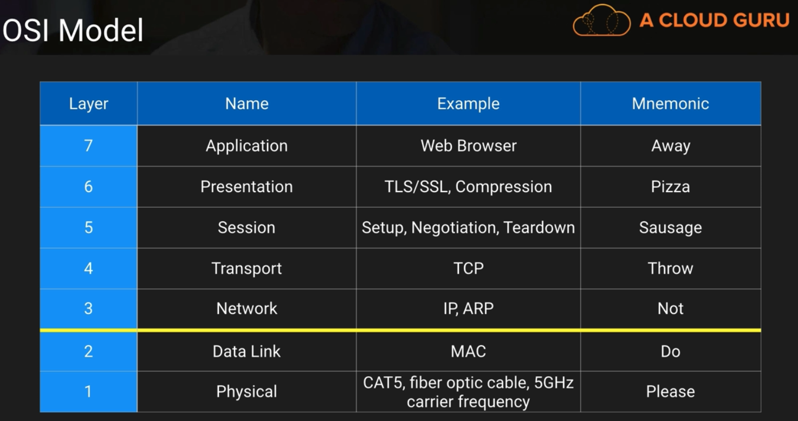
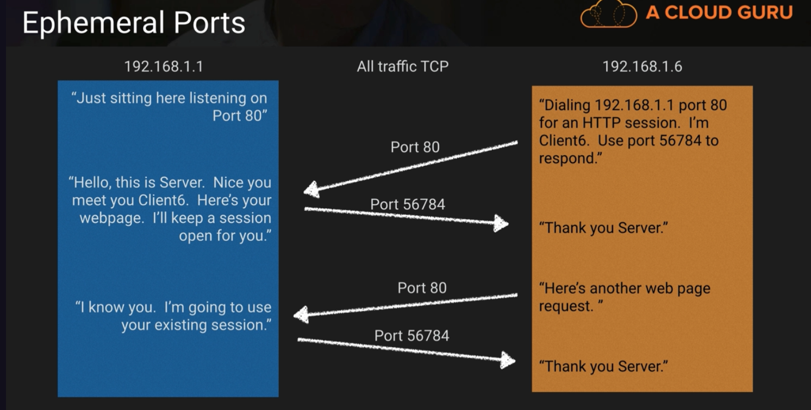
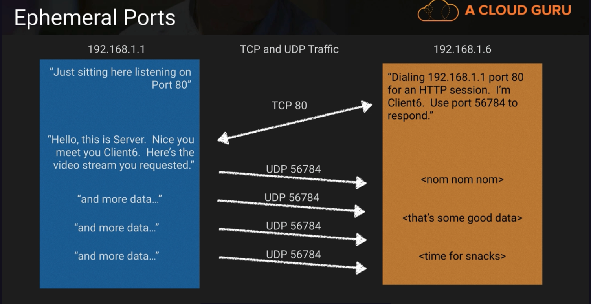

# Networking Concepts

## OSI model

Layers 1 and 2 are AWS responsibility.
Layers 3-7 are customer responsibility.
The shared responsiblity model here is between layer 2 and 3, because there are some scenarios where the customer and AWS have the ability to cross that line.

Unicast vs Multicast
Unicast -> direct that doesn't bother any other device on the network
Multicast -> when a network card starts sending messages to everybody on the network. Done at the MAC (layer 2.. Data Link). Multicast isn't allowed on VPC officially.

## TCP vs UDP vs ICMP
| Protocol | Characteristics | Plain Speak | Users |
|:-------------------:|:-------------------------------------:|:---------------------------------------------------------------------------:|:-----:|
| TCP (Layer 4) | Connection-based, stateful, acknowledges receipt | After everything I say, I want you to confirm that you received it | Web, Email, File Transfer |
| UDP (Layer 4) | Connectionless, stateless, simple, no retransmission delays | I'm going to start talking and its ok you miss some words | Streaming media, DNS | 
| ICMP (officially, it's layer 3 but people debate this) | Used by network devices to exchange info | Routers can keep in touch about the health of the network using our own language | traceroute, ping | 

## Ephemeral Ports
Also known as Dynamic ports
- Short-lived transport protocol ports used in IP communications
- Above the "well-known" IP ports (above 1024)
1. Suggested range is 49152 to 65535 but..
   - Linux kernels generally use 32568 to 61000
   - Windows platforms default from 1025
- NACL and Security Group implications

## TCP Traffic

- Essentially the web server preserves the session port for the client.

## TCP and UDP Traffic

UDP just sends sends sends. It is favored when streaming media because having to acknowledge every packet of data can become burdensome of the network, client and server.

## Reserved IP addresses
- AWS uses certain IP address in each VPC as reserved.. so you can't use them
- 5 IPs are reserved in every VPC subnet (example 10.0.0.0/24)
  1. 10.0.0.0: Network Address
  2. 10.0.0.1: Reserved by AWS for the VPC router
  3. 10.0.0.2: Reserved by AWS for Amazon DNS
  4. 10.0.0.3: Reserved by AWS for future use
  5. 10.0.0.255: VPCs don't support broadcast so AWS reserves this address

If the subnet was 192.168.8.16/28 -->
1. 192.168.8.16: Network Address
2. 192.168.8.17: Reserved by AWS for the VPC router
3. 192.168.8.18: Reserved by AWS for Amazon DNS
4. 192.168.8.19: Reserved by AWS for future use
5. 192.168.8.20 to 192.168.8.30: Usable
6. 192.168.8.31: VPCs don't support broadcast so AWS reserves this address

## AWS Availability Zones

To balance the load across its data centers, AWS allows for the physical to logical assignment of AZ's to be established at the Account level. That way every account isn't always using the same AZs.
