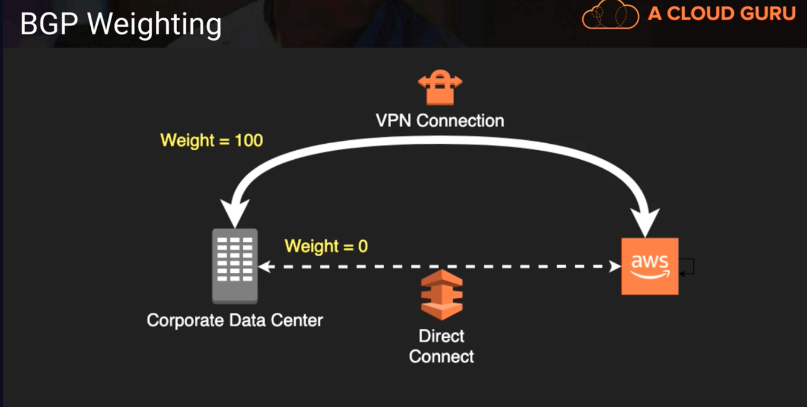
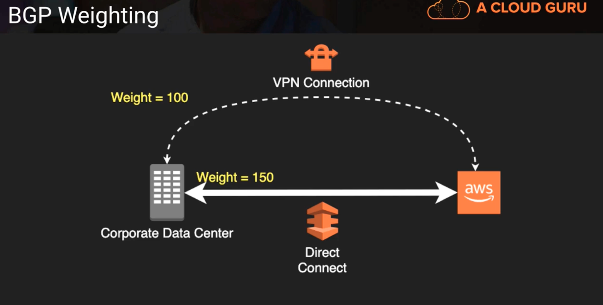

# Routing

https://www.subnet-calculator.com/cidr.php

## Routing Tables
1. VPCs have an implicit router and main routing table
2. You can modify the main routing table or create new tables
3. Each route table contains a local route for the CIDR block
4. Most specific route for an address wins

| Destination | Target | notes | notes |
|:--------------------:|:-----------------------------:|:------------:|:---------:|
| 10.0.0.0/16 | local | | |
| 192.168.0.0/24 | vpg-xxxxxx | | |
| 0.0.0.0/0 | nat-xxxxxxx | (default route) it catches any IP that doesn't fall on our list | |
| pl-xxxxxxx | vpce-xxxxxxx | could be a resolved IP addess of S3 | EC2 instance talks to that VPC endpoint using their private IP address |

Essentially, the routing table looks at an address and depending on which address that IP address falls inside the destination network it will forward the request to the appropriate gateway/router

Above, the last route entry is setup for when you create an endpoint for your VPC. This prefix list is a predefined mapping of all the IP addresses for that particular service; acts as a sort of intercept to route the traffic that would normally go out through the default route in this case the public internet. And it just routes it through the VPC endpoint connection

## Border Gateway Protocol
1. Popular routing protocol for the internet
2. "Propagates" information about the network to allow for dynamic routing
3. Requireed for Direct Connect and optional for VPN
4. Alternative of not using BGP with AWS VPC is static routes
5. AWS supports BGP community tagging as a way to control traffic scope and route preference
6. Required TCP port 179 + ephemeral ports (remember these?)
7. Autonomous System Number (ASN) = Unique endpoint identifier (uniquely identifies each endpoint in a BGP network)
8. Weighting is local to the router and higher weight is preferred path for outbound traffic (you can assign different weights to routes in that network)

Above, since VPN connection weight is higher our router would transition traffic through that route

Above, since direct connect weight is higher our router would transition traffic through that route

