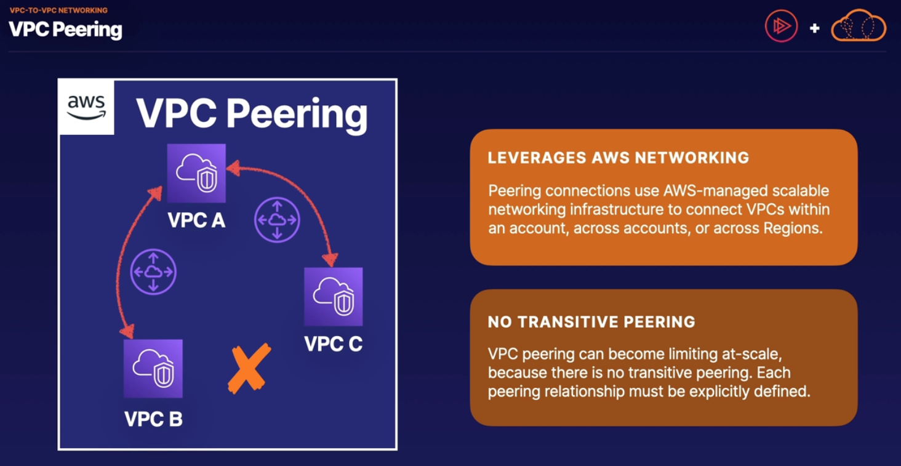
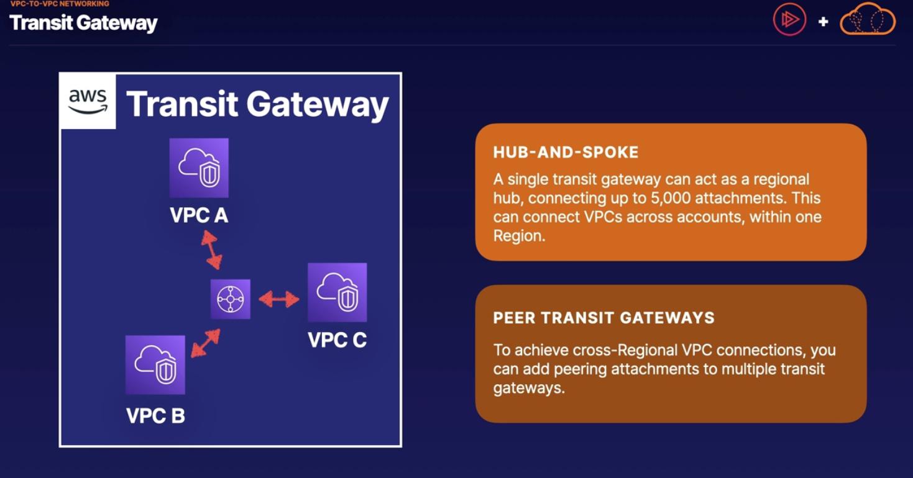
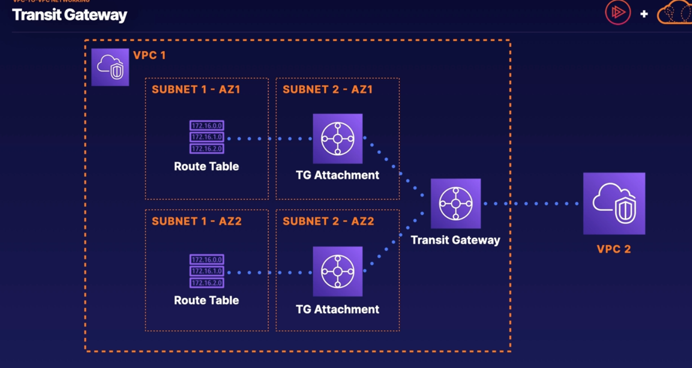

# VPC-to-VPC Networking

https://aws.amazon.com/transit-gateway/faqs/

## VPC Connection Options
1. VPC peering -> you can associate VPCs and direct traffic between them across the internal AWS network
2. AWS transit gateway -> can be used to direct traffic across many VPCs
3. Software Site-to-Site VPN -> you can connect VPCs with this
4. Software VPN-to-AWS managed VPN -> you can connect VPCs with this
5. AWS Managed VPN -> network VPCs together

## VPC Peering
you can associate VPCs and direct traffic between them across the internal AWS network backbone.

You can peer VPC across account and regions but it is important to note that when you peer VPCs there's no transitive peering. So if VPC A is peered with VPC B and VPC A is peered with VPC C, VPC B is not peered with VPC C

## Transit Gateway

Provides a more flexible or scalable solution

Uses a hub and spoke architecture, where you have a single gateway and gateway attachement within each VPC. A single transit gateway can only serve one region, but transit gateways can be peered with eacher to do cross-regional connections.

- Transit gateways associate with subnets using transit gateway attachments. In order to communicate with all the subnets in your VPC you will have to have a transit gateway attachment in at least one subnet per availability zone. Other subnets in that availability zone can communicate with the transite gateway by having a route to the transit gateway attachment that exists in the same availability zone. 

- Transit gateway requires a transit gateway attachment in each availability zone in order to communicate with all four subnets. This transit gateway can then be associated with other VPCs that have their own transit gateway attachments within their subnets.

## CIDR Considerations

It's important to note that when calculating the number of IP addresses for a subnet, subtract 5 for AWS reserved IPs.
On AWS, your net mask can be any value from /16 to /28.
 /16 providing -> 65,536 and /28 providing -> 16

- When configuring, these IP ranges, CIDR blocks cannot overlap 
- If I have a VPC with a CIDR block of 10.0.0.0/16 and another VPC with 10.0.10.0/20 they cannot peer/connect because they overlap. IP addresses would have conflicting destinations.
  - if VPC is 10.0.0.0/16 and another VPC is 10.1.10.0/20 we will be able to peer the VPCs

# Learn how to calculate CIDR ranges for the exam.