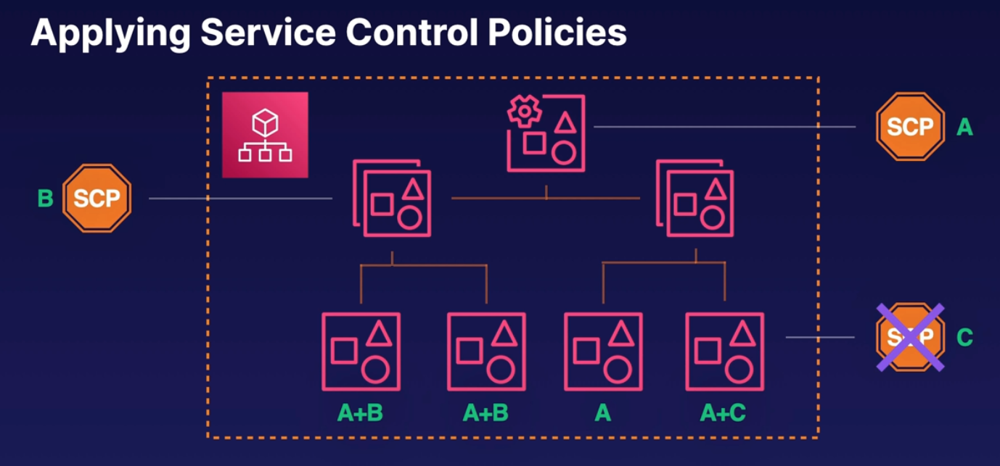

# Controlling Access in Your Organization

## Service Control Policies

- they can be applied across organizations, organizational units, or accounts
- they use IAM policy syntax but never grant permissions, they only deny permissions
- the effects are inherited by all accounts below the (SCP)service control policy's targets. If we use this on an organizational unit, all accounts that fall within that OU will have that SCP applied.

## Applying Service Control Policies
- it is considered not to apply service control policies to individual accounts
- if we find that we need different security needs for two accounts in a single OU its likely that we should consider breaking them into multiple OUs 
- This picture below illustrates how SCPs are inherited

### Service Control Policies come in two different flavors:
    1. allow list -> implicitly denies all actions not listed. Organizations are assigned the managed SCP FullAWSAccess by default. So it lists what you can do, then denies the rest.
    2. deny list -> explicitly denies specific actions for all affected users and roles

    - An action must be allowed and not denied in order for it to be available to users and roles in a given account

### Effective permissions of a user or role
- the effective permission of a user or role is the super position of the service control policy and IAM policy applied to their user.
   - this means an action is only enabled if it's allowed explicitly by an IAM policy and not denied by the service control policy affecting that user

### AWS Config
- it monitors best practices across one's organization. It provides a lot of these config guardrails by default.
1. define detective controls and view at a glance whether accounts are compliant.
    - config rules are a set of detective controls that you can view at a glance whether accounts are compliant 
2. discover noncompliant resources that require action 
3. keep a history of actions that caused noncompliance across all accounts. AWS provides a lot of best practice rules by default. You can define custom ones as you'd like 

### IAM Identity Center (formerly AWS SSO)
- the recommended way to give users access to your AWS accounts
1. IAM Identity Center maps users and groups from an identity provider to IAM users and groups
2. IAM Identity Center is designed to integrate with any identity provider that uses SAML 2.0 like Azure AD.
3. AWS SSO can also act as an independent user directory. This means that if you don't already use something like Active Directory or Okt, IAM Identity Center can be it's own user pool.

### Accessing an Account
IAM Identity Center acts as a liason between our identity provider and AWS IAM and allows users to assume roles when accessing an account

### How IAM Identity Center Maps Groups to Accounts
Not only can you map one user to many accounts but you can map one user to many permission sets in many accounts
