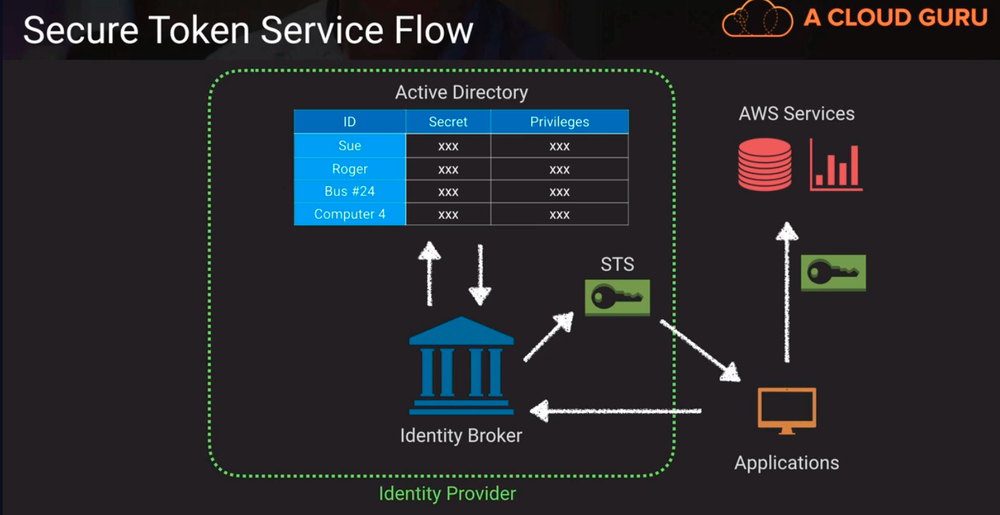
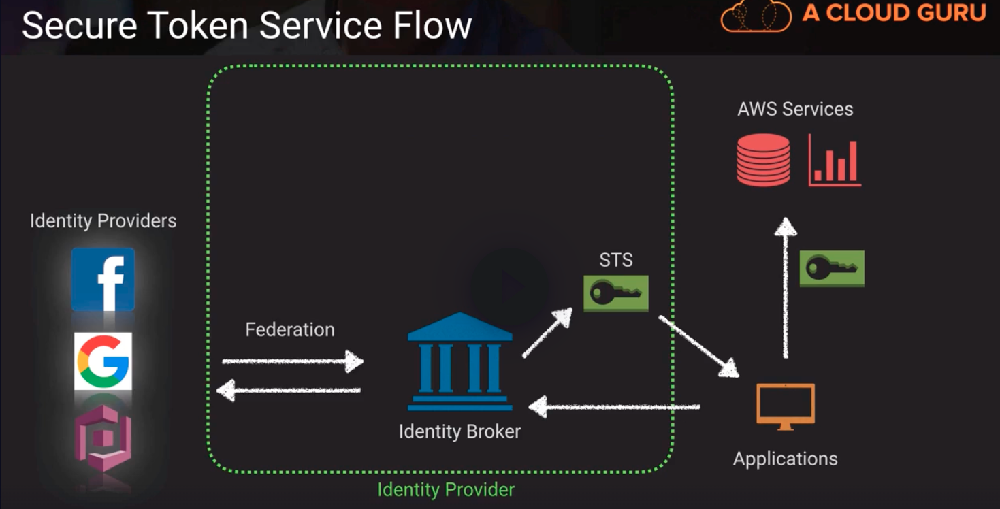

# Credentials and Access Management
- Know what IAM is and components
- Know the difference between Users, Groups, Roles, Policies
- Know the difference Resource-based policies vs Identity-based policies
- Know how to read and write policies in JSON
- Services -> Actions -> Resources and how they play into IAM policies

* Security Token Service (STS) -> allows us to temporarily grant credential access to applications or users. We can source those credentials from IAM or source from one of the federated options like Facebook or Google.

    - In contrast, Amazon Cognito is more designed to be used in mobile applications and the Cognito SDK already has a lot of the security handling built into it

## Secure Token Service Flow

- above, 
  1. the application makes a request to the identity broker. 
  2. the identity broker is going to look at the active directory.
  3. we're going to authenticate against the AD and fetch the authorizations
  4. then reach out to the security token service and generate a token to represent that authentication and authorization
  5. we hand that token over to our application which then uses it to access a variety of AWS services

- above,
  1. we can use federation and generate a token, provided that we authenticate properly against one of those federated identity providers

## Token Vending Machine Concept -> a common way to issue temporary credentials for mobile app development
- 2 Modes for TVM:
  1. anonymous TVM - used as a way to provide access to AWS services only, does not store user identity
  2. identity TVM - used for registration and login, and authorizations

- AWS now recommends that mobile developers use Cognito and the related SDK because it has all the functionality built in so we don't have to create a TVM concept.

## AWS Secrets Manager
- store passwords, encryption keys, API keys, SSH keys, PGP keys, etc
- alternative to storing passwords or keys in a "vault" (software or physical)
- can access secrets via API with fine-grained access control provided by IAM
- automatically rotate RDS database credentials for MySQL, PostgreSQL and Aurora
- better than hard-coding credentials in scripts or application

