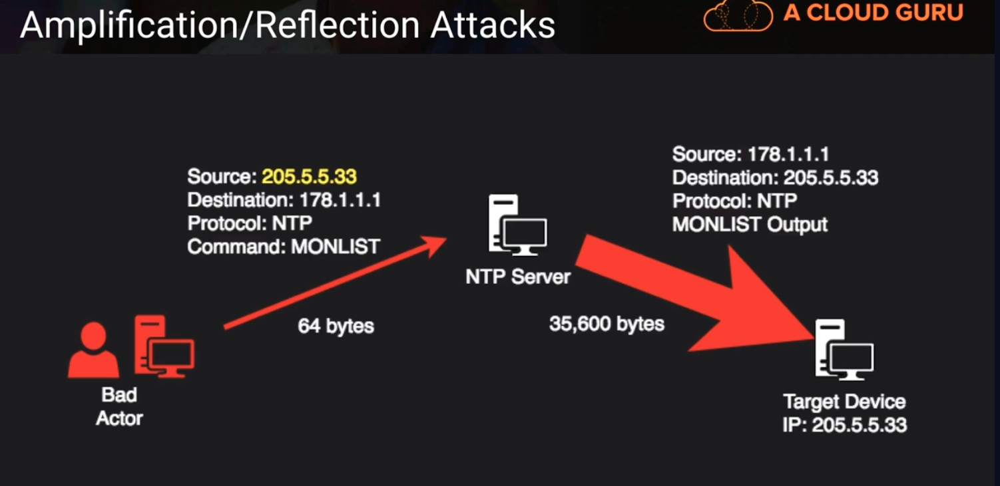
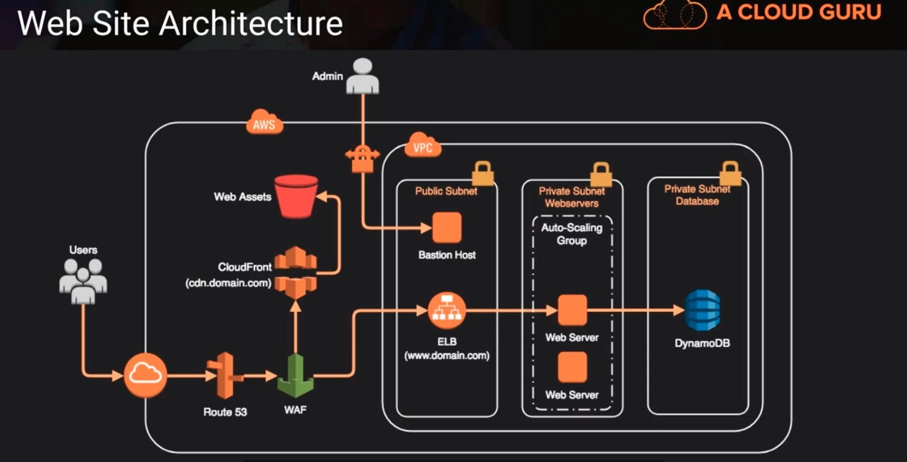

# Distributed Denial of Service Attacks

## Phishing 
- an attempt from  bad actors to retrieve personal or financial information

## Distributed Denial of Service (DDOS)
- bad actors sends commands to compromised machines and then they will do something that will impair the targeted device. either by overwhelming it with traffic or sending lots of requests to it and it lowers its performance and could potentially cause an outage. In extreme cases it could expose sensitive data.

## Amplification/Reflection Attacks
a type of denial service attack 

Above,
NTP (network time protocol service) has this command built into it called MONLIST. MONLIST was built in there to help with monitoring; it returns the last 600 IP Addresses that it's talked to. 
   - a bad actor can spoof a packet. they can manipulate a data packet to make it look like that packet came from some other device. So they would send this spoofed packet into an NTP server and that NTP server would send back a message that's many times larger to the spoofed address. This has the effect of potentially overwhelming the target.

## Application Attacks (Layer 7)

Above,
Attacks that happen at HTTP, where a bad actor would flood a target web server with get requests that would push up the utilization of the network coming into the web server. It would push up the utilization of the web server and also maybe if it's backended with a database. It would have the effect of creating an outage or a very slow delay to a legitimate web client that's trying to access that same web server.

## Mitigating DDoS

| Best Practice | AWS Service |
|:-------------:|:-----------------------:|
| Minimize attack surface | NACLs, SGs, VPC Design |
| Scale to absorb attack | Auto-scaling Groups, AWS CloudFront, Static Web Content via S3 |
| Safeguard exposed resources | Route 53, AWS WAF, AWS Shield |
| Learn normal behavior | AWS GuardDuty, CloudWatch |
| Have a plan | All You! |

## Web Site Architecture

Above,
we have a web architecture that's pretty well prepared for a denial of service attack
1. we use CloudFront as our CDN, and serve up all our static assets and images from there
2. we use a WAF (web application firewall) in front of our web server 
3. we use an elastic load balancer and auto scaling group behind the WAF
4. we use dynamoDB because it scales very rapidly and very robustly
