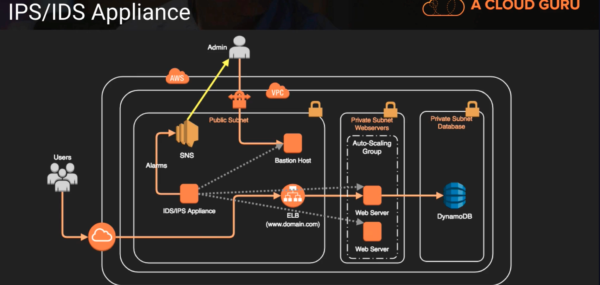

# IDS and IPS

https://aws.amazon.com/marketplace/solutions/infrastructure-software

## Intrusion Prevention and Detection
- Intrusion Detection System (IDS) -> watches the network and systems for suspicious activity that might indicate someone trying to compromist a system. 
    - it's generally more reactive or passive, it might scan systems for vulnerabilities or maybe it sees some suspicious activity about somebody repeatedly missing passwords or incorrect passwords and then it can alarm somebody
- Intrusion Prevention System (IPS) -> tries to prevent exploits by sitting behind firewalls and scanning and analyzing suspicious content for threats
    - its more active, it dynamically analyze traffic as it's flowing through the network and it tries to identify certain signatures in that traffic that may indicate suspicious activity and oftentimes intruder prevention systems have dynamic capability and they can take action on that threat such as blacklisting an IP address.
- Normally comprised of a collection / monitoring system and monitoring agents on each system
- Logs collected or analyzed in cloudwatch, S3 or 3rd party tools (Splunk, SumoLogic, etc) sometimes called a Security Information and Event Management (SIEM) system

## IPS/IDS Applications

Above, 
the IDS/IPS is inside the public subnet and monitors the various parts and pieces of our infrastructure generally through an agent that's installed locally. Anything identified that needs to be corrected or handled it can trigger an alarm, in this instance would send a notification to SNS. 

## CloudWatch vs. CloudTrail
| CloudWatch | CloudTrail |
|:-------------------------:|:--------------------------:|
| Log events across AWS services; Think operations | Log API activity across AWS services; Think activities |
| Higher-level comprehensive Monitoring and Eventing | More low-level granular |
| Log from multiple accounts | Log from multiple accounts |
| Logs stored indefinitely | Logs stored to S3 or CloudWatch indefinitely |
| Alarms history for 14 days | No native alarming; Can use CloudWatch alarms (but you can create alarms by piping those CloudTrail logs into CloudWatch and tell CloudWatch to watch for certain things and alarm/event on certain things) |