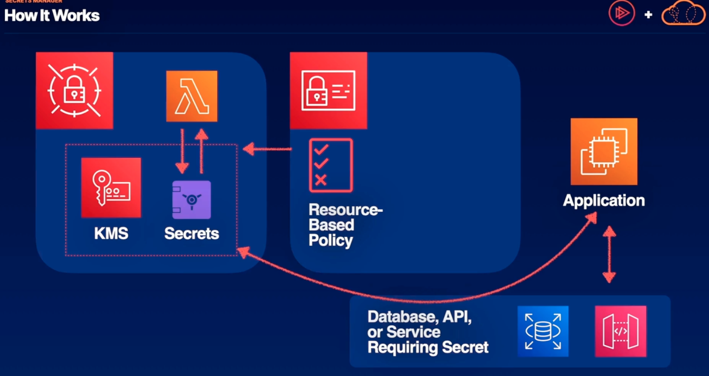
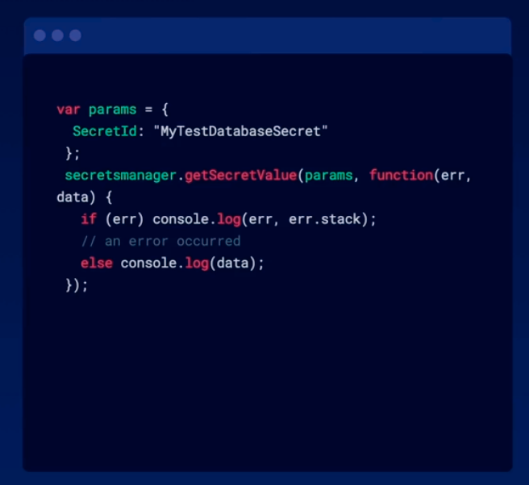

# Secrets Manager -> takes plain text secrets (ex. passwords, access keys) and encrypts them and only give access to entities that have the appropriate IAM roles.
- automatically rotates those encryption keys to keep your secrets safe
- uses KMS keys to encrypt secrets
- uses lambda to automatically rotate keys
- IAM roles grant services and applications access to specific secrets (not only do we have rotating KMS keys to keep those secrets encrypted, we also have temporary credentials from IAM roles granting access to those secrets) 
  - its a secure way to store secrets that you want to grant your application access to

## How it works

Above,
1. With secrets manager we store secrets(ex. access keys or database credentials) using KMS encryption. Lambda is used to periodically refresh those KMS keys so that they're never too long living.
2. Then with the application which wants access to those secrets and the application will pass off the secrets to the database or API that requires it.
3. One way we can grant the application access to the secrets is by using a resource-based policy. 
   - this policy attaches to the secret itself. It can explicitly allow some entities access to the secret. 
   - If your application is given access, it will receive the encrypted secret. The secret will remain encrypted in transit to your application and then any application or service that wants to access the plain text of that key, if it's ben given permissions by a resource-based policy, can then decrypt that secret
   

Above,
3. Another way we can grant the application access to the secrets is by using identity-based policy
   - identity-based policy is an IAM role that you define granting explicit access to one or more secrets. This role can then be applied to your application and multiple other services.
4. those applications or services granted to this IAM role will be able to retrieve and decrypt those secrets.
5. With secrets manager, we can monitoring and audit the automation of our rotating keys. 
   - now we can easily visualize when those keys are being rotated and when they're being used.

## Application Access

Above, 
Use case is that we don't have to store sensitive data in plain text in our application. In order to give your application access to secrets stored in Secrets Manager, we can use the AWS SDK and use the GetSecretValue function. 
- using GetSecretValue, as long as your application has the appropriate permissions you will be able to retrieve and decrypt that secret
1. Grant IAM Access
   - In order to retrieve a secret from Secrets Manager, your application must be given access to the specific secret, either through a resource-based policy or an identity-based policy
2. Retrieve with AWS SDK
   - Even though the code to retrieve a secret is static, encryption keys and access keys are being rotated by Secrets Manager and IAM, respectively, behind the scenes.

## Summary
1. Secrets manager leverages Lambda to automatically rotate KMS keys. this helps keeps secrets encrypted at rest and in transit.
2. Using resource- or identity-based policies grant access to applications and services. No need to make application changes when keys rotate.